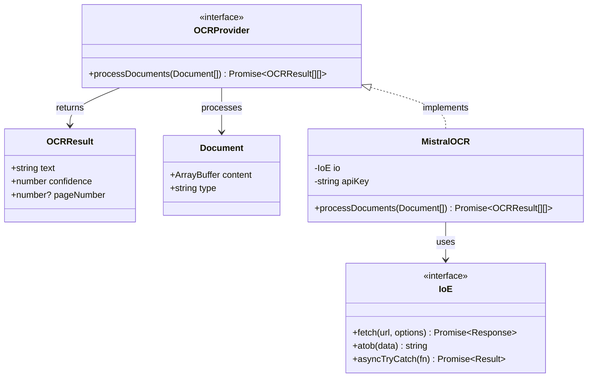
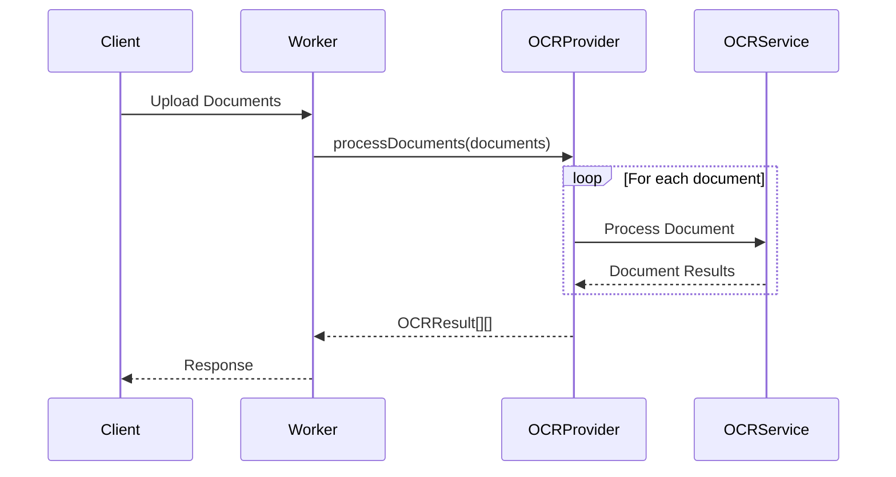

# OCR Checks Server Architecture

## Overview

The OCR Checks Server is a Cloudflare Worker application that processes images of paper checks using Mistral AI's vision capabilities to extract structured data. The system is designed with a functional programming approach, leveraging the `functionalscript` library for IO operations and error handling.

## System Components

### 1. Core Components

#### Worker Entry Point (`src/index.ts`)
- Main Cloudflare Worker handler
- Handles HTTP requests
- Manages image processing pipeline
- Implements CORS and request validation

#### OCR Processing (`src/ocr.f.ts`)
- Core OCR functionality
- Implements the `processCheckImage` function
- Handles image preprocessing and API communication
- Uses functional programming patterns with `IoE` interface

#### OCR Abstraction (`src/ocr/types.ts`)
```typescript
// Common OCR result type
type OCRResult = {
    text: string;
    confidence: number;
    pageNumber?: number;
}

// Document type for batch processing
type Document = {
    content: ArrayBuffer;
    type: 'image' | 'pdf';
}

// OCR provider interface
interface OCRProvider {
    processDocuments(documents: Document[]): Promise<OCRResult[][]>;
}

// Current implementation using Mistral
class MistralOCR implements OCRProvider {
    constructor(private io: IoE, private apiKey: string) {}
    
    async processDocuments(documents: Document[]): Promise<OCRResult[][]> {
        // Implementation using Mistral API
        // Returns array of results for each document
        // Each document's results array contains results for each page
    }
}
```

### UML Diagrams

#### Class Diagram


#### Sequence Diagram - Batch Processing


### 2. Type System

#### IO Interface (`IoE`)
- Extends the base `Io` type from `functionalscript`
- Adds enhanced `fetch` capabilities for API communication
- Provides `atob` for base64 encoding
- Maintains compatibility with functional programming patterns

#### Data Types
- `MistralResponse`: API response structure
- `CheckData`: Extracted check information
- `Result<T, E>`: Error handling from `functionalscript`

### 3. Testing Infrastructure

#### Unit Tests (`test-ocr.f.ts`)
- Tests the core OCR processing functionality
- Uses mock implementations of `IoE`
- Validates API request/response handling
- Tests error scenarios

#### Integration Tests (`test-ocr.ts`)
- Tests the complete worker functionality
- Processes actual check images
- Validates end-to-end workflow

## Data Flow

1. **Document Upload**
   - Client sends document (image/PDF) via HTTP POST
   - Worker validates content type and size

2. **Document Processing**
   - Document converted to appropriate format
   - OCR provider selected based on content type
   - Document processed by selected provider

3. **API Communication**
   - Structured prompt sent to OCR provider
   - Response parsed and validated

4. **Response Handling**
   - Data extracted and formatted
   - Error handling and validation
   - JSON response returned to client

## Error Handling

- Uses `Result` type from `functionalscript`
- Implements `asyncTryCatch` for async operations
- Validates API responses
- Handles image processing errors

## Dependencies

- `functionalscript`: Core functional programming utilities
- `@mistralai/mistralai`: Mistral AI API client
- `hono`: Web framework for Cloudflare Workers
- `sharp`: Image processing (if needed for preprocessing)

## Development Workflow

1. **Local Development**
   - `npm run dev`: Start local worker
   - `npm test`: Run unit tests
   - `npm run test:integration`: Run integration tests

2. **Deployment**
   - Uses Wrangler for deployment
   - Environment variables managed via `wrangler.toml`
   - CI/CD integration possible via GitHub Actions

## Security Considerations

- API key management via environment variables
- Input validation and sanitization
- CORS configuration
- Rate limiting (if implemented)

## Future Considerations

- Image preprocessing optimization
- Caching strategies
- Rate limiting implementation
- Additional OCR providers support
- Batch processing capabilities 