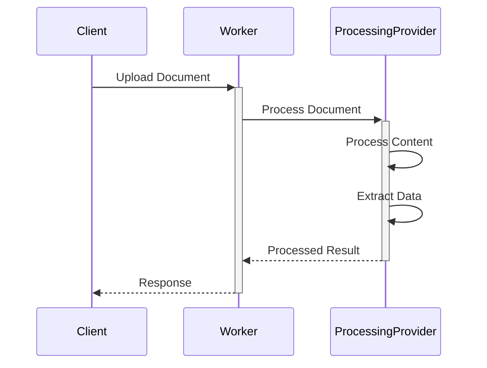

# OCR Checks Server Architecture

## Overview

The OCR Checks Server is a Cloudflare Worker application that processes images of paper checks to extract structured data. The system is designed with a functional programming approach, leveraging the `functionalscript` library for IO operations and error handling.

## System Components

### 1. Core Components

#### Worker Entry Point (`src/index.ts`)
- Main Cloudflare Worker handler
- Handles HTTP requests
- Manages processing pipeline
- Implements CORS and request validation

#### Processing Pipeline
- Handles document processing
- Manages API communication
- Uses functional programming patterns with `IoE` interface

### 2. Type System

#### IO Interface (`IoE`)
- Extends the base `Io` type from `functionalscript`
- Adds enhanced `fetch` capabilities for API communication
- Provides `atob` for base64 encoding
- Maintains compatibility with functional programming patterns

#### Data Types
- `CheckData`: Extracted check information
- `Result<T, E>`: Error handling from `functionalscript`

### 3. Testing Infrastructure

#### Unit Tests
- Tests core processing functionality
- Uses mock implementations of `IoE`
- Validates API request/response handling
- Tests error scenarios

#### Integration Tests
- Tests the complete worker functionality
- Processes actual check images
- Validates end-to-end workflow

## UML Diagrams

### Sequence Diagram

## Data Flow

1. **Document Upload**
   - Client sends document via HTTP POST
   - Worker validates content type and size

2. **Document Processing**
   - Document converted to appropriate format
   - Processed by selected provider
   - Data extracted and structured

3. **Response Handling**
   - Data formatted and validated
   - Error handling and validation
   - JSON response returned to client

## Error Handling

- Uses `Result` type from `functionalscript`
- Implements `asyncTryCatch` for async operations
- Validates API responses
- Handles processing errors

## Dependencies

- `functionalscript`: Core functional programming utilities
- `hono`: Web framework for Cloudflare Workers
- `sharp`: Image processing (if needed for preprocessing)

## Development Workflow

1. **Local Development**
   - `npm run dev`: Start local worker
   - `npm test`: Run unit tests
   - `npm run test:integration`: Run integration tests

2. **Deployment**
   - Uses Wrangler for deployment
   - Environment variables managed via `wrangler.toml`
   - CI/CD integration possible via GitHub Actions

## Security Considerations

- API key management via environment variables
- Input validation and sanitization
- CORS configuration
- Rate limiting (if implemented)

## Future Considerations

- Processing optimization
- Caching strategies
- Rate limiting implementation
- Additional providers support
- Batch processing capabilities 