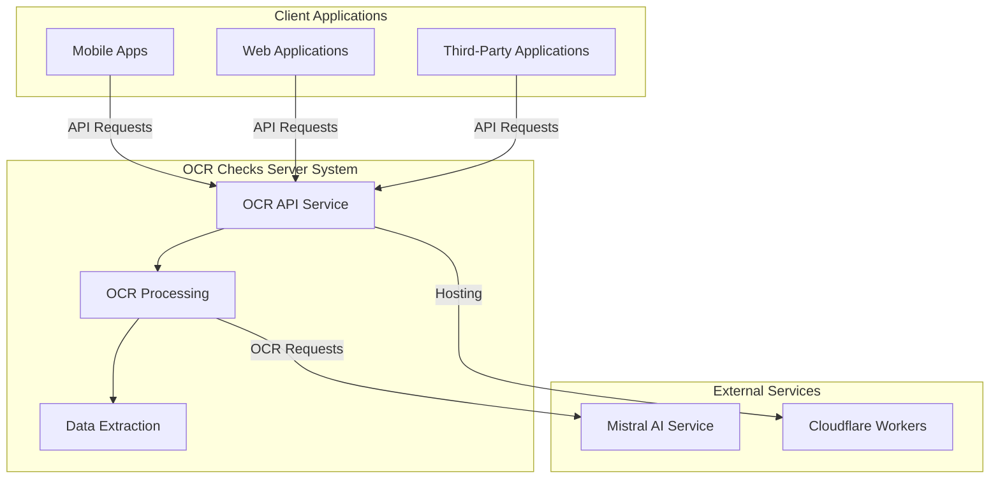

# 📖 Software Architecture Document – Introduction

---
**🏠 [Home](../../README.md)** | **📚 [Documentation](../README.md)** | **🏗️ [Architecture](index.md)** | **➡️ [Next: Goals & Constraints](02_Architectural_Goals.md)**
---

## Purpose

This document describes the architecture of the OCR Checks Server system in detail. It provides a comprehensive view of the architectural design decisions, component structure, deployment model, and runtime behavior of the system. The document serves as:

1. A reference for developers working on the system
2. A guide for maintainers and operators
3. A technical overview for stakeholders and new team members
4. Documentation of key architectural decisions and their rationales

## Scope

The OCR Checks Server is a Cloudflare Worker-based system that performs Optical Character Recognition (OCR) on paper checks and receipts using Mistral AI's vision capabilities. The system:

- Accepts image uploads of checks and receipts
- Processes images using AI-based OCR
- Extracts structured data from the OCR results
- Returns standardized JSON responses
- Provides confidence scores for extracted data
- Offers client libraries for integration

This architecture document covers the complete system architecture, including the core server, client libraries, and deployment infrastructure. It describes both the current implementation and planned future extensions.

## Stakeholders

The primary stakeholders of this architecture document are:

| Stakeholder | Concerns |
|-------------|----------|
| **Development Team** | Implementation guidelines, component structure, technical decisions |
| **Operations Team** | Deployment processes, monitoring strategy, scaling approach |
| **Product Owners** | System capabilities, integration options, extension points |
| **Client Developers** | API specifications, client library usage, integration patterns |
| **QA Team** | Test coverage, validation mechanisms, error handling |
| **Security Team** | Authentication methods, data protection, API security |

## System Context

The OCR Checks Server operates within a larger ecosystem of services and client applications:

## Document Structure

This architecture document is organized into the following major sections:

1. **Introduction** - Provides context and overview (this section)
2. **Architectural Goals and Constraints** - Describes quality attributes and constraints
3. **System Overview** - Provides a high-level system description
4. **Logical Architecture** - Details the component structure and interactions
5. **Physical Architecture** - Describes deployment environment and infrastructure
6. **Technologies Used** - Lists the technologies, frameworks, and tools
7. **Build and Deployment Architecture** - Explains the build and deployment processes
8. **Runtime View** - Details the runtime behavior and workflow
9. **Data Architecture** - Describes data models, flows, and persistence
10. **Security Architecture** - Details authentication, authorization, and data protection
11. **Integration and External Interfaces** - Describes API specifications and integrations
12. **Operational Concerns** - Covers monitoring, logging, and operational aspects
13. **Architectural Decision Log** - Documents key architectural decisions
14. **Glossary and References** - Provides terminology and reference information

Each section focuses on a specific aspect of the architecture, providing both diagrams and textual descriptions to present a comprehensive view of the system.

---
**🏠 [Home](../../README.md)** | **📚 [Documentation](../README.md)** | **🏗️ [Architecture](index.md)** | **➡️ [Next: Goals & Constraints](02_Architectural_Goals.md)** | **⬆️ [Top](#-software-architecture-document--introduction)**
---