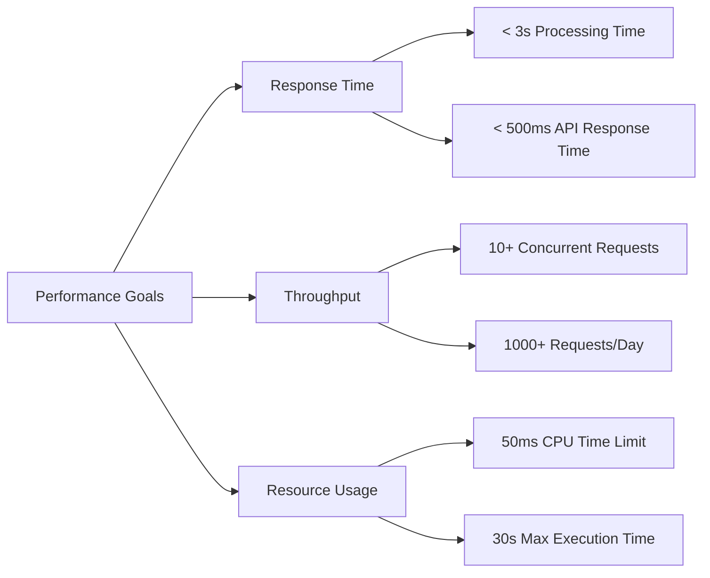
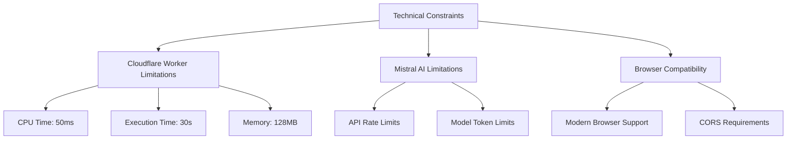

# 🎯 Software Architecture Document – Architectural Goals and Constraints

---
**🏠 [Home](../../README.md)** | **📚 [Documentation](../README.md)** | **🏗️ [Architecture](index.md)** | **⬅️ [Previous: Introduction](01_Introduction.md)** | **➡️ [Next: System Overview](03_System_Overview.md)**
---

## Quality Attributes

The OCR Checks Server architecture is designed to meet the following key quality attributes:

### Performance

- **Response Time**:
  - API responses must be returned within 500ms for non-OCR operations
  - Complete document processing must complete within 3 seconds for standard documents
  - Health check endpoint must respond within 100ms

- **Throughput**:
  - The system must support at least 10 concurrent document processing requests
  - Daily capacity of at least 1,000 document processing operations per day

- **Resource Efficiency**:
  - Cloudflare Worker CPU time limit of 50ms per operation
  - Maximum execution time of 30 seconds for any single operation
  - Efficient memory usage to stay within Cloudflare Worker limits

### Reliability

- **Error Handling**:
  - Comprehensive error handling for all external API calls
  - Retry mechanism for transient errors in Mistral AI communication
  - Fallback mechanisms for critical system components

- **Stability**:
  - The system must maintain 99.9% uptime
  - Graceful handling of temporary Mistral AI service outages
  - Proper circuit breaking for external service dependencies

### Scalability

- **Horizontal Scalability**:
  - Stateless design to allow for automatic scaling on Cloudflare Workers
  - No interdependencies between worker instances

- **Load Management**:
  - Rate limiting mechanisms to protect from abuse
  - Request queuing for handling traffic spikes

### Security

- **Data Protection**:
  - Sensitive data (API keys, user information) must be properly secured
  - HTTPS for all API communications
  - Appropriate CORS configuration for browser-based applications

- **Access Control**:
  - API key validation for service access
  - Role-based permissions for different operations

### Maintainability

- **Modularity**:
  - Clean separation of concerns between system components
  - Dependency injection for flexible configuration and testing
  - Well-defined interfaces between modules

- **Testability**:
  - Comprehensive test coverage (unit, functional, integration)
  - Mocking capabilities for external dependencies
  - Test environments that mimic production configuration

## System Constraints

### Technical Constraints

1. **Cloudflare Worker Environment**
   - Execution time limit: 30 seconds maximum per request
   - CPU time limit: 50ms per request
   - Memory constraints: Limited to Cloudflare Worker memory allocation
   - No direct filesystem access
   - Edge computing constraints for deployment and operations

2. **Mistral AI Integration**
   - API rate limits imposed by Mistral AI
   - Token limits for the OCR and extraction models
   - Response time dependency on Mistral AI service

3. **Browser Compatibility**
   - API must support modern web browsers for client-side integration
   - CORS requirements for browser-based access

### Business Constraints

1. **Time-to-Market**
   - Initial version must be released within specified project timeline
   - Features prioritized based on business value

2. **Resource Constraints**
   - Development team size and composition
   - Limited infrastructure budget

3. **Regulatory Requirements**
   - Data protection regulations for handling financial documents
   - Compliance with financial industry standards
   - AGPL-3.0-or-later license requirements

## Design Principles

The architecture adheres to the following design principles:

1. **SOLID Principles**
   - Single Responsibility: Each class/module has a single reason to change
   - Open/Closed: Open for extension, closed for modification
   - Liskov Substitution: Subtypes must be substitutable for their base types
   - Interface Segregation: Many specific interfaces over one general interface
   - Dependency Inversion: Depend on abstractions, not concretions

2. **Clean Architecture**
   - Separation of concerns with clear boundaries
   - Dependencies point inward, toward domain logic
   - External details (frameworks, APIs) depend on core business logic

3. **Functional Programming Patterns**
   - Immutable data structures where appropriate
   - Error handling with Result tuples
   - Pure functions for predictable behavior

4. **Defensive Programming**
   - Input validation at system boundaries
   - Assertion of preconditions
   - Graceful error handling

## Architectural Strategies

1. **API-First Design**
   - Well-defined REST API with OpenAPI/Swagger documentation
   - Consistent error responses and status codes
   - Versioning strategy for API evolution

2. **Cloud-Native Architecture**
   - Designed for Cloudflare Workers serverless platform
   - Stateless service design
   - Edge deployment for global availability

3. **Dependency Injection**
   - Container-based DI using InversifyJS
   - Service locator pattern for modular component access
   - Factory pattern for complex object creation

4. **Event-Driven Processing**
   - Asynchronous processing of document OCR workflows
   - Promise-based request handling

---
**🏠 [Home](../../README.md)** | **📚 [Documentation](../README.md)** | **🏗️ [Architecture](index.md)** | **⬅️ [Previous: Introduction](01_Introduction.md)** | **➡️ [Next: System Overview](03_System_Overview.md)** | **⬆️ [Top](#-software-architecture-document--architectural-goals-and-constraints)**
---