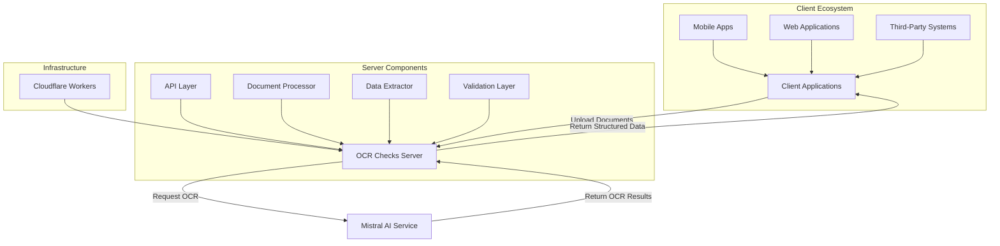
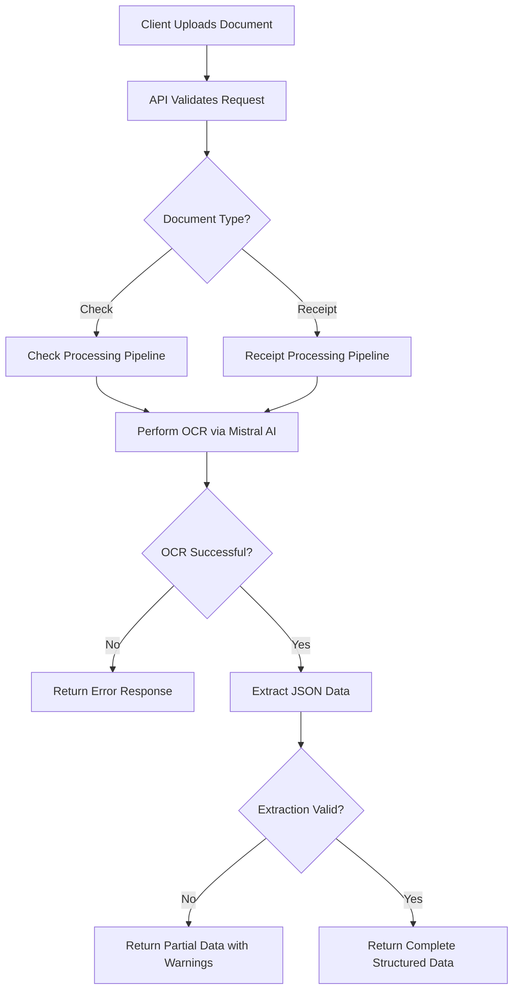

# 🌐 Software Architecture Document – System Overview

---
**🏠 [Home](../../README.md)** | **📚 [Documentation](../README.md)** | **🏗️ [Architecture](index.md)** | **⬅️ [Previous: Goals & Constraints](02_Architectural_Goals.md)** | **➡️ [Next: Logical Architecture](04_Logical_Architecture.md)**
---

## High-Level Description

The OCR Checks Server is a cloud-based system that provides Optical Character Recognition (OCR) and data extraction services for financial documents, specifically paper checks and receipts. The system leverages Mistral AI's vision capabilities to analyze uploaded document images and extract structured data such as check amounts, dates, payee information, receipt totals, and line items.

The system is deployed as a Cloudflare Worker, making it globally available with low latency. It provides RESTful API endpoints for document processing and health monitoring, and is designed to be integrated with a variety of client applications, including mobile apps, web applications, and third-party systems.

## Context Diagram

## Key Components

The OCR Checks Server consists of the following key components:

### 1. API Layer

The API layer is responsible for:
- Handling HTTP requests and responses
- Implementing RESTful API endpoints
- Request validation and error handling
- CORS support for browser-based applications
- Rate limiting and request throttling
- API documentation via Swagger UI

### 2. OCR Processing

The OCR processing component:
- Accepts document images (JPEG, PNG, HEIC) and PDFs
- Validates and preprocesses document inputs
- Communicates with Mistral AI for OCR operations
- Processes OCR results for downstream consumption
- Handles OCR service failures and retries

### 3. Data Extraction

The data extraction component:
- Defines document schemas (checks, receipts)
- Extracts structured data from OCR results
- Validates extracted data against schemas
- Calculates confidence scores for extracted fields
- Formats data into standardized JSON responses

### 4. Dependency Injection System

The DI system:
- Manages component dependencies
- Provides a mechanism for flexible configuration
- Enables effective testing through component substitution
- Implements the Inversion of Control principle

### 5. Validation Layer

The validation layer:
- Validates API inputs and parameters
- Ensures data integrity throughout the processing pipeline
- Provides detailed error feedback
- Implements schema-based validation using Zod

### 6. Swift Client Library

The Swift client library:
- Provides an iOS/macOS native interface to the OCR service
- Handles document uploads and response parsing
- Implements Swift concurrency patterns (async/await)
- Provides type-safe models for check and receipt data

### 7. NolockCapture Package

The NolockCapture package:
- Provides advanced document capture capabilities
- Implements depth sensing for document flattening
- Processes 3D point clouds for perspective correction
- Handles image preprocessing to improve OCR accuracy

## System Interfaces

### External Interfaces

| Interface | Description | Protocol |
|-----------|-------------|----------|
| HTTP API | Main service interface for client applications | HTTPS/REST |
| Mistral AI | External AI service for OCR processing | HTTPS/REST |
| Cloudflare Workers | Deployment platform for the service | Cloudflare API |

### Internal Interfaces

| Interface | Description | Protocol |
|-----------|-------------|----------|
| OCR Provider | Interface between API and OCR processing | Internal TypeScript |
| JSON Extractor | Interface between OCR results and data extraction | Internal TypeScript |
| DI Container | Interface for component dependency resolution | InversifyJS |

## User Roles

The system accommodates the following user roles:

### API Consumers

- **Mobile App Developers**: Integrate document scanning and processing into iOS/Android apps
- **Web Developers**: Implement document upload and processing in web applications
- **System Integrators**: Connect third-party systems to OCR capabilities
- **Financial Services Providers**: Process checks and receipts for banking or accounting systems

### System Operators

- **Service Administrators**: Monitor and manage the OCR service
- **DevOps Engineers**: Handle deployment, scaling, and infrastructure concerns
- **Support Personnel**: Troubleshoot issues and assist API consumers

### Contributors

- **Developers**: Contribute to the core system codebase
- **Maintainers**: Manage releases and system evolution

## Processing Workflow

## System Characteristics

### State Management

The OCR Checks Server is designed as a stateless system. Each request is processed independently, with no persistent state maintained between requests. This enables horizontal scaling and resilience.

### Fault Tolerance

The system implements fault tolerance through:
- Retry mechanisms for external service calls
- Comprehensive error handling throughout the processing pipeline
- Graceful degradation in case of partial extraction failures

### Security

Security is maintained through:
- API key validation for service access
- HTTPS for all communications
- Input validation to prevent injection attacks
- Proper CORS configuration to control access

---
**🏠 [Home](../../README.md)** | **📚 [Documentation](../README.md)** | **🏗️ [Architecture](index.md)** | **⬅️ [Previous: Goals & Constraints](02_Architectural_Goals.md)** | **➡️ [Next: Logical Architecture](04_Logical_Architecture.md)** | **⬆️ [Top](#-system-overview)**
---