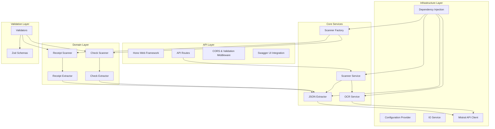
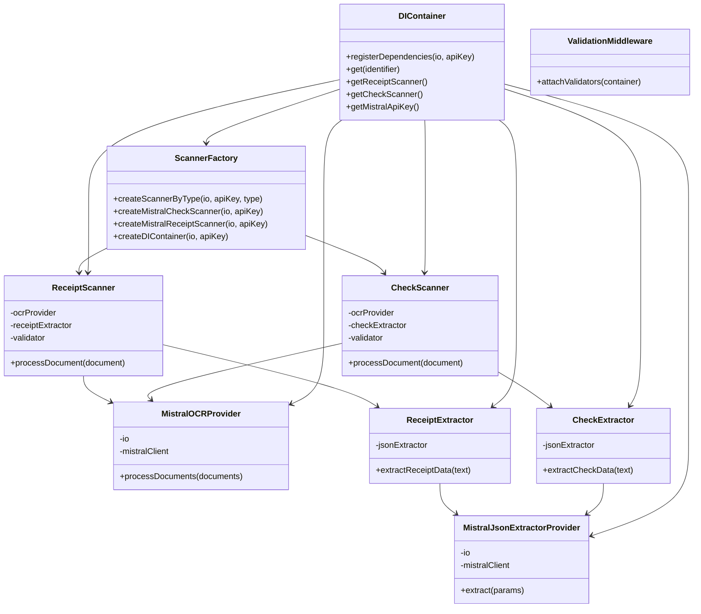
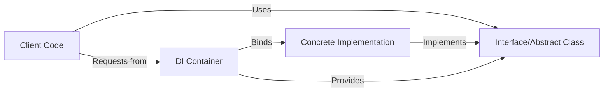
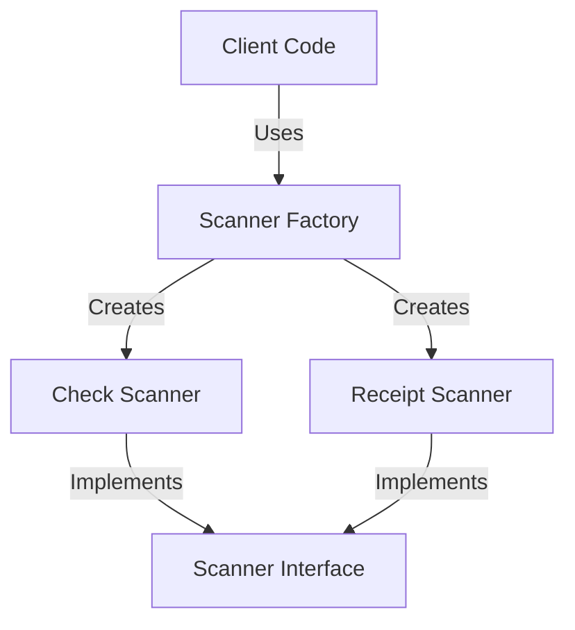
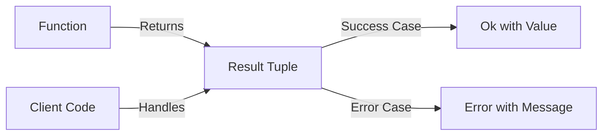
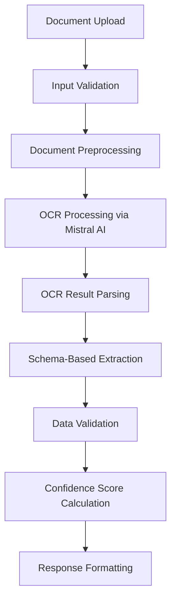

# Software Architecture Document – Logical Architecture

[Home](index.md) | [Up](index.md) | [Previous](03_System_Overview.md) | [Next](05_Physical_Architecture.md)

## Component Structure

The logical architecture of the OCR Checks Server is organized into distinct layers and components, each with specific responsibilities. The following diagram illustrates the high-level component structure:



## Module Decomposition

The system is decomposed into the following major modules:

### 1. API Module (`src/index.ts`)

The API module serves as the entry point for the application and:
- Defines HTTP route handlers
- Sets up CORS configuration
- Initializes the Hono framework
- Handles incoming requests and outgoing responses
- Provides Swagger UI for API documentation

### 2. Scanner Module (`src/scanner/`)

The Scanner module coordinates the document processing workflow:
- `factory.ts` - Creates appropriate scanner instances based on document type
- `check-scanner.ts` - Implements check-specific scanning logic
- `receipt-scanner.ts` - Implements receipt-specific scanning logic
- `types.ts` - Defines scanner-related interfaces and types

### 3. OCR Module (`src/ocr/`)

The OCR module handles optical character recognition:
- `mistral.ts` - Integrates with Mistral AI for OCR processing
- `base64.ts` - Handles image encoding/decoding
- `types.ts` - Defines OCR-related interfaces and types

### 4. JSON Extraction Module (`src/json/`)

The JSON Extraction module transforms OCR results into structured data:
- `mistral.ts` - Manages Mistral AI interactions for JSON extraction
- `extractors/check-extractor.ts` - Implements check-specific data extraction
- `extractors/receipt-extractor.ts` - Implements receipt-specific data extraction
- `schemas/check.ts` - Defines the check document schema
- `schemas/receipt.ts` - Defines the receipt document schema

### 5. Dependency Injection Module (`src/di/`)

The DI module manages component dependencies:
- `container.ts` - Implements the dependency injection container
- `test-container.ts` - Provides a specialized container for testing
- `index.ts` - Exports container-related functionality

### 6. Validation Module (`src/validators/`)

The Validation module ensures data integrity:
- `base.ts` - Defines common validator functionality
- `mistral.ts` - Validates Mistral-related configurations
- `scanner/check-scanner.ts` - Validates check scanner inputs
- `scanner/receipt-scanner.ts` - Validates receipt scanner inputs
- `api/middleware.ts` - Implements API validation middleware

### 7. IO Module (`src/io.ts`)

The IO module provides abstracted I/O operations:
- Logging interface
- Error reporting
- Debug information handling

## Class Structure

The following diagram shows the key classes and their relationships:



## Design Patterns

The OCR Checks Server implements several design patterns to achieve a clean, maintainable architecture:

### 1. Dependency Injection



The system uses InversifyJS to implement dependency injection, allowing for:
- Loose coupling between components
- Easy substitution of implementations for testing
- Centralized configuration management
- Simplified component resolution

Key DI bindings include:
- `TYPES.OCRProvider` bound to `MistralOCRProvider`
- `TYPES.JsonExtractorProvider` bound to `MistralJsonExtractorProvider`
- `TYPES.ReceiptExtractor` bound to `ReceiptExtractor`
- `TYPES.CheckExtractor` bound to `CheckExtractor`

### 2. Factory Pattern



The `ScannerFactory` class implements the Factory pattern to:
- Create appropriate scanner instances based on document type
- Abstract away the complex construction process
- Centralize scanner creation logic
- Enable easy extension with new scanner types

### 3. Strategy Pattern

The system uses the Strategy pattern to handle different document types and processing approaches:
- Different extractor implementations (check vs. receipt)
- Swappable OCR providers
- Pluggable validation strategies

### 4. Middleware Pattern

Hono middleware is used to implement cross-cutting concerns:
- CORS handling
- Request validation
- Authentication
- Error handling

### 5. Result Type Pattern



Functions return a tuple of `['ok' | 'error', value | error]` to:
- Enable consistent error handling
- Make error cases explicit in the type system
- Avoid exceptions for expected error conditions
- Provide context-specific error information

## OCR Processing Pipeline

The OCR processing pipeline is a key architectural component:



1. **Document Upload**: Client uploads a document image or PDF
2. **Input Validation**: System validates content type, format, and size
3. **Document Preprocessing**: Image handling and format conversion if needed
4. **OCR Processing**: Document is sent to Mistral AI for OCR
5. **OCR Result Parsing**: Raw OCR output is parsed into usable text
6. **Schema-Based Extraction**: Text is analyzed to extract structured data
7. **Data Validation**: Extracted data is validated against schemas
8. **Confidence Score Calculation**: Confidence scores are computed
9. **Response Formatting**: Final JSON response is formatted and returned

## Key Interfaces

The system defines several critical interfaces that establish boundaries between components:

### Document Processing Interfaces

```typescript
// Scanner interface for document processing
interface Scanner {
  processDocument(document: Document): Promise<ScannerResult>;
}

// OCR provider interface
interface OCRProvider {
  processDocuments(documents: Document[]): Promise<OCRResult>;
}

// JSON extractor interface
interface JsonExtractorProvider {
  extract(params: ExtractionParams): Promise<ExtractionResult>;
}
```

### Validation Interfaces

```typescript
// Generic validator interface
interface IValidator<T> {
  validate(value: T): ValidationResult;
  assertValid(value: T): T;
}

// Scanner input validator
interface IScannerInputValidator extends IValidator<Document> {
  validate(document: Document): ValidationResult;
  assertValid(document: Document): Document;
}
```

### IO Interface

```typescript
// IO interface for logging and error handling
interface IoE {
  log(message: string, context?: any): void;
  error(message: string, context?: any): void;
  debug(message: string, context?: any): void;
}
```

## Software Layers

The system is organized into the following logical layers:

### 1. Presentation Layer
- API endpoints
- Request/response handling
- Documentation (Swagger UI)

### 2. Application Layer
- Scanner coordination
- Document processing workflow
- Error handling

### 3. Domain Layer
- Document type-specific logic
- Business rules implementation
- Schema definitions

### 4. Infrastructure Layer
- External API integration (Mistral AI)
- Dependency injection
- Configuration management
- Logging

Each layer has a specific responsibility and depends only on layers below it, maintaining a clean separation of concerns.

---

[Home](index.md) | [Up](index.md) | [Previous](03_System_Overview.md) | [Next](05_Physical_Architecture.md)