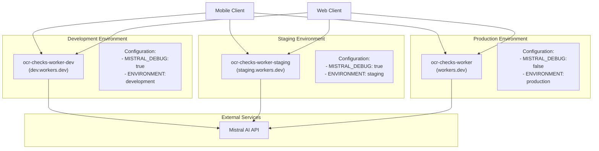
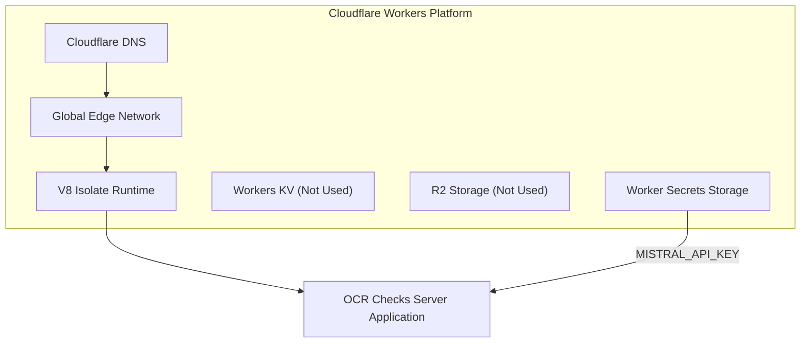
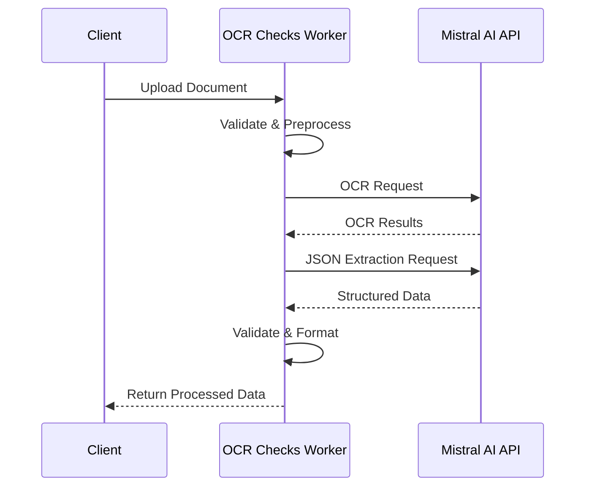
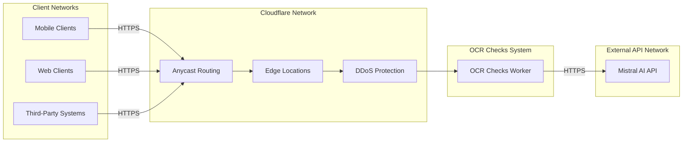
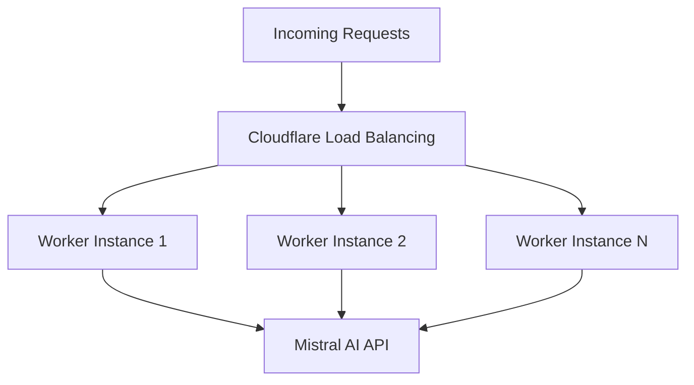
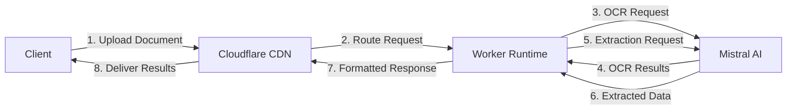
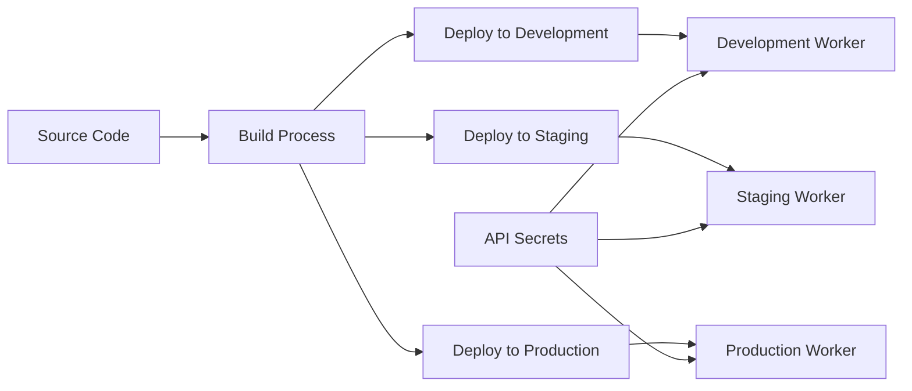

# Software Architecture Document – Physical Architecture

[Home](index.md) | [Up](index.md) | [Previous](04_Logical_Architecture.md) | [Next](06_Technologies_Used.md)

## Deployment Environment

The OCR Checks Server is deployed as a Cloudflare Worker, which is a serverless computing platform that runs on Cloudflare's global network of data centers. This deployment model offers several advantages for the system:

1. **Global Distribution**: The application is automatically deployed to Cloudflare's global edge network, spanning over 275 cities in more than 100 countries, providing low latency for users worldwide.

2. **Serverless Execution**: No dedicated servers need to be provisioned or managed; the application runs on demand when requests are received.

3. **Automatic Scaling**: The platform automatically scales to handle varying loads without manual intervention.

4. **High Availability**: Built-in redundancy and failover mechanisms ensure high availability.

## Deployment Topology

The system is deployed across three distinct environments:



### Environment Details

| Environment | Worker Name | Domain | Purpose |
|-------------|-------------|--------|---------|
| Development | ocr-checks-worker-dev | ocr-checks-worker-dev.af-4a0.workers.dev | Development testing, feature integration |
| Staging | ocr-checks-worker-staging | ocr-checks-worker-staging.af-4a0.workers.dev | Pre-production testing, client verification |
| Production | ocr-checks-worker | ocr-checks-worker.af-4a0.workers.dev | Live production environment |

## Infrastructure Components

### Cloudflare Workers

The Cloudflare Workers platform provides the runtime environment for the application:



Key characteristics of the Cloudflare Workers environment:

1. **V8 Isolates**: The application runs in lightweight V8 isolates rather than traditional containers or virtual machines, enabling fast startup times.

2. **Resource Limits**:
   - CPU execution time: Limited to 50ms per request
   - Total execution time: Limited to 30 seconds per request
   - Memory: Limited to the standard Cloudflare Worker memory allocation

3. **Secret Management**: API keys and other secrets are stored in Cloudflare Worker Secrets, not included in the deployed code.

4. **Access Controls**: Configured via Cloudflare Workers security settings and API authentication.

### Mistral AI Service

The system integrates with Mistral AI's API services for OCR and data extraction:



The interaction with Mistral AI includes:
- API authentication via key
- Sending document images for OCR processing
- Sending OCR results for structured data extraction
- Handling rate limits and failures with retry mechanisms

## Network Architecture

The network architecture is primarily defined by Cloudflare's infrastructure:



### Network Security

1. **TLS Encryption**: All communications use HTTPS/TLS encryption.
2. **Anycast Routing**: Cloudflare's anycast network routes requests to the closest edge location.
3. **DDoS Protection**: Built-in protection against distributed denial-of-service attacks.
4. **Rate Limiting**: Configurable rate limiting to prevent abuse.

### Network Paths

| Path | From | To | Protocol | Purpose |
|------|------|---|----------|---------|
| Client to API | Client Applications | Cloudflare Edge | HTTPS | Document submission, result retrieval |
| API to Mistral | OCR Checks Worker | Mistral AI API | HTTPS | OCR processing, data extraction |
| Deployment | CI/CD Pipeline | Cloudflare API | HTTPS | Application deployment |

## Hardware Requirements

As a serverless application, the OCR Checks Server doesn't have specific hardware requirements for deployment. The application runs on Cloudflare's infrastructure, which automatically manages hardware resources.

### Client-Side Requirements

Clients interacting with the OCR Checks Server should meet these minimum requirements:

| Client Type | Requirements |
|-------------|--------------|
| Mobile Devices | - iOS 14+ or Android 8+ <br> - 2GB RAM minimum <br> - Camera for document capture <br> - Network connectivity |
| Web Browsers | - Modern browser (Chrome, Firefox, Safari, Edge) <br> - JavaScript enabled <br> - WebGL support for advanced client-side processing |
| API Clients | - TLS 1.2+ support <br> - HTTP/2 preferred <br> - JSON parsing capabilities |

### Swift Client-Specific Requirements

For iOS applications using the Swift client library:
- iOS 14.0 or later
- Swift 5.5 or later (for async/await support)
- Minimum 2GB RAM
- Camera access for document capture
- LiDAR Scanner (optional, for enhanced document flattening)

## Scalability

The serverless architecture provides inherent scalability:



1. **Horizontal Scaling**: Cloudflare automatically creates and manages worker instances based on demand.
2. **Geographic Scaling**: Requests are processed at the nearest edge location.
3. **Load Balancing**: Automatic distribution of requests across multiple worker instances.

The main scaling constraint is the Mistral AI API's rate limits and capacity, which may require implementation of:
- Request queuing
- Throttling mechanisms
- Batch processing
- Caching strategies for repeated requests

## Physical Data Flow



1. **Document Upload**: Client sends document image to the API
2. **Request Routing**: Cloudflare routes the request to the nearest edge location
3. **OCR Processing**: System sends document to Mistral AI for OCR
4. **OCR Results**: Mistral AI returns OCR text
5. **Data Extraction**: System sends OCR text to Mistral AI for structured data extraction
6. **Extracted Data**: Mistral AI returns structured JSON data
7. **Response Formatting**: System formats the final response
8. **Result Delivery**: Formatted response is delivered to the client

## Environments and Configuration

Each environment has specific configuration parameters defined in the `wrangler.toml` file:

### Development Environment
```toml
[env.dev]
name = "ocr-checks-worker-dev"
workers_dev = true
vars = { ENVIRONMENT = "development", MISTRAL_DEBUG = true }

[env.dev.limits]
cpu_ms = 50
duration_ms = 30000
```

### Staging Environment
```toml
[env.staging]
name = "ocr-checks-worker-staging"
workers_dev = true
vars = { ENVIRONMENT = "staging", MISTRAL_DEBUG = true }

[env.staging.limits]
cpu_ms = 50
duration_ms = 30000
```

### Production Environment
```toml
[env.production]
name = "ocr-checks-worker"
workers_dev = true
vars = { ENVIRONMENT = "production", MISTRAL_DEBUG = false }

[env.production.limits]
cpu_ms = 50
duration_ms = 30000
```

## Logging and Monitoring

The physical architecture includes logging and monitoring capabilities:

```toml
[observability.logs]
enabled = true
```

Cloudflare Workers provides built-in logging and observability features:
- Real-time logs for debugging
- Error tracking and reporting
- Performance metrics
- Request volume monitoring

## Deployment Process

The deployment process to each environment follows this flow:



Deployments are performed using Wrangler, Cloudflare's CLI tool for Worker management.

---

[Home](index.md) | [Up](index.md) | [Previous](04_Logical_Architecture.md) | [Next](06_Technologies_Used.md)