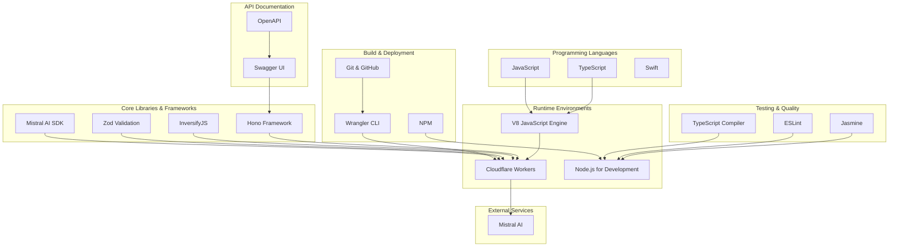
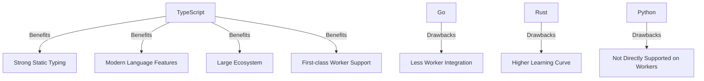
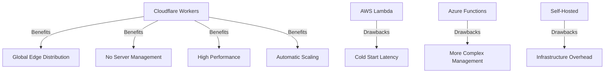

# Software Architecture Document – Technologies Used

[Home](index.md) | [Up](index.md) | [Previous](05_Physical_Architecture.md) | [Next](07_Build_Deployment.md)

## Technology Stack Overview

The OCR Checks Server system employs a modern technology stack designed for cloud-native serverless deployment. The stack is optimized for performance, maintainability, and developer productivity. The following diagram provides a high-level overview of the major technologies used:

## Programming Languages

### TypeScript

TypeScript is the primary programming language used for the OCR Checks Server implementation.

**Version**: 5.3.3

**Usage in the system**:
- Server-side application logic
- Type definitions
- API endpoints implementation
- Service implementation
- Configuration

**Key advantages**:
- Strong static typing for early error detection
- Enhanced IDE support and tooling
- Interface-based design
- Type-safe dependency injection
- Better documentation through type definitions

### JavaScript

JavaScript (ECMAScript) is used as the compiled target for TypeScript.

**Version**: ES2020 (target)

**Usage in the system**:
- Runtime execution in Cloudflare Workers
- Test scripts
- Build scripts

### Swift

Swift is used for the client library implementation that provides iOS/macOS integration.

**Version**: 5.5+

**Usage in the system**:
- iOS/macOS client implementation
- Type-safe model definitions for client integration
- Document capturing and preprocessing

## Runtime Environments

### Cloudflare Workers

Cloudflare Workers is the primary runtime environment for the deployed application.

**Version**: Latest

**Usage in the system**:
- Production hosting
- Serverless execution
- Global distribution
- Edge computing

**Key characteristics**:
- V8 Isolate-based execution model
- Low-latency response times
- Global edge network distribution
- Automatic scaling

### Node.js

Node.js is used for local development, testing, and build processes.

**Version**: 18.x+

**Usage in the system**:
- Local development server
- Test execution
- Build script execution
- Development tools

## Core Libraries & Frameworks

### Hono

Hono is a lightweight web framework for Cloudflare Workers.

**Version**: 4.7.7

**Usage in the system**:
- HTTP routing
- Middleware implementation
- Request/response handling
- CORS configuration
- Static file serving

**Key features used**:
- Route handlers
- CORS middleware
- Cloudflare Workers integration
- Static file middleware

### InversifyJS

InversifyJS is a dependency injection container for TypeScript applications.

**Version**: 7.5.1

**Usage in the system**:
- Component dependency management
- Service registry
- Factory pattern implementation
- Testability support

**Key features used**:
- Interface-based binding
- Singleton scope management
- Factory bindings
- Dynamic value resolution

### Zod

Zod is a TypeScript-first schema validation library.

**Version**: 3.24.4

**Usage in the system**:
- Input validation
- Schema definition
- API request validation
- Configuration validation

**Key features used**:
- Type inference
- Error messaging
- Nested object validation
- Schema composition

### Mistral AI SDK

Official SDK for interacting with Mistral AI services.

**Version**: 1.6.0

**Usage in the system**:
- OCR processing
- Structured data extraction
- AI model interaction

**Key features used**:
- Vision model integration
- Retry handling
- Authentication
- Result parsing

### Additional Libraries

| Library | Version | Purpose |
|---------|---------|---------|
| @hono/swagger-ui | 0.5.1 | Swagger UI integration for API documentation |
| @hono/zod-openapi | 0.19.6 | OpenAPI schema generation from Zod schemas |
| buffer | 6.0.3 | Binary data handling |
| heic-convert | 2.1.0 | HEIC image format conversion support |
| sharp | 0.34.1 | Image processing and manipulation |
| reflect-metadata | 0.2.2 | Metadata reflection for dependency injection |

## Testing & Quality Tools

### Jasmine

Jasmine is the testing framework used for unit, functional, integration, and performance tests.

**Version**: 5.6.0

**Usage in the system**:
- Unit test implementation
- Integration test framework
- Test suite organization
- Assertion library

**Key features used**:
- BDD-style test descriptions
- Asynchronous test support
- Test suite organization
- Mocking capabilities

### ESLint

ESLint is used for code quality enforcement and style checking.

**Version**: 9.25.1

**Usage in the system**:
- Code style enforcement
- Code quality checks
- Best practice enforcement

**Configuration**:
- TypeScript-specific rules
- Modern JavaScript rules
- Clean code principles

### TypeScript Compiler

TypeScript's compiler is used for type checking and transpilation.

**Version**: 5.3.3

**Usage in the system**:
- Static type checking
- Code transpilation
- Interface enforcement
- Advanced typing features

**Configuration**:
- Strict mode enabled
- ES2020 output target
- Module interoperability

## Build & Deployment Tools

### Wrangler

Wrangler is Cloudflare's CLI tool for Workers development and deployment.

**Version**: 4.12.1

**Usage in the system**:
- Local development server
- Production deployment
- Environment configuration
- Secret management

**Key features used**:
- Multi-environment configuration
- Secret management
- Build process integration
- Live reload for development

### NPM

Node Package Manager for dependency management and script execution.

**Version**: Latest

**Usage in the system**:
- Dependency management
- Script execution
- Version management
- Build process management

**Key scripts**:
- `npm run dev` - Run local development server
- `npm run deploy` - Deploy to Cloudflare Workers
- `npm run test` - Run all tests
- `npm run test:unit` - Run unit tests
- `npm run test:integration` - Run integration tests

### Git & GitHub

Version control and collaboration platform.

**Usage in the system**:
- Source code management
- Collaboration
- Version tracking
- Release management

**Features used**:
- Git Flow branching model
- Pull requests for code review
- GitHub Actions for CI/CD
- Release tagging

## API Documentation

### Swagger UI

Swagger UI is used for interactive API documentation.

**Version**: Integrated via @hono/swagger-ui

**Usage in the system**:
- Interactive API exploration
- Endpoint documentation
- Request/response schema documentation
- Testing interface

### OpenAPI

OpenAPI specification for API documentation.

**Version**: 3.0

**Usage in the system**:
- API contract definition
- Schema documentation
- Endpoint documentation
- Client code generation support

## External Services

### Mistral AI

AI service providing OCR and structured data extraction capabilities.

**Usage in the system**:
- Document OCR processing
- Structured data extraction from OCR text
- Text analysis for financial documents

**Integration points**:
- REST API calls to Mistral endpoints
- SDK usage for structured interactions
- Error handling and retry logic
- Authentication with API key

## Client Technologies

### Swift Package

The Swift client library is implemented as a Swift Package.

**Key features**:
- Swift Package Manager integration
- iOS and macOS support
- Async/await support
- Type-safe API interfaces

### NolockCapture

Advanced document capture framework for iOS.

**Key features**:
- Depth-aware document capture
- Perspective correction
- Document flattening
- 3D point cloud processing

## Technology Selection Rationale

The technology stack was selected based on the following criteria:

### TypeScript vs. Other Languages

TypeScript was chosen over alternatives because:
- First-class support in Cloudflare Workers environment
- Strong typing system for maintainable code
- Large ecosystem of libraries and frameworks
- Modern language features supporting clean architecture

### Hono vs. Other Web Frameworks

Hono was selected over alternatives (like Express.js, Fastify, etc.) due to:
- Optimized for edge computing and Cloudflare Workers
- Minimal footprint and high performance
- Built-in TypeScript support
- Middleware system compatible with Workers environment

### InversifyJS vs. Other DI Solutions

InversifyJS was chosen over other dependency injection solutions because:
- Native TypeScript support
- Decorator-based syntax for clean class definitions
- Powerful container capabilities
- Active maintenance and community support

### Cloudflare Workers vs. Other Platforms

Cloudflare Workers was selected as the deployment platform because:
- Global edge network for low-latency responses
- Serverless model eliminates infrastructure management
- Simplified deployment process
- Cost-effective scaling model
- Low cold-start times compared to traditional serverless options

## Technology Compatibility Matrix

| Component | Technologies | Compatibility Notes |
|-----------|--------------|---------------------|
| Server Core | TypeScript, Hono, InversifyJS | Seamless integration with strong typing |
| API Documentation | Swagger UI, OpenAPI, Hono integration | Integrated via @hono/swagger-ui package |
| Testing | Jasmine, Node.js | Well-supported TypeScript testing framework |
| Deployment | Wrangler, Cloudflare Workers | Purpose-built tools for Workers deployment |
| Client Libraries | Swift, Swift Package Manager | Modern Swift features like async/await |
| External Services | Mistral AI SDK | Official SDK integration |

## Version Constraints and Compatibility

The system has the following version dependencies and constraints:

| Technology | Minimum Version | Maximum Version | Constraints |
|------------|----------------|-----------------|-------------|
| Node.js | 16.x | - | Required for local development only |
| TypeScript | 5.0 | - | Language features like decorators needed |
| Cloudflare Workers | - | - | Compatible with current Workers runtime |
| Swift | 5.5 | - | Required for async/await support |
| Mistral AI SDK | 1.6.0 | - | Required for vision model support |

## Technology Risk Assessment

| Technology | Risk Level | Concerns | Mitigation |
|------------|------------|----------|------------|
| Cloudflare Workers | Low | Service availability, vendor lock-in | Monitor status, design for portability |
| Mistral AI | Medium | API changes, service availability | Robust error handling, abstraction layer |
| Hono Framework | Low | Future maintenance, breaking changes | Version pinning, minimal dependencies |
| InversifyJS | Low | TypeScript compatibility, updates | Version pinning, clear interfaces |
| Swift Client | Low | iOS version compatibility | Backward compatibility approach |

---

[Home](index.md) | [Up](index.md) | [Previous](05_Physical_Architecture.md) | [Next](07_Build_Deployment.md)