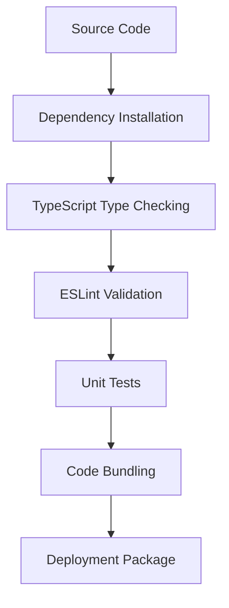
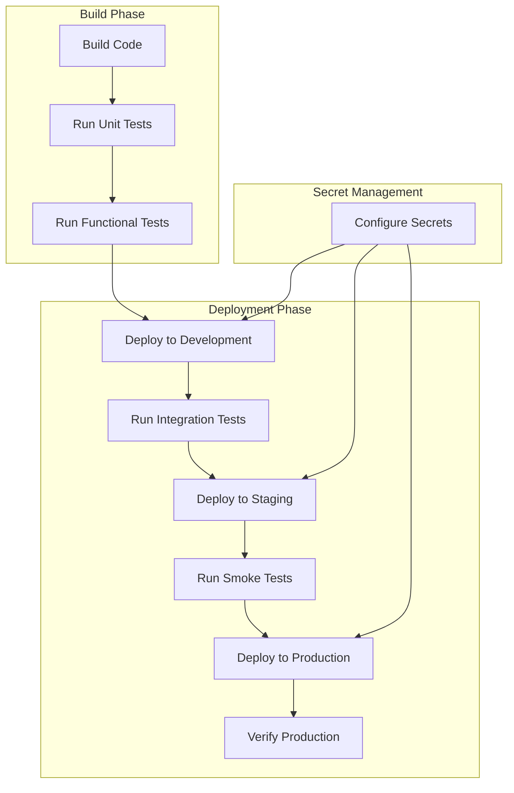
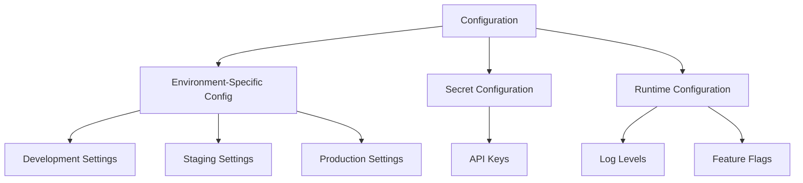
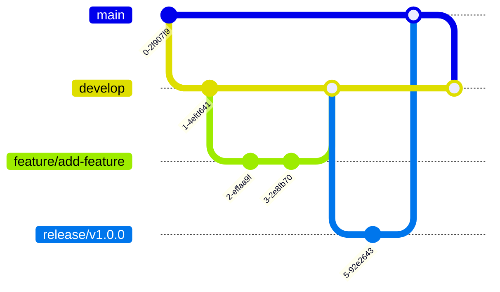
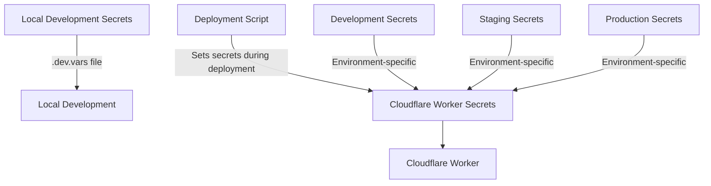
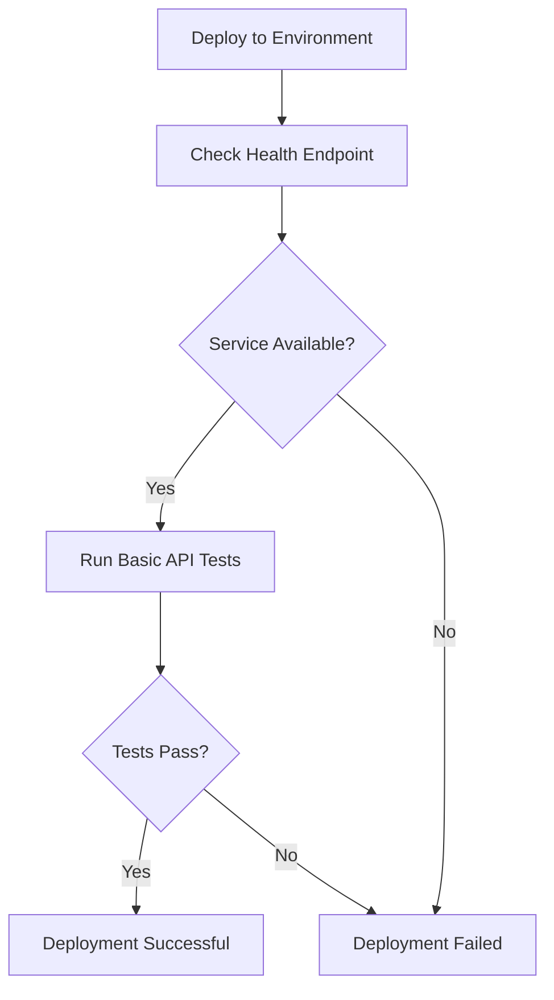
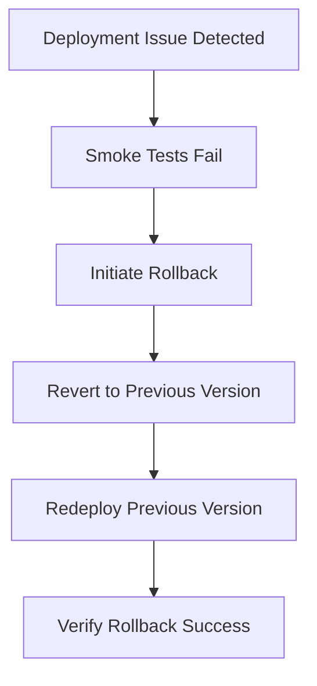

# Software Architecture Document – Build and Deployment Architecture

[Home](index.md) | [Up](index.md) | [Previous](06_Technologies_Used.md) | [Next](08_Runtime_View.md)

## Build Process

The OCR Checks Server uses a structured build process to transform source code into deployable artifacts. The process handles dependency resolution, transpilation, bundling, and optimization.

### Build Process Overview



### Key Build Steps

1. **Dependency Installation**
   - NPM is used to install project dependencies
   - Package versions are locked via package-lock.json
   - Development and production dependencies are differentiated

2. **TypeScript Type Checking**
   - TypeScript compiler validates type correctness
   - Interface implementations are verified
   - Type errors must be resolved before proceeding

3. **Code Linting**
   - ESLint enforces code style and quality rules
   - TypeScript-specific rules are applied
   - Linting errors must be fixed before proceeding

4. **Unit Testing**
   - Jasmine test runner executes unit tests
   - Test coverage is evaluated
   - All tests must pass before proceeding

5. **Code Bundling**
   - Wrangler bundles the code for Cloudflare Workers
   - Dependencies are included in the bundle
   - Bundle is optimized for Workers runtime

### Build Tools and Configuration

#### TypeScript Configuration

TypeScript compilation is configured via `tsconfig.json`:

```json
{
  "compilerOptions": {
    "target": "ES2020",
    "module": "ESNext",
    "moduleResolution": "node",
    "esModuleInterop": true,
    "strict": true,
    "experimentalDecorators": true,
    "emitDecoratorMetadata": true,
    "skipLibCheck": true,
    "forceConsistentCasingInFileNames": true
  },
  "include": ["src/**/*.ts"],
  "exclude": ["node_modules", "dist"]
}
```

Key TypeScript configuration choices:
- ES2020 target for modern JavaScript features
- ESNext module format for dynamic imports
- Strict type checking enabled
- Decorator support for InversifyJS
- Node.js module resolution

#### ESLint Configuration

Code quality is enforced via ESLint with the configuration in `eslint.config.js`.

Key ESLint rules include:
- TypeScript-specific rules
- Modern JavaScript best practices
- Formatting standards
- Error prevention rules

#### Jasmine Configuration

Testing is configured via `jasmine.json`:

```json
{
  "spec_dir": "tests",
  "spec_files": [
    "**/*[sS]pec.ts",
    "**/*[tT]est.ts"
  ],
  "helpers": [
    "helpers/**/*.ts"
  ],
  "stopSpecOnExpectationFailure": false,
  "random": true
}
```

## Deployment Pipeline

The deployment pipeline automates the process of building, testing, and deploying the application to different environments.

### Deployment Process Overview



### Deployment Environments

The system supports three distinct deployment environments:

1. **Development Environment**
   - URL: ocr-checks-worker-dev.af-4a0.workers.dev
   - Purpose: Development testing, feature validation
   - Debug settings: MISTRAL_DEBUG=true, detailed logging

2. **Staging Environment**
   - URL: ocr-checks-worker-staging.af-4a0.workers.dev
   - Purpose: Pre-production testing, client integration testing
   - Debug settings: MISTRAL_DEBUG=true, detailed logging

3. **Production Environment**
   - URL: ocr-checks-worker.af-4a0.workers.dev
   - Purpose: Live production service
   - Debug settings: MISTRAL_DEBUG=false, minimal logging

### Deployment Tools

#### Wrangler CLI

Cloudflare's Wrangler CLI is the primary deployment tool:

```bash
# Development deployment
npm run deploy:with-secrets -- dev

# Staging deployment
npm run deploy:with-secrets -- staging

# Production deployment
npm run deploy:with-secrets -- production
```

The deployment script (`scripts/deploy-with-secrets.sh`) handles:
- Setting up secrets for the target environment
- Executing the Wrangler deployment
- Verifying deployment success

#### Wrangler Configuration

Deployment configuration is managed via `wrangler.toml`:

```toml
# Development environment
[env.dev]
name = "ocr-checks-worker-dev"
workers_dev = true
vars = { ENVIRONMENT = "development", MISTRAL_DEBUG = true }

# Staging environment
[env.staging]
name = "ocr-checks-worker-staging"
workers_dev = true
vars = { ENVIRONMENT = "staging", MISTRAL_DEBUG = true }

# Production environment
[env.production]
name = "ocr-checks-worker"
workers_dev = true
vars = { ENVIRONMENT = "production", MISTRAL_DEBUG = false }
```

## Environment Configuration

Each environment has specific configuration parameters and settings.

### Configuration Management



### Configuration Sources

1. **wrangler.toml**
   - Environment-specific settings
   - Resource limits
   - Environment variables

2. **Cloudflare Worker Secrets**
   - API keys (Mistral AI)
   - Authentication credentials
   - Other sensitive configuration

3. **Configuration Files**
   - `src/config/mistral-client-config.json` for Mistral client settings
   - Type definitions for configuration validation

### Configuration Validation

Configuration is validated at runtime:
- API keys must meet format requirements
- Mistral client configuration must be valid
- Environment settings are checked for correctness

## CI/CD Strategy

The continuous integration and continuous deployment (CI/CD) strategy follows GitFlow principles.

### GitFlow Workflow



The GitFlow model includes:
- `main` branch for production-ready code
- `develop` branch for development integration
- Feature branches for new development
- Release branches for version preparation
- Hotfix branches for critical fixes

### Development Workflow

1. **Feature Development**
   - Create feature branch from develop: `git flow feature start feature-name`
   - Develop and test the feature
   - Merge back to develop: `git flow feature finish feature-name`

2. **Release Process**
   - Create release branch from develop: `git flow release start v1.x.0`
   - Finalize and test the release
   - Merge to main and develop: `git flow release finish v1.x.0`

3. **Hotfix Process**
   - Create hotfix branch from main: `git flow hotfix start v1.x.1`
   - Fix the critical issue
   - Merge to main and develop: `git flow hotfix finish v1.x.1`

### Automated Tests

The CI/CD pipeline includes several types of automated tests:

1. **Unit Tests**
   - Test individual components in isolation
   - Run via: `npm run test:unit`
   - Fast execution for rapid feedback

2. **Functional Tests**
   - Test function interaction patterns
   - Run via: `npm run test:functional`
   - Focus on business logic

3. **Integration Tests**
   - Test end-to-end system behavior
   - Run via: `npm run test:integration`
   - Verify component interaction

4. **Semi-Integration Tests**
   - Test against real external services
   - Run via: `npm run test:semi`
   - Verify external dependencies

5. **Performance Tests**
   - Test system performance characteristics
   - Run via: `npm run test:performance`
   - Verify performance meets requirements

6. **Smoke Tests**
   - Verify basic functionality after deployment
   - Run via: `npm run test:smoke`
   - Quick verification of critical paths

### Deployment Automation Script

The `deploy-with-secrets.sh` script automates the deployment process:

```bash
#!/bin/bash
# Deployment script with secret management

# Colors for better readability
RED='\033[0;31m'
GREEN='\033[0;32m'
BLUE='\033[0;34m'
YELLOW='\033[1;33m'
NC='\033[0m' # No Color

echo -e "${BLUE}=== OCR Checks Server Deployment ===${NC}"

# Check if .dev.vars exists
if [ ! -f ".dev.vars" ]; then
  echo -e "${RED}Error: .dev.vars file not found${NC}"
  exit 1
fi

# Extract Mistral API key from .dev.vars
MISTRAL_API_KEY=$(grep 'MISTRAL_API_KEY=' .dev.vars | cut -d '=' -f 2)

if [ -z "$MISTRAL_API_KEY" ]; then
  echo -e "${RED}Error: MISTRAL_API_KEY not found in .dev.vars${NC}"
  exit 1
fi

echo -e "${BLUE}Step 1: Setting up secrets...${NC}"

# Set environment to dev by default, but allow override with parameter
ENV="dev"
if [ -n "$1" ]; then
  ENV="$1"
fi

ENV_FLAG="--env $ENV"
echo -e "${BLUE}Deploying to environment: $ENV${NC}"

# Try to set the Mistral API key as a secret
echo -e "${BLUE}Setting MISTRAL_API_KEY secret...${NC}"
echo "$MISTRAL_API_KEY" | wrangler secret put MISTRAL_API_KEY $ENV_FLAG

echo -e "${BLUE}Step 2: Deploying application...${NC}"
# Run the deployment with environment
npm run deploy -- $ENV_FLAG
```

## Versioning Strategy

The system uses semantic versioning (SemVer) for version management.

### Version Numbering

The version format is: `MAJOR.MINOR.PATCH`

- **MAJOR**: Incremented for incompatible API changes
- **MINOR**: Incremented for backward-compatible feature additions
- **PATCH**: Incremented for backward-compatible bug fixes

### Version Management

Versions are tracked in:
- `package.json` for the Node.js package
- Git tags for release points
- Release branches for version preparation

### Release Documentation

Each release includes:
- Release summary document in `docs/releases/`
- Version-specific release notes
- Documentation updates for new features

## Secret Management

Secrets and sensitive configuration are managed securely.

### Secret Storage



1. **Local Development**
   - Secrets stored in `.dev.vars` file (not committed to version control)
   - Format: `KEY=value`

2. **Deployed Environments**
   - Secrets stored in Cloudflare Worker Secrets
   - Set via Wrangler CLI during deployment
   - Environment-specific secret scopes

### Secret Types

1. **API Keys**
   - Mistral AI API key
   - Managed via Worker Secrets

2. **Configuration Secrets**
   - Environment-specific configuration
   - Managed via Worker Secrets

### Secret Deployment

Secrets are deployed using Wrangler:

```bash
# Set a secret for development environment
echo "your-api-key" | wrangler secret put MISTRAL_API_KEY --env dev

# Set a secret for staging environment
echo "your-api-key" | wrangler secret put MISTRAL_API_KEY --env staging

# Set a secret for production environment
echo "your-api-key" | wrangler secret put MISTRAL_API_KEY --env production
```

## Smoke Testing

After deployment, smoke tests verify basic functionality.

### Smoke Test Process



### Smoke Test Implementation

Smoke tests are implemented in `scripts/smoke-test.sh` and include:
- Health endpoint verification
- Basic API functionality tests
- Configuration validation

### Smoke Test Execution

Smoke tests can be run with:

```bash
# Run smoke tests on development environment
npm run test:smoke:dev

# Run smoke tests on staging environment
npm run test:smoke:staging

# Run smoke tests on production environment
npm run test:smoke:production
```

## Rollback Strategy

In case of deployment issues, a rollback process is available.

### Rollback Process



### Rollback Methods

1. **Version Rollback**
   - Redeployment of previous version from Git tag
   - Execution of deployment script with previous version

2. **Worker Version Rollback**
   - Cloudflare Workers maintains version history
   - Rollback to previous worker version via Cloudflare dashboard

---

[Home](index.md) | [Up](index.md) | [Previous](06_Technologies_Used.md) | [Next](08_Runtime_View.md)