# Software Architecture Document – Runtime View

[Home](index.md) | [Up](index.md) | [Previous](07_Build_Deployment.md) | [Next](09_Data_Architecture.md)

## System Initialization

The OCR Checks Server follows a specific initialization sequence when starting up in the Cloudflare Workers environment. This sequence ensures that all dependencies are properly configured and services are available before handling requests.

### Initialization Sequence

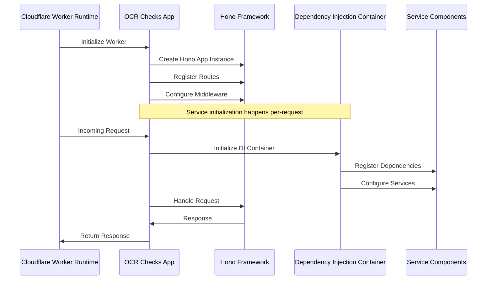

### Key Initialization Steps

1. **Worker Initialization**
   - Cloudflare Workers environment instantiates the worker
   - Module exports are evaluated
   - `app` instance is created

2. **Route Registration**
   - API routes are registered with the Hono framework
   - Middleware is configured for all routes
   - Static file handlers are set up

3. **Per-Request Initialization**
   - Dependency injection container is created or retrieved
   - Services are registered and configured
   - API key validation occurs

4. **Request Processing**
   - Incoming request is passed to the appropriate route handler
   - Services are used to process the request
   - Response is generated and returned

### Service Initialization

The following services are initialized during the startup process:

| Service | Initialization | Dependencies |
|---------|----------------|--------------|
| Hono App | At worker start | None |
| Dependency Injection Container | Per request | IoE (I/O services) |
| Mistral Client | On first use via DI | API Key, Configuration |
| OCR Provider | On first use via DI | Mistral Client |
| JSON Extractor | On first use via DI | Mistral Client |
| Scanner Services | On first use via DI | OCR Provider, JSON Extractor |
| Validators | On first use via DI | None |

## Key Processes

The OCR Checks Server handles several key runtime processes. The following sections describe the most important process flows in the system.

### Document Processing Process

The document processing workflow is the core functionality of the system:

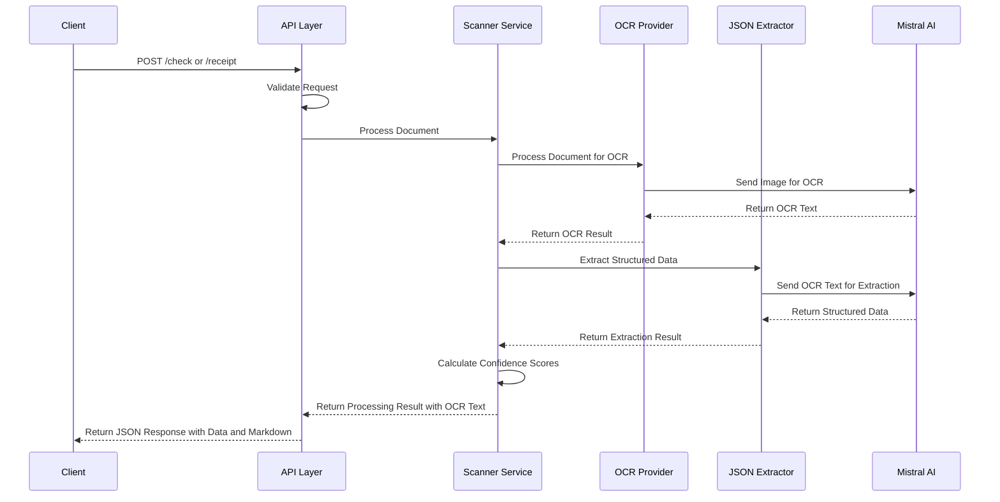

1. **Request Reception**
   - Client sends document image to `/check` or `/receipt` endpoint
   - API layer validates content type and request format

2. **Document Scanning**
   - Scanner service orchestrates the processing workflow
   - Document is sent to OCR provider for text extraction
   - OCR text is sent to extractor for structured data extraction

3. **Result Processing**
   - Confidence scores are calculated for extraction accuracy
   - Results are formatted according to API schema, including raw OCR text
   - Response is returned to client with both structured data and markdown

### Universal Document Processing

The system also supports a universal document processing endpoint:

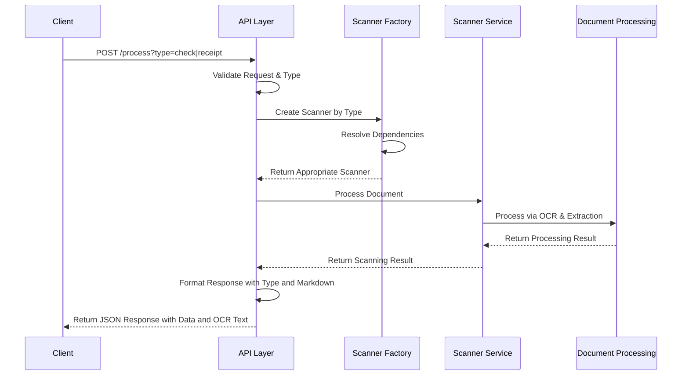

The universal endpoint provides flexibility by:
- Supporting multiple document types via a single endpoint

## AI Model Architecture Decision

### Mistral AI to Cloudflare Llama Migration

**Issue**: The system originally used Mistral AI for both OCR processing and JSON extraction. However, **Mistral AI service demonstrated significant instability issues** including:
- Frequent timeout errors during JSON extraction
- Connection failures and unreliable API responses
- Inconsistent response times affecting user experience
- Service interruptions impacting production reliability

**Solution**: Migration to hybrid AI architecture:
- **OCR Processing**: Continue using Mistral AI (`mistral-ocr-latest`) - stable performance
- **JSON Extraction**: Migrate to Cloudflare Workers AI (`@cf/meta/llama-3.3-70b-instruct-fp8-fast`) - edge-native reliability

**Benefits of Migration**:
- **Improved Reliability**: Edge-native processing eliminates external service dependencies for JSON extraction
- **Consistent Performance**: Cloudflare's infrastructure provides stable, predictable response times  
- **Reduced Complexity**: Eliminates complex retry logic needed for unstable Mistral AI JSON extraction
- **Cost Efficiency**: Cloudflare Workers AI competitive pricing model
- **Maintained Quality**: Preserves anti-hallucination detection and validation logic

**Current Architecture** (v1.63.0+):
- **Remote Environments** (dev, staging, production): Cloudflare Llama 3.3 for JSON extraction
- **Local Development**: Mistral AI for JSON extraction (for development consistency)
- **All Environments**: Mistral AI for OCR processing (stable service area)
- Using the factory pattern to create appropriate scanners
- Maintaining consistent response format with document type information

### Health Check Process

The health check endpoint verifies system health:

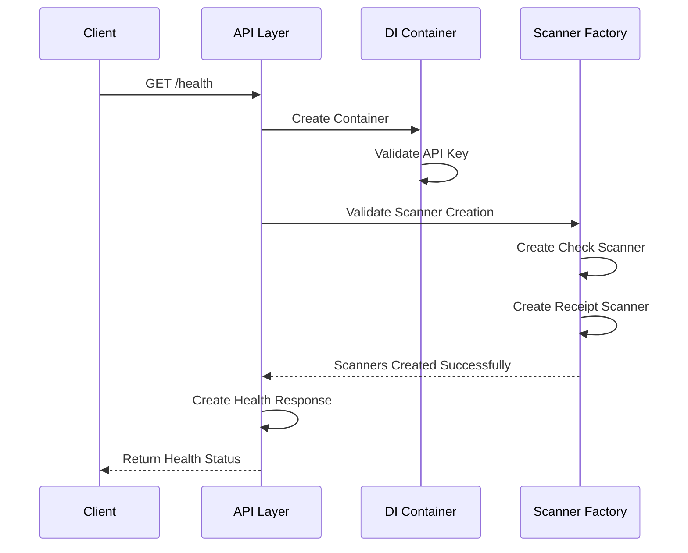

The health check process:
- Validates the DI container configuration
- Verifies scanner factory functionality
- Confirms API key availability and format
- Returns version, status, and timestamp information

## Request Processing Workflows

### Check Processing Workflow

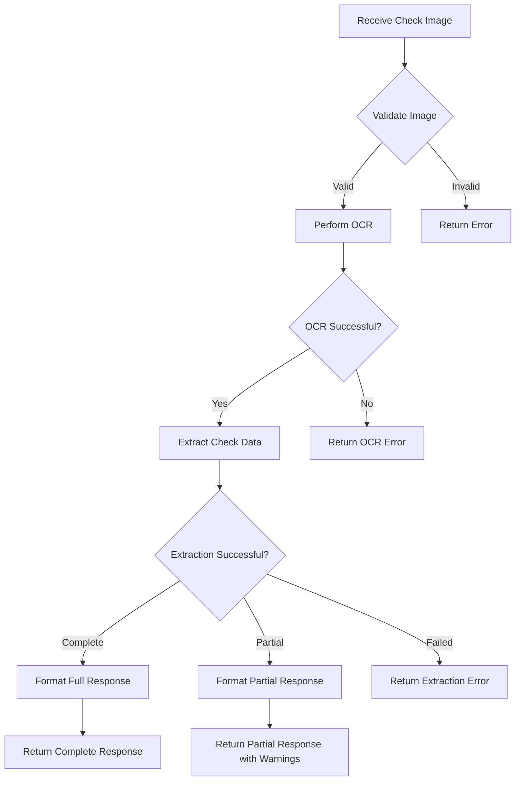

The check processing workflow:
1. Validates the uploaded check image
2. Performs OCR on the check image
3. Extracts structured data from OCR text
4. Formats response based on extraction success

### Receipt Processing Workflow


The receipt processing workflow follows a similar pattern to check processing but uses receipt-specific extraction logic.

## Exception Handling

The OCR Checks Server implements a comprehensive exception handling strategy to ensure robust operation.

### Error Handling Approach

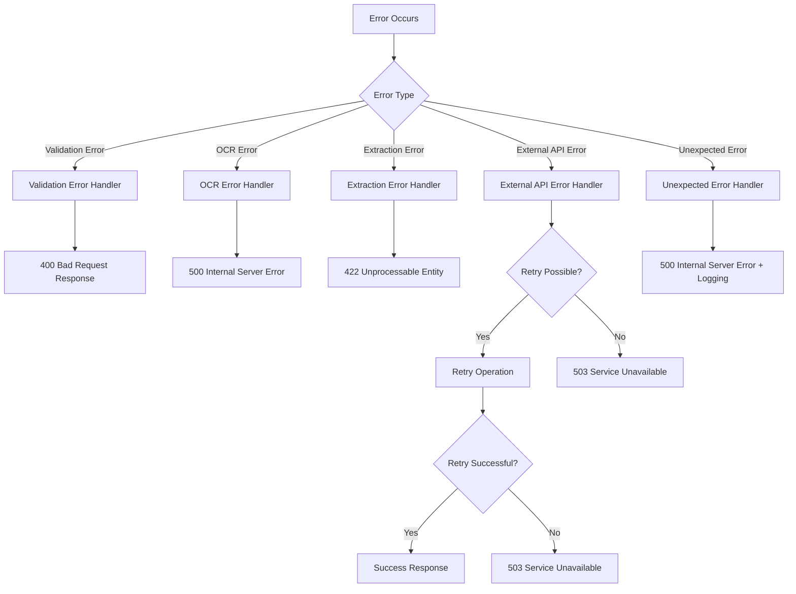

### Error Types and Handling

| Error Type | Handling Approach | Response Code | Example |
|------------|-------------------|---------------|---------|
| Validation Error | Return descriptive error message | 400 Bad Request | Invalid image format |
| OCR Error | Return error with details | 500 Internal Server Error | OCR processing failed |
| Extraction Error | Return partial data or error | 422 Unprocessable Entity | Unable to extract data |
| External API Error | Retry with exponential backoff | 503 Service Unavailable | Mistral API unavailable |
| Unexpected Error | Log error and return generic message | 500 Internal Server Error | Unhandled exception |

### Result Type Pattern

The system uses the Result type pattern for error handling:

```typescript
// Result type definition (pseudocode)
type Result<T, E> = ['ok', T] | ['error', E];

// Usage example
async function processDocument(document: Document): Promise<Result<ScanResult, string>> {
  try {
    // Processing logic
    return ['ok', result];
  } catch (error) {
    return ['error', 'Failed to process document: ' + error.message];
  }
}

// Error handling example
const result = await processDocument(document);
if (result[0] === 'error') {
  // Handle error case
  return new Response(JSON.stringify({ error: result[1] }), {
    status: 500,
    headers: { 'Content-Type': 'application/json' }
  });
}
// Handle success case
```

### Retry Strategy

The system implements a retry strategy for transient errors:

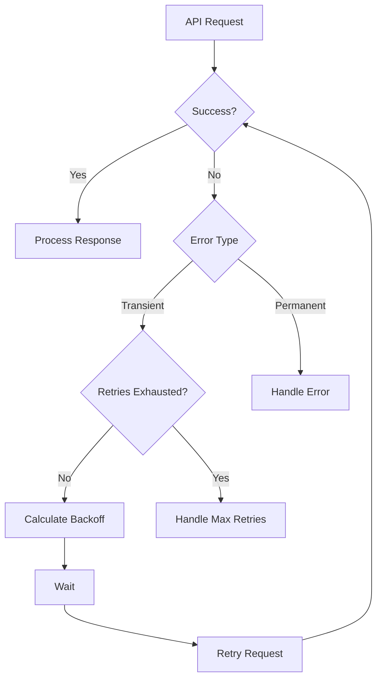

Retry configuration for Mistral AI API requests:

```typescript
// Retry configuration
const retryConfig = {
  strategy: "backoff",
  backoff: {
    initialInterval: 1000,    // Initial retry delay in ms
    maxInterval: 10000,       // Maximum retry delay
    exponent: 1.8,            // Backoff exponent
    maxElapsedTime: 25000     // Maximum total retry time
  },
  retryConnectionErrors: true
};
```

## Memory Management

The OCR Checks Server operates in a constrained memory environment due to Cloudflare Workers limits.

### Memory Constraints

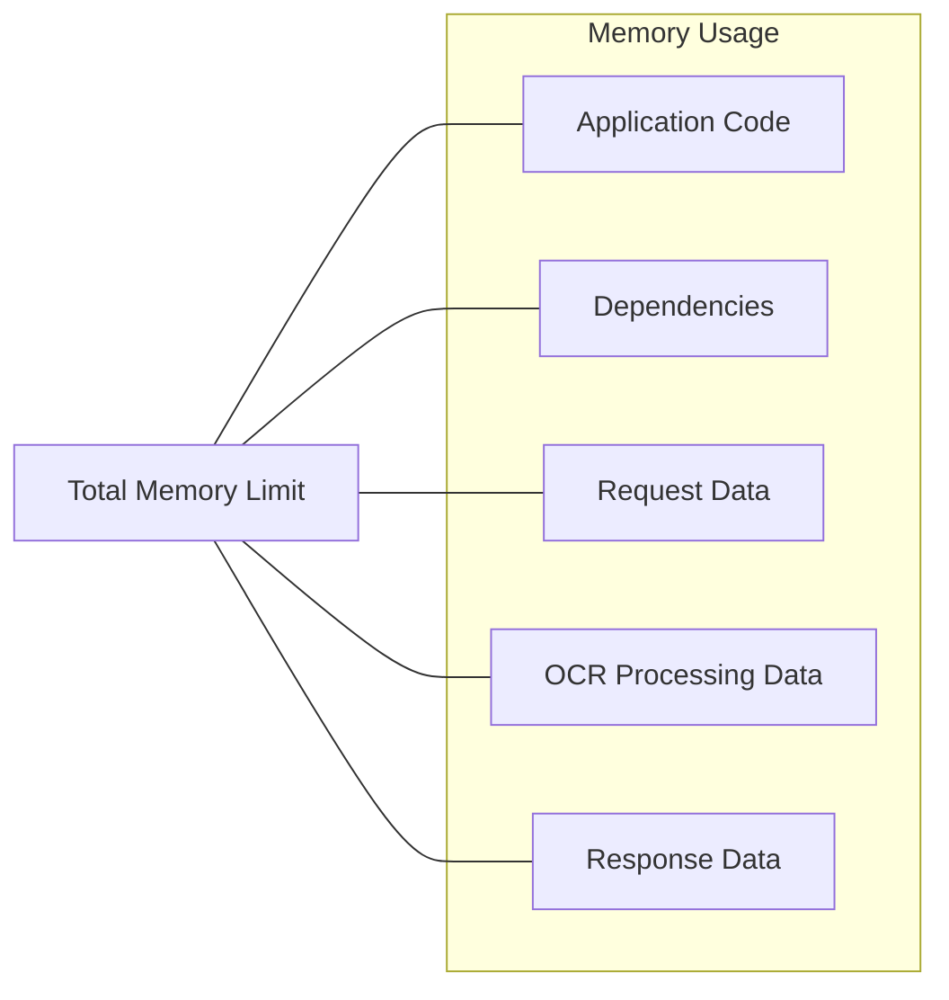

The system optimizes memory usage through:
- Efficient data structures
- Stream processing where possible
- Minimal dependency usage
- Careful handling of large documents
- Cleanup of temporary data

### Image Processing Memory Management

Image processing is particularly memory-intensive:

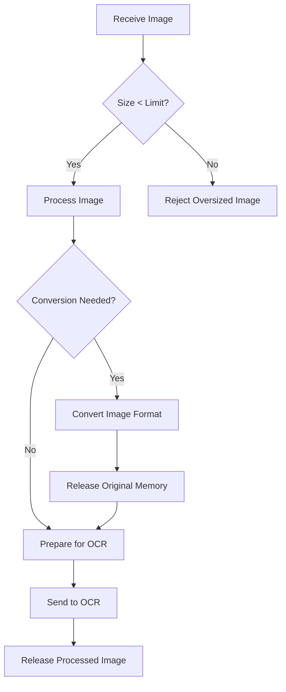

The system manages memory during image processing by:
- Validating image sizes before processing
- Converting images to efficient formats when needed
- Releasing memory as soon as possible
- Processing in chunks when dealing with large documents

## Concurrency Model

Cloudflare Workers use an event-driven, single-threaded execution model with async/await patterns.

### Request Handling Concurrency

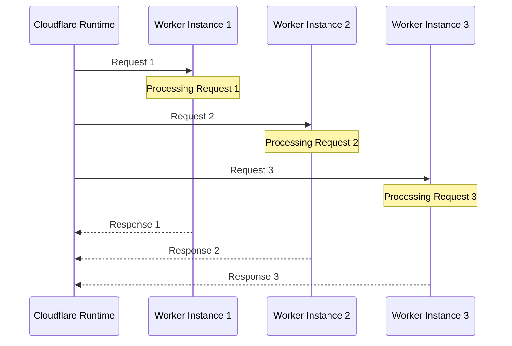

Key aspects of the concurrency model:
- Each request is handled by a separate worker instance
- No shared memory between requests
- Stateless design eliminates concurrency issues
- Async/await pattern for I/O operations

### Async Operation Handling

The system uses promises and async/await extensively:

```typescript
// Example async handler (pseudocode)
app.post('/check', async (c) => {
  try {
    // Async operations
    const imageBuffer = await c.req.arrayBuffer();
    const scanner = ScannerFactory.createMistralCheckScanner(workerIoE, c.env.MISTRAL_API_KEY);
    const document = { content: imageBuffer, type: DocumentType.Image };
    const result = await scanner.processDocument(document);
    
    // Handle result
    if (result[0] === 'error') {
      return new Response(JSON.stringify({ error: result[1] }), {
        status: 500,
        headers: { 'Content-Type': 'application/json' }
      });
    }
    
    // Return successful response
    return new Response(JSON.stringify({
      data: result[1].json,
      markdown: result[1].rawText,
      confidence: {
        ocr: result[1].ocrConfidence,
        extraction: result[1].extractionConfidence,
        overall: result[1].overallConfidence
      }
    }), {
      status: 200,
      headers: { 'Content-Type': 'application/json' }
    });
  } catch (error) {
    // Handle unexpected errors
    console.error('Error processing check:', error);
    return new Response(JSON.stringify({ message: 'Internal server error', error }), {
      status: 500,
      headers: { 'Content-Type': 'application/json' }
    });
  }
});
```

## System State Management

The OCR Checks Server is designed as a stateless system, with no persistent state between requests.

### Stateless Design

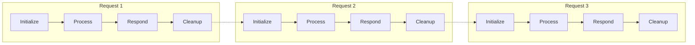

The stateless design:
- Eliminates shared state issues
- Enables horizontal scaling
- Simplifies the programming model
- Increases system resilience

### Per-Request State

Each request maintains its own isolated state:

1. **Request Context**
   - Request parameters and headers
   - Uploaded document data
   - Environment configuration

2. **Processing Context**
   - OCR results
   - Raw OCR text (markdown)
   - Extracted structured data
   - Confidence scores

3. **Response Context**
   - Formatted structured JSON data
   - Raw OCR text (markdown field)
   - Error information if applicable
   - Response headers

## Startup and Shutdown

Cloudflare Workers have specific startup and shutdown behaviors:

### Worker Lifecycle

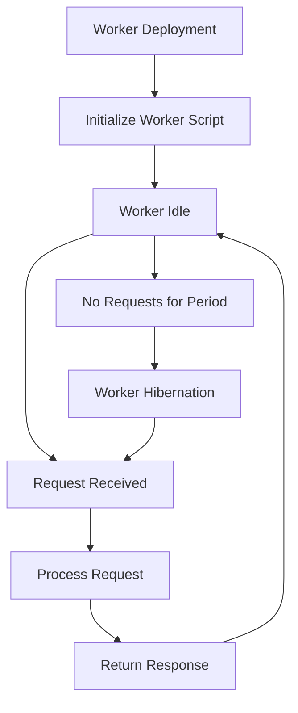

#### Startup Process

When a Worker script is first deployed or activated:
1. Worker script is loaded into the V8 isolate
2. Module-level code is executed
3. Worker enters idle state waiting for requests

#### Per-Request Activation

When a request is received:
1. Request handler is invoked
2. Dependency container is initialized
3. Services are configured
4. Request is processed
5. Response is returned

#### Hibernation

After a period of inactivity:
1. Worker instance may be hibernated
2. Resources are freed
3. Next request will require reactivation

There is no explicit shutdown process in Cloudflare Workers; the platform manages worker lifecycle automatically.

---

[Home](index.md) | [Up](index.md) | [Previous](07_Build_Deployment.md) | [Next](09_Data_Architecture.md)