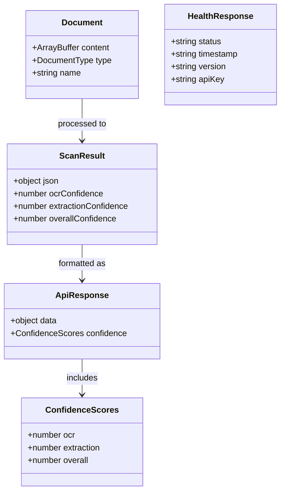
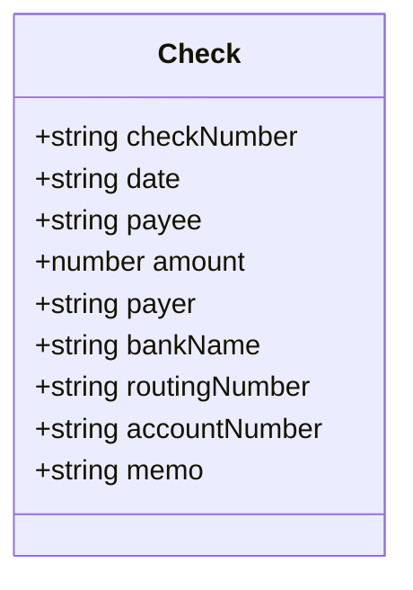
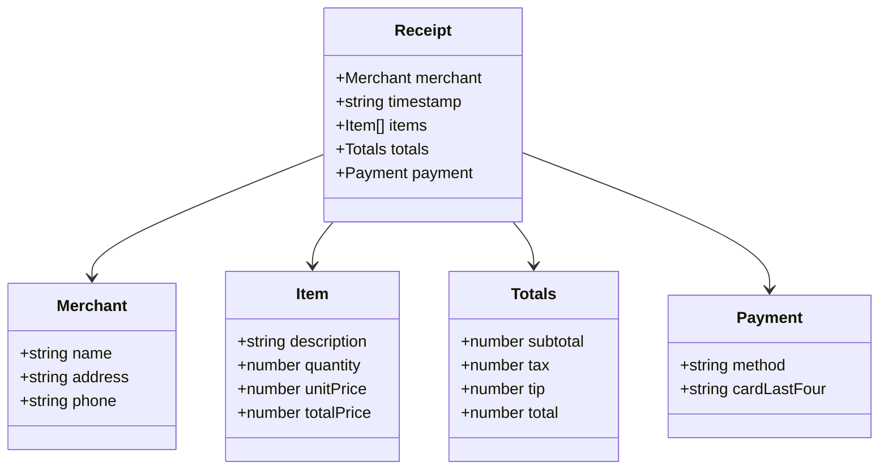
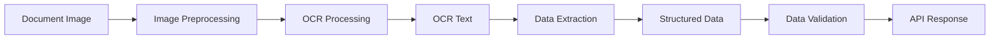
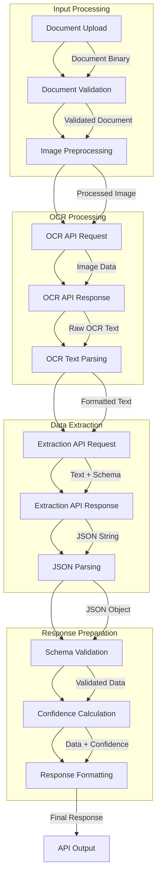
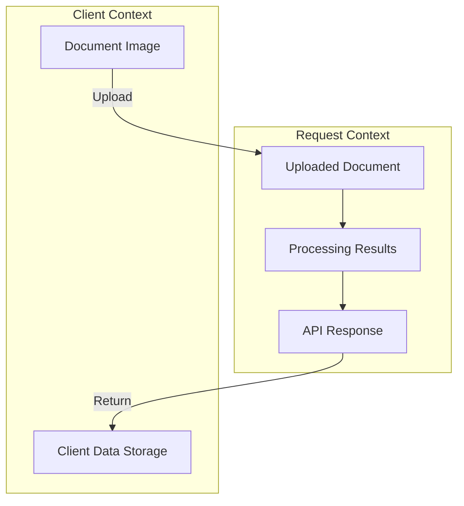
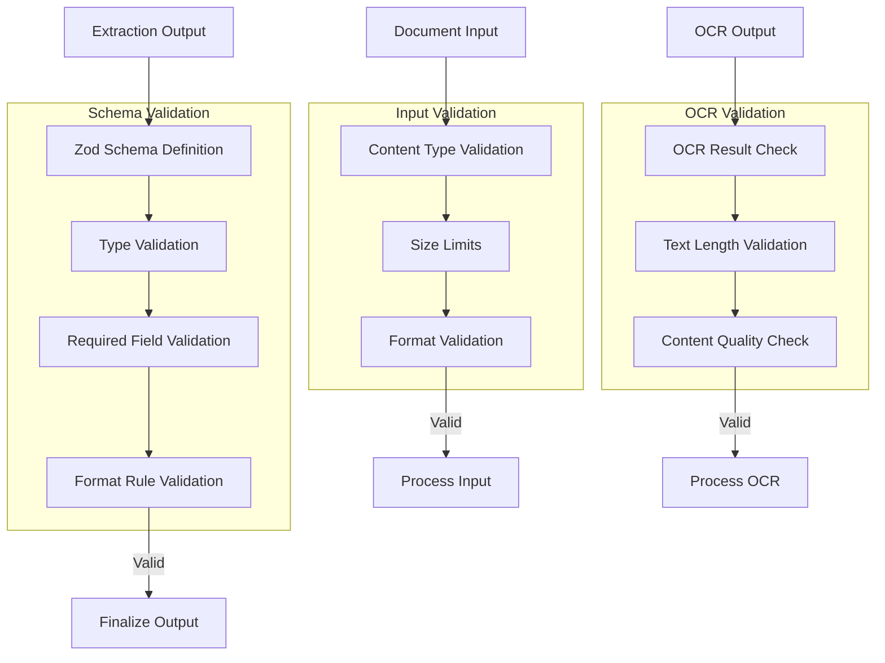
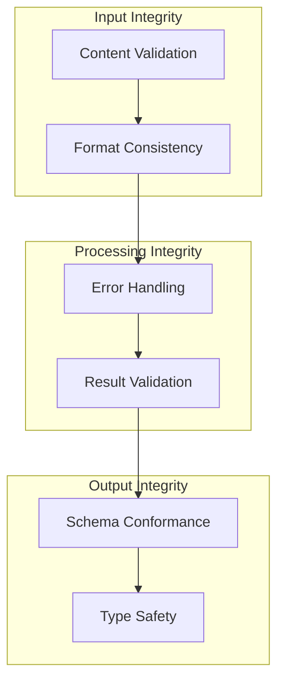
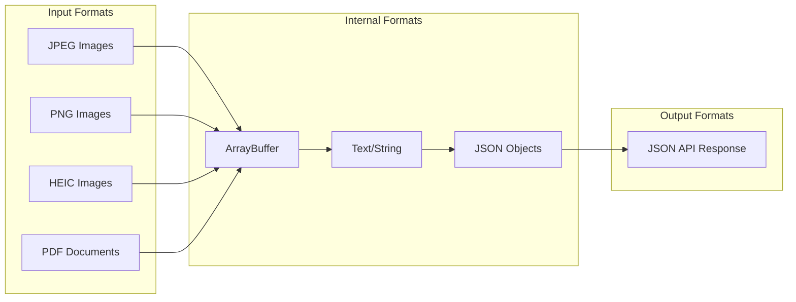
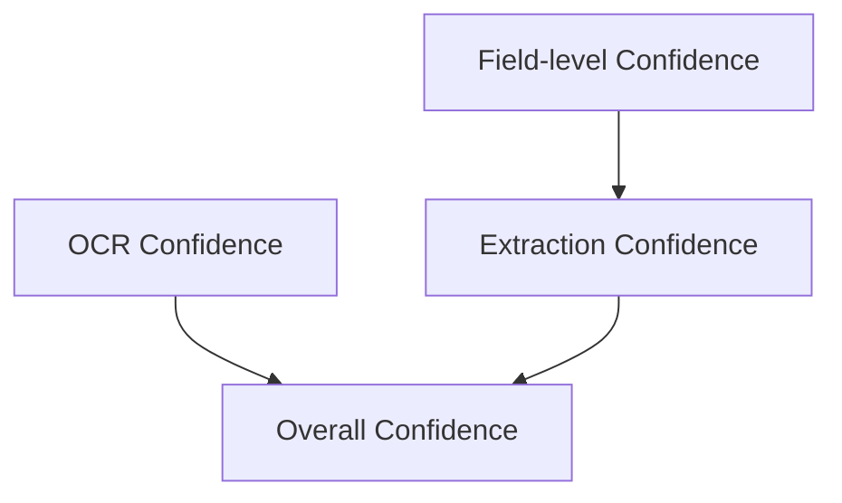

# Software Architecture Document – Data Architecture

[Home](index.md) | [Up](index.md) | [Previous](08_Runtime_View.md) | [Next](10_Security_Architecture.md)

## Data Models

The OCR Checks Server works with several core data models that represent documents, processing results, and configuration information.

### Core Data Models



### Document Models

The system uses two primary document models: checks and receipts.

#### Check Model



The Check model represents a paper check with the following properties:

| Property | Type | Description | Required |
|----------|------|-------------|----------|
| checkNumber | string | Check sequence number | Yes |
| date | string | Date the check was written (YYYY-MM-DD) | Yes |
| payee | string | Person or entity receiving the payment | Yes |
| amount | number | Payment amount in decimal format | Yes |
| payer | string | Person or entity making the payment | Yes |
| bankName | string | Name of the bank issuing the check | No |
| routingNumber | string | Bank routing number | No |
| accountNumber | string | Bank account number | No |
| memo | string | Memo or note on the check | No |

#### Receipt Model



The Receipt model represents a purchase receipt with the following structure:

| Property | Type | Description | Required |
|----------|------|-------------|----------|
| merchant | object | Merchant information | Yes |
| merchant.name | string | Merchant name | Yes |
| merchant.address | string | Merchant address | No |
| merchant.phone | string | Merchant phone number | No |
| timestamp | string | Purchase date and time (ISO 8601) | Yes |
| items | array | List of purchased items | Yes |
| items[].description | string | Item description | Yes |
| items[].quantity | number | Quantity purchased | No |
| items[].unitPrice | number | Price per unit | No |
| items[].totalPrice | number | Total price for this item | Yes |
| totals | object | Receipt totals | Yes |
| totals.subtotal | number | Sum before tax and tip | Yes |
| totals.tax | number | Tax amount | No |
| totals.tip | number | Tip amount | No |
| totals.total | number | Final total amount | Yes |
| payment | object | Payment information | No |
| payment.method | string | Payment method (CASH, CREDIT_CARD, etc.) | No |
| payment.cardLastFour | string | Last four digits of card (if applicable) | No |

### Processing Models

The system uses several internal models to manage the processing pipeline:

#### Document Type

```typescript
enum DocumentType {
  Image = "image",
  PDF = "pdf"
}
```

#### OCR Result

```typescript
type OCRResult = Result<OCROutput, string>;
type OCROutput = [OCREntry[]];
type OCREntry = { text: string; confidence: number };
```

#### Extraction Result

```typescript
type ExtractionResult = Result<ExtractionOutput, string>;
type ExtractionOutput = {
  json: object;
  confidence: number;
};
```

#### Scanner Result

```typescript
type ScannerResult = Result<ScanResult, string>;
type ScanResult = {
  json: object;
  ocrConfidence: number;
  extractionConfidence: number;
  overallConfidence: number;
};
```

### Schema Models

The system uses Zod schemas to define and validate data structures:

```typescript
// Check schema example (simplified)
const checkSchema = z.object({
  checkNumber: z.string(),
  date: z.string().regex(/^\d{4}-\d{2}-\d{2}$/),
  payee: z.string(),
  amount: z.number().positive(),
  payer: z.string(),
  bankName: z.string().optional(),
  routingNumber: z.string().optional(),
  accountNumber: z.string().optional(),
  memo: z.string().optional()
});

// Receipt schema example (simplified)
const receiptSchema = z.object({
  merchant: z.object({
    name: z.string(),
    address: z.string().optional(),
    phone: z.string().optional()
  }),
  timestamp: z.string(),
  items: z.array(z.object({
    description: z.string(),
    quantity: z.number().optional(),
    unitPrice: z.number().optional(),
    totalPrice: z.number()
  })),
  totals: z.object({
    subtotal: z.number(),
    tax: z.number().optional(),
    tip: z.number().optional(),
    total: z.number()
  }),
  payment: z.object({
    method: z.string().optional(),
    cardLastFour: z.string().optional()
  }).optional()
});
```

## Data Flow

The OCR Checks Server processes data through a well-defined flow from input to output.

### Main Data Flow



### Detailed Data Flow



### Data Transformation

As data flows through the system, it undergoes several transformations:

1. **Document Image to Binary**
   - Upload conversion to ArrayBuffer
   - Format normalization if needed

2. **Binary to OCR Text**
   - Image processing by Mistral AI
   - Text extraction from image

3. **OCR Text to Structured Data**
   - Schema-guided extraction via Mistral AI
   - JSON structure creation from text

4. **Structured Data to API Response**
   - Schema validation
   - Confidence score calculation
   - Response formatting

## Data Storage

The OCR Checks Server operates as a stateless system and does not maintain persistent data storage.

### Temporary Storage

Data is held temporarily in memory during request processing:



Temporary data includes:
- Uploaded document image (held during processing)
- OCR results (held during extraction)
- Extracted data (held during response preparation)

### No Persistence

The system deliberately avoids data persistence for several reasons:
- Privacy considerations for financial documents
- Simplification of architecture and deployment
- Reduction of security risk
- Alignment with serverless computing model
- Compliance with data minimization principles

### Client-Side Storage

Storage responsibility is delegated to client applications, which may:
- Store processed document data
- Maintain history of processed documents
- Implement their own persistence mechanisms

## Data Validation

The OCR Checks Server implements comprehensive data validation throughout the processing pipeline.

### Validation Approach



### Validation Implementations

Several validator classes handle different validation needs:

1. **Base Validator**
   - Abstract base class with common validation logic
   - Error handling pattern standardization
   - Validation result typing

2. **API Key Validator**
   - Validates Mistral API key format and length
   - Prevents invalid API keys from being used

3. **Mistral Config Validator**
   - Validates Mistral client configuration
   - Ensures retry policy is correctly configured

4. **Scanner Input Validator**
   - Validates document input format
   - Ensures document type is supported
   - Checks document content is present

5. **Schema Validators**
   - Check schema validator
   - Receipt schema validator
   - Enforces data structure requirements

### Validation Process

The validation process uses Zod for schema validation:

```typescript
// Example Zod validator (pseudocode)
const validateCheck = (data: unknown): Result<Check, string> => {
  try {
    // Apply the schema validation
    const validatedData = checkSchema.parse(data);
    return ['ok', validatedData];
  } catch (error) {
    if (error instanceof z.ZodError) {
      // Format Zod errors into readable message
      const issues = error.issues.map(issue => 
        `${issue.path.join('.')}: ${issue.message}`
      ).join(', ');
      return ['error', `Validation failed: ${issues}`];
    }
    return ['error', `Unexpected validation error: ${error.message}`];
  }
};
```

## Data Integrity

The OCR Checks Server ensures data integrity throughout the processing pipeline.

### Integrity Measures



1. **Input Integrity**
   - Content type validation
   - Image format verification
   - Size limit enforcement

2. **Processing Integrity**
   - Comprehensive error handling
   - Validation between processing steps
   - Result type pattern for error propagation

3. **Output Integrity**
   - Schema validation before response
   - Type safety through TypeScript
   - Confidence score calculation

### Data Quality

The system implements several measures to enhance data quality:

1. **OCR Quality Enhancement**
   - Image preprocessing when needed
   - Character recognition confidence scoring
   - Contextual text analysis

2. **Extraction Quality**
   - Schema-guided extraction
   - Extraction confidence scoring
   - Partial result handling for degraded documents

3. **Response Quality**
   - Confidence levels for each processing stage
   - Overall confidence score calculation
   - Response format consistency

## Data Serialization

The OCR Checks Server uses consistent serialization formats for data exchange.

### Serialization Formats



1. **Input Serialization**
   - Documents are received as binary data
   - Supported input formats include JPEG, PNG, HEIC, and PDF
   - Binary data is stored as ArrayBuffer

2. **Internal Serialization**
   - OCR results are represented as text strings
   - Structured data is represented as JSON objects
   - TypeScript interfaces ensure type safety

3. **Output Serialization**
   - API responses are serialized as JSON
   - Standard JSON format for compatibility
   - UTF-8 encoding for text

### API Response Format

Standard JSON response format:

```json
{
  "data": {
    // Document-specific data (check or receipt)
  },
  "confidence": {
    "ocr": 0.92,        // OCR confidence score (0-1)
    "extraction": 0.85, // Extraction confidence score (0-1)
    "overall": 0.78     // Combined confidence score (0-1)
  }
}
```

## Confidence Calculation

The system calculates confidence scores to indicate the reliability of extracted data.

### Confidence Score Types



1. **OCR Confidence**
   - Provided by the OCR engine
   - Indicates text recognition quality
   - Range: 0.0 to 1.0

2. **Extraction Confidence**
   - Provided by the extraction engine
   - Indicates structured data extraction quality
   - Range: 0.0 to 1.0

3. **Overall Confidence**
   - Combined measure of OCR and extraction
   - Weighted calculation giving extraction higher weight
   - Range: 0.0 to 1.0

### Confidence Calculation Logic

The overall confidence is calculated using a weighted formula:

```typescript
// Example confidence calculation (pseudocode)
function calculateOverallConfidence(ocrConfidence: number, extractionConfidence: number): number {
  // Extraction confidence is weighted more heavily (60%)
  const extractionWeight = 0.6;
  const ocrWeight = 0.4;
  
  // Calculate weighted average
  const overall = (ocrConfidence * ocrWeight) + (extractionConfidence * extractionWeight);
  
  // Round to 2 decimal places
  return Math.round(overall * 100) / 100;
}
```

---

[Home](index.md) | [Up](index.md) | [Previous](08_Runtime_View.md) | [Next](10_Security_Architecture.md)