# Software Architecture Document – Security Architecture

[Home](index.md) | [Up](index.md) | [Previous](09_Data_Architecture.md) | [Next](11_Integration_External_Interfaces.md)

## Security Overview

The OCR Checks Server processes sensitive financial documents, making security a critical aspect of the architecture. The security architecture is designed to protect all aspects of the system, including data in transit, API access control, and configuration management.

### Security Layers

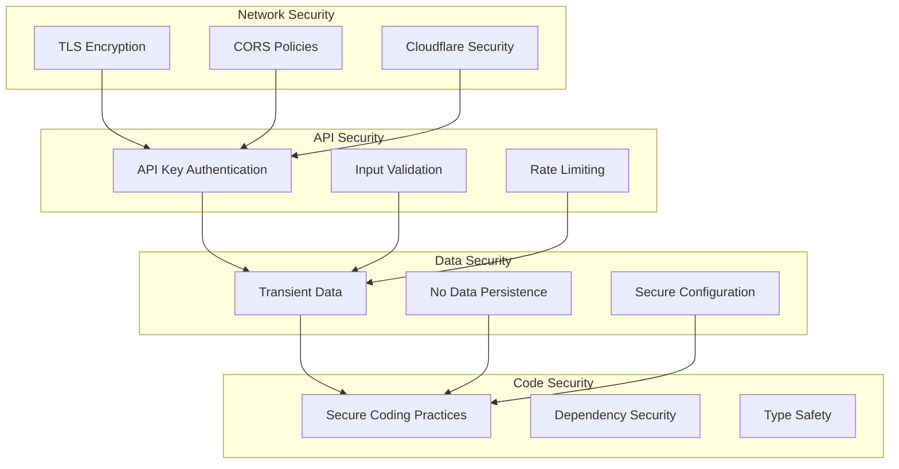

## Authentication and Authorization

The OCR Checks Server implements authentication and authorization mechanisms to control access to its functionalities.

### Authentication Mechanism

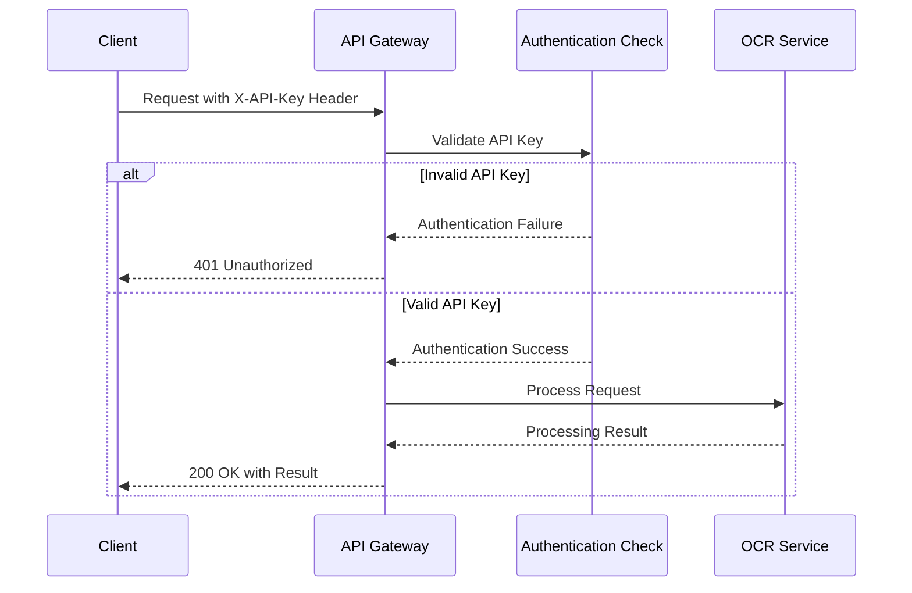

#### API Key Authentication

The system uses API key-based authentication:

1. **API Key Format**
   - Mistral AI API key used for service authentication
   - Key format validation enforced
   - Minimum length requirements

2. **API Key Transmission**
   - API key is stored as a Cloudflare Worker Secret
   - Key is never exposed in responses
   - Key is used for Mistral AI service authentication

3. **API Key Validation**
   - Validation at system initialization
   - Formal validation using Zod schema
   - Length and format checks

### Authorization Model

The system currently implements a simple authorization model:

1. **Service Access**
   - Valid API key grants access to all service functions
   - No granular permission model currently implemented
   - Future enhancement: role-based access control

2. **Environmental Controls**
   - Development environment: relaxed validation for testing
   - Staging environment: production-like validation
   - Production environment: strict validation

3. **Health Endpoint**
   - Health endpoint accessible without authentication
   - Limited information disclosed (status, version, timestamp)
   - API key truncated in health response (first 4 characters only)

## Data Protection

The OCR Checks Server implements multiple levels of data protection to safeguard sensitive financial information.

### Data in Transit

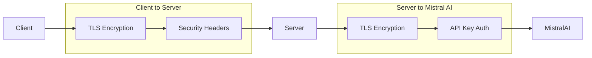

1. **TLS Encryption**
   - All API communication uses HTTPS
   - Managed by Cloudflare's edge network
   - Modern TLS protocols enforced

2. **Security Headers**
   - CORS headers to control access
   - Content-Type enforcement
   - No sensitive data in headers

### Data in Processing

As a serverless application, all data remains in memory only during request processing:

1. **Transient Storage Only**
   - No data persisted between requests
   - Memory cleared after request completion
   - No database or file storage used

2. **Memory Management**
   - Document images held in memory only during processing
   - Processed data discarded after response
   - No caching of document images or OCR results

3. **Data Minimization**
   - Only necessary data is collected and processed
   - Only extracted results are returned
   - Raw OCR text not included in responses

### Sensitive Data Handling

The system handles several types of sensitive data:

1. **Financial Document Data**
   - Check information (account numbers, routing numbers)
   - Receipt details (payment information, card numbers)
   - Merchant and personal information

2. **API Keys and Secrets**
   - Mistral AI API key
   - No keys included in code or configuration files
   - Keys stored in Cloudflare Worker Secrets

3. **Configuration Data**
   - Environment-specific configuration
   - Debug settings
   - Service URLs

### Secret Management

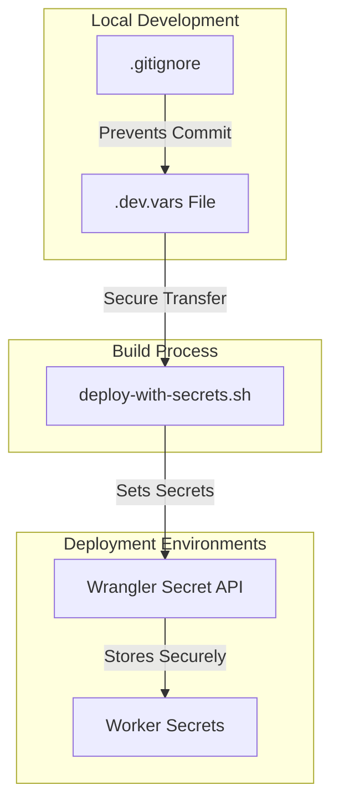

1. **Local Development Secrets**
   - Stored in `.dev.vars` file (git-ignored)
   - Never committed to version control
   - Used only for local development

2. **Deployed Environment Secrets**
   - Managed via Cloudflare Worker Secrets
   - Set during deployment process
   - Environment-specific secret scopes

3. **Secret Deployment Process**
   - `deploy-with-secrets.sh` script handles secret management
   - Extracts secrets from local files
   - Sets secrets in Cloudflare environment

## API Security

The OCR Checks Server implements several measures to secure its API endpoints.

### Input Validation

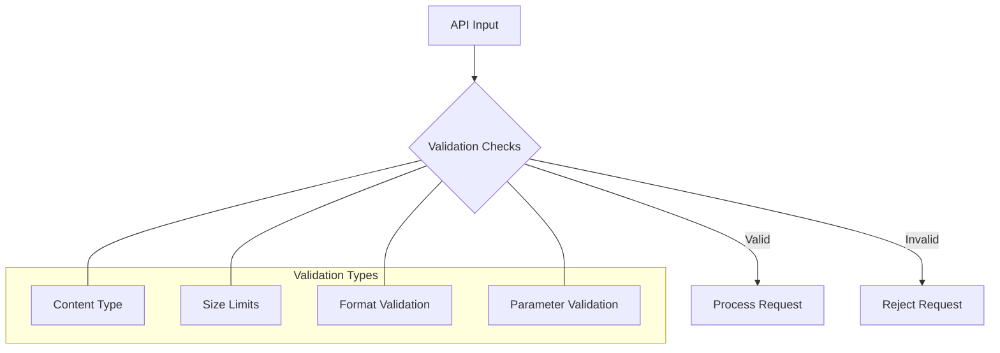

1. **Request Validation**
   - Content type validation
   - Image format verification
   - Size limit enforcement
   - Parameter type checking

2. **Error Responses**
   - Clear error messages
   - Appropriate HTTP status codes
   - No sensitive information in errors

3. **Schema Validation**
   - Zod schemas for data validation
   - Type checking for all inputs
   - Format validation for structured data

### CORS Configuration

The system implements Cross-Origin Resource Sharing (CORS) to control which domains can access the API:

```typescript
// CORS configuration
app.options('*', (c) => {
  return new Response(null, {
    status: 204,
    headers: {
      'Access-Control-Allow-Origin': '*',
      'Access-Control-Allow-Methods': 'GET, POST, PUT, DELETE, OPTIONS',
      'Access-Control-Allow-Headers': 'Content-Type, Authorization, X-API-Key',
      'Access-Control-Max-Age': '86400',
    }
  });
});

// Add CORS headers to all responses
app.use('*', async (c, next) => {
  await next();
  
  // Get the response
  const response = c.res;
  
  // Add CORS headers
  response.headers.set('Access-Control-Allow-Origin', '*');
  response.headers.set('Access-Control-Allow-Methods', 'GET, POST, PUT, DELETE, OPTIONS');
  response.headers.set('Access-Control-Allow-Headers', 'Content-Type, Authorization, X-API-Key');
});
```

Key CORS settings:
- Access-Control-Allow-Origin: '*' (allows all origins)
- Access-Control-Allow-Methods: Specifies allowed HTTP methods
- Access-Control-Allow-Headers: Allows specific headers including API key header
- Access-Control-Max-Age: Caches preflight requests to improve performance

### Rate Limiting

The system leverages Cloudflare's rate limiting capabilities:

1. **Request Rate Limiting**
   - Limits the number of requests per minute
   - Prevents API abuse and DoS attacks
   - Configurable per environment

2. **Resource Rate Limiting**
   - Limits on CPU usage (50ms per request)
   - Total execution time limits (30 seconds)
   - Prevents resource exhaustion

## Infrastructure Security

The OCR Checks Server leverages Cloudflare's robust security infrastructure.

### Cloudflare Security Features

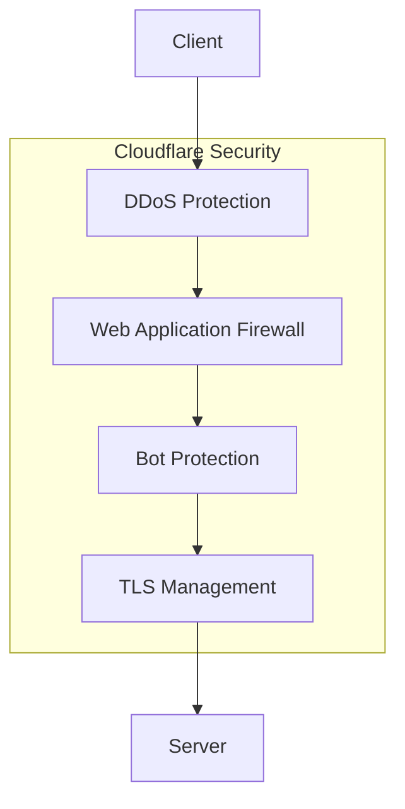

1. **DDoS Protection**
   - Automatic protection against distributed denial-of-service attacks
   - Traffic analysis and filtering
   - Anycast network distribution

2. **Web Application Firewall**
   - Protection against common web vulnerabilities
   - SQL injection prevention
   - Cross-site scripting (XSS) protection

3. **Bot Protection**
   - Identification and blocking of malicious bots
   - Challenge-based verification for suspicious traffic
   - Machine learning detection of automated attacks

4. **TLS Management**
   - Automatic certificate management
   - Modern TLS protocol enforcement
   - Secure cipher suite selection

### Isolation Model

Cloudflare Workers use a secure isolation model:

1. **V8 Isolates**
   - Each request runs in an isolated V8 environment
   - No shared memory between requests
   - Prevents cross-request data leakage

2. **Stateless Design**
   - No persistent state between requests
   - Clean memory state for each request
   - Minimizes attack surface

## Secure Communication

The system implements secure communication patterns for all interactions.

### Client-Server Communication

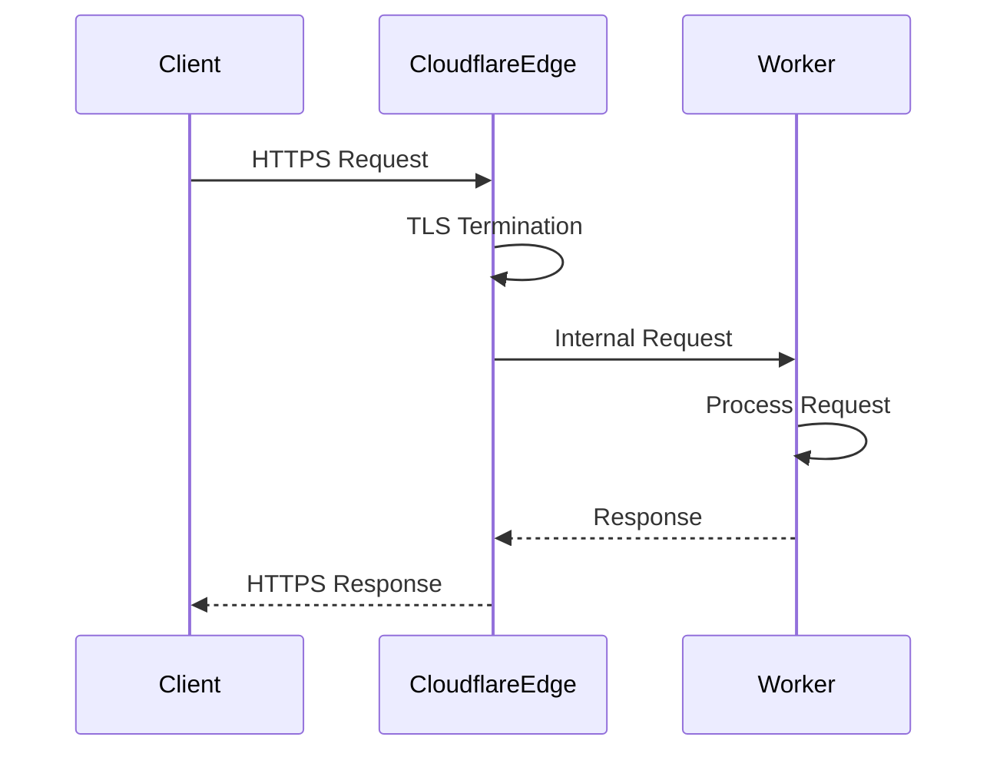

1. **Transport Layer Security**
   - All client-server communication uses HTTPS
   - TLS 1.2+ enforced
   - Managed by Cloudflare edge network

2. **API Endpoint Security**
   - Well-defined API contracts
   - Input validation at API boundaries
   - Clear error handling

### Server-Mistral Communication

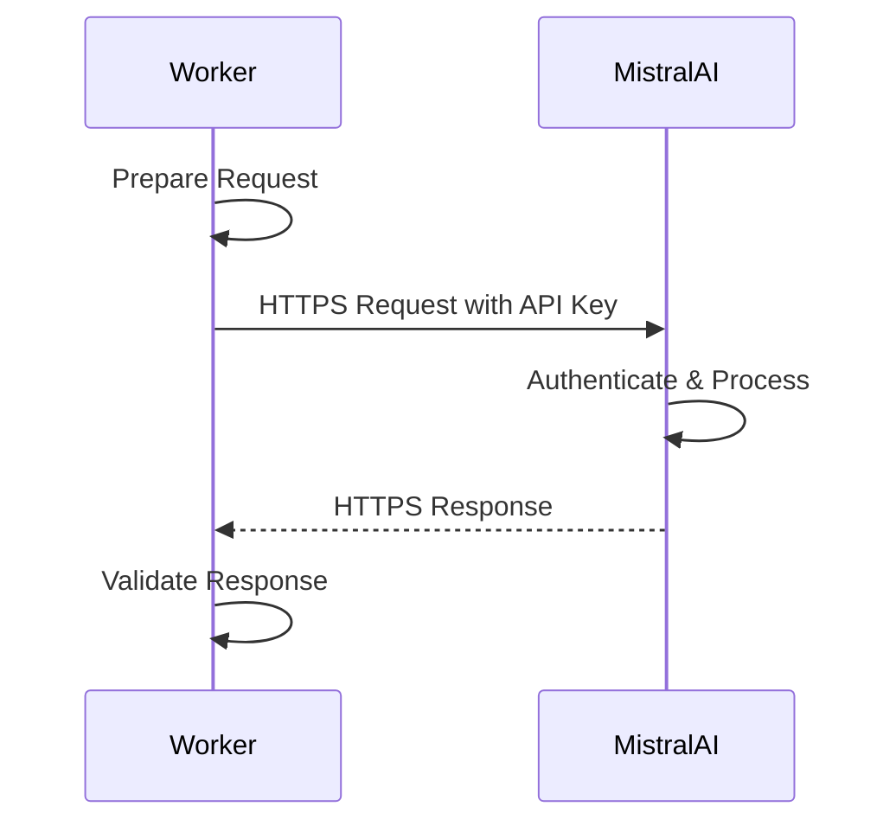

1. **Secure API Integration**
   - HTTPS for all Mistral AI communication
   - API key authentication
   - Request and response validation

2. **Error Handling**
   - Retry mechanism for transient errors
   - Circuit breaking for persistent failures
   - Secure error reporting (no sensitive data)

## Threat Mitigation

The OCR Checks Server implements strategies to mitigate various security threats.

### Common Web Vulnerabilities

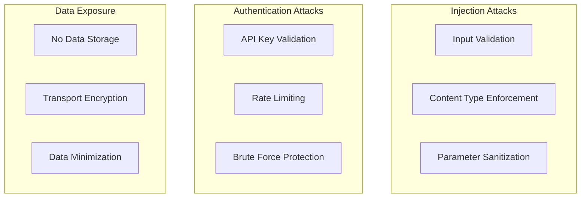

1. **Injection Prevention**
   - Strict input validation
   - Content type enforcement
   - No database queries (eliminates SQL injection)

2. **Cross-Site Scripting Prevention**
   - JSON-only responses (no HTML rendering)
   - Content-Type headers enforced
   - Proper encoding of all data

3. **CSRF Protection**
   - API key requirement for all sensitive operations
   - No cookies used for authentication
   - POST-only for data-changing operations

### Emerging Threats

The system is designed to address emerging threats:

1. **AI Model Attacks**
   - Input validation for AI model requests
   - Response validation from AI services
   - Monitoring for unusual patterns

2. **Supply Chain Attacks**
   - Dependency security scanning
   - Pin dependencies to specific versions
   - Regular updates of dependencies

3. **Zero-Day Vulnerabilities**
   - Cloudflare's rapid patching capability
   - Minimal attack surface due to serverless design
   - Defense-in-depth approach

## Security Controls

The OCR Checks Server implements several security controls to ensure comprehensive protection.

### Preventive Controls

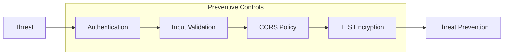

1. **Authentication Controls**
   - API key validation
   - Key format requirements
   - Secure key storage

2. **Input Validation Controls**
   - Schema-based validation
   - Content type checking
   - Size and format limitations

3. **Network Controls**
   - HTTPS enforcement
   - Cloudflare DDoS protection
   - CORS policy implementation

### Detective Controls

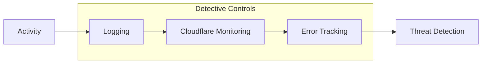

1. **Logging Controls**
   - Request logging (no sensitive data)
   - Error logging
   - Execution time monitoring

2. **Monitoring Controls**
   - Cloudflare analytics
   - Error rate monitoring
   - Performance monitoring

3. **Anomaly Detection**
   - Unusual traffic patterns
   - Error rate spikes
   - Performance degradation

### Responsive Controls

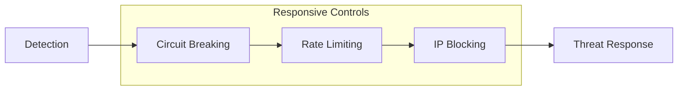

1. **Circuit Breaking**
   - Automatic service protection during failures
   - Graceful degradation
   - Prevents cascading failures

2. **Rate Limiting**
   - Request rate limits
   - Resource usage limits
   - Automatic throttling

3. **Blocking Capabilities**
   - Cloudflare IP blocking
   - Cloudflare bot detection
   - Traffic filtering

## Compliance Considerations

The OCR Checks Server is designed with consideration for various financial and data protection regulations.

### Regulatory Framework

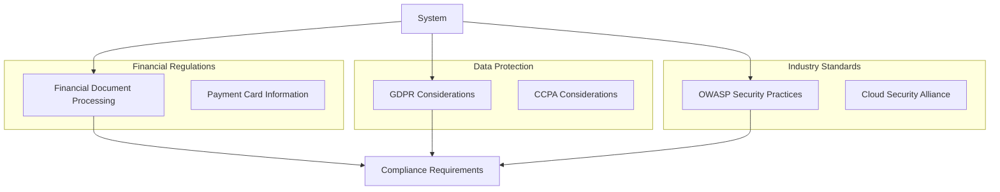

Key compliance considerations:

1. **Financial Document Processing**
   - Secure processing of financial information
   - Protection of account numbers and routing information
   - No persistent storage of financial documents

2. **Data Protection**
   - Minimal data collection
   - No persistent storage of personal information
   - Secure processing of all data

3. **Industry Best Practices**
   - OWASP Secure Coding Guidelines
   - Cloud Security Alliance recommendations
   - Modern encryption standards

### Compliance Implementation

The system's design supports compliance through:

1. **Data Minimization**
   - Only necessary data is processed
   - No unnecessary data collection
   - Data is discarded after processing

2. **Processing Transparency**
   - Clear documentation of data flow
   - Confidence scores for data extraction
   - API contract documentation

3. **Security by Design**
   - Security integrated into architecture
   - Threat modeling in design phase
   - Regular security reviews

---

[Home](index.md) | [Up](index.md) | [Previous](09_Data_Architecture.md) | [Next](11_Integration_External_Interfaces.md)