# Software Architecture Document – Integration and External Interfaces

[Home](index.md) | [Up](index.md) | [Previous](10_Security_Architecture.md) | [Next](12_Operational_Concerns.md)

## API Specifications

The OCR Checks Server provides a RESTful API for client applications to interact with the system. The API is designed to be simple, consistent, and well-documented.

### API Overview

```mermaid
graph LR
    subgraph "Client Applications"
        MobileApp[Mobile Apps]
        WebApp[Web Applications]
        ThirdParty[Third-Party Systems]
    end
    
    subgraph "OCR Checks Server API"
        CheckAPI[/check Endpoint]
        ReceiptAPI[/receipt Endpoint]
        ProcessAPI[/process Endpoint]
        HealthAPI[/health Endpoint]
        DocsAPI[/api-docs Endpoint]
    end
    
    MobileApp -->|POST| CheckAPI
    MobileApp -->|POST| ReceiptAPI
    MobileApp -->|POST| ProcessAPI
    MobileApp -->|GET| HealthAPI
    
    WebApp -->|POST| CheckAPI
    WebApp -->|POST| ReceiptAPI
    WebApp -->|POST| ProcessAPI
    WebApp -->|GET| HealthAPI
    WebApp -->|GET| DocsAPI
    
    ThirdParty -->|POST| CheckAPI
    ThirdParty -->|POST| ReceiptAPI
    ThirdParty -->|POST| ProcessAPI
    ThirdParty -->|GET| HealthAPI
```

### API Endpoints

| Endpoint | Method | Purpose | Request Format | Response Format |
|----------|--------|---------|----------------|-----------------|
| `/check` | POST | Process check images | Image (JPEG, PNG, HEIC) | JSON (check data) |
| `/receipt` | POST | Process receipt images | Image (JPEG, PNG, HEIC) | JSON (receipt data) |
| `/process` | POST | General document processing | Image with `type` parameter | JSON (document data) |
| `/health` | GET | System health status | None | JSON (health status) |
| `/api-docs` | GET | API documentation (Swagger UI) | None | HTML (Swagger UI) |
| `/openapi.json` | GET | OpenAPI specification | None | JSON (OpenAPI spec) |

### OpenAPI Specification

The API is fully documented using OpenAPI Specification (formerly Swagger):

```yaml
openapi: 3.0.0
info:
  title: OCR Checks Server API
  description: API for OCR processing of checks and receipts
  version: 1.57.0
servers:
  - url: https://ocr-checks-worker.af-4a0.workers.dev
    description: Production
  - url: https://ocr-checks-worker-staging.af-4a0.workers.dev
    description: Staging
  - url: https://ocr-checks-worker-dev.af-4a0.workers.dev
    description: Development
paths:
  /check:
    post:
      summary: Process a check image
      requestBody:
        content:
          image/*:
            schema:
              type: string
              format: binary
      responses:
        200:
          description: Successful check processing
          content:
            application/json:
              schema:
                $ref: '#/components/schemas/CheckResponse'
  /receipt:
    post:
      summary: Process a receipt image
      requestBody:
        content:
          image/*:
            schema:
              type: string
              format: binary
      responses:
        200:
          description: Successful receipt processing
          content:
            application/json:
              schema:
                $ref: '#/components/schemas/ReceiptResponse'
  /process:
    post:
      summary: Process a document
      parameters:
        - name: type
          in: query
          required: true
          schema:
            type: string
            enum: [check, receipt]
      requestBody:
        content:
          image/*:
            schema:
              type: string
              format: binary
      responses:
        200:
          description: Successful document processing
          content:
            application/json:
              schema:
                $ref: '#/components/schemas/ProcessResponse'
  /health:
    get:
      summary: Check API health
      responses:
        200:
          description: API is healthy
          content:
            application/json:
              schema:
                $ref: '#/components/schemas/HealthResponse'
components:
  schemas:
    CheckResponse:
      type: object
      properties:
        data:
          $ref: '#/components/schemas/Check'
        confidence:
          $ref: '#/components/schemas/Confidence'
    # Additional schema definitions...
```

### Swagger UI Integration

The system provides a Swagger UI interface for interactive API documentation:

```mermaid
graph LR
    Client[Client Browser] -->|GET| APIDocsEndpoint[/api-docs Endpoint]
    APIDocsEndpoint --> SwaggerUI[Swagger UI Interface]
    SwaggerUI -->|GET| OpenAPISpec[/openapi.json]
    OpenAPISpec --> SwaggerUI
    SwaggerUI -->|Interaction| APIEndpoints[API Endpoints]
```

Key features of the Swagger UI integration:
- Interactive API documentation
- Request builder for testing
- Response visualization
- Environment selection (dev, staging, production)
- Schema inspection

## External System Interfaces

The OCR Checks Server interacts with several external systems to provide its functionality.

### Mistral AI Integration

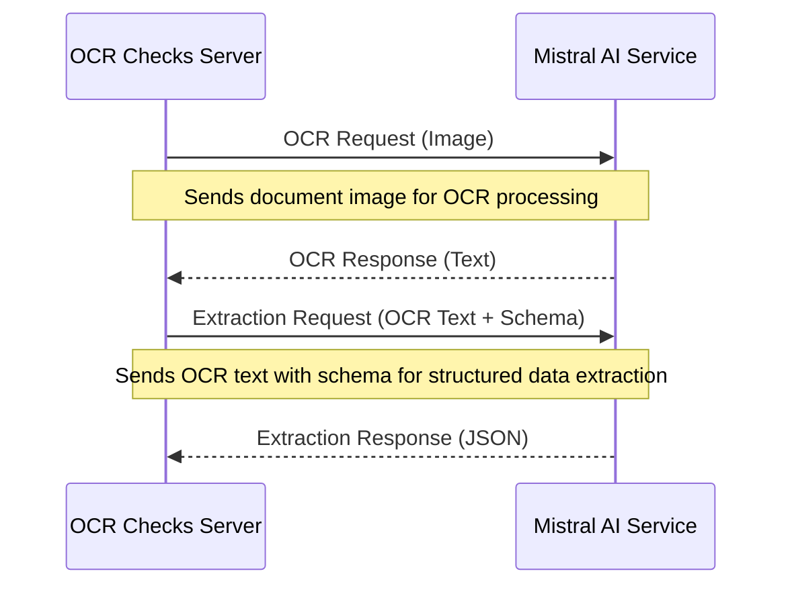

#### Mistral AI Interface Details

1. **OCR Processing Interface**
   - Endpoint: Mistral AI Vision API
   - Authentication: API Key
   - Request Format: Image binary + processing instructions
   - Response Format: JSON with OCR text
   - Error Handling: Retry with exponential backoff

2. **JSON Extraction Interface**
   - Endpoint: Mistral AI Chat API
   - Authentication: API Key
   - Request Format: OCR text + schema definition
   - Response Format: JSON with structured data
   - Error Handling: Retry with exponential backoff

#### Mistral AI Client Configuration

```typescript
// Retry configuration for Mistral API
const retryConfig = {
  strategy: "backoff",
  backoff: {
    initialInterval: 1000,    // Initial retry delay in ms
    maxInterval: 10000,       // Maximum retry delay
    exponent: 1.8,            // Backoff exponent
    maxElapsedTime: 25000     // Maximum total retry time
  },
  retryConnectionErrors: true
};

// Create Mistral client with configuration
const mistralClient = new Mistral({ 
  apiKey: validApiKey,
  retryConfig: typedRetryConfig,
  timeoutMs: 15000
});
```

### Cloudflare Workers Integration

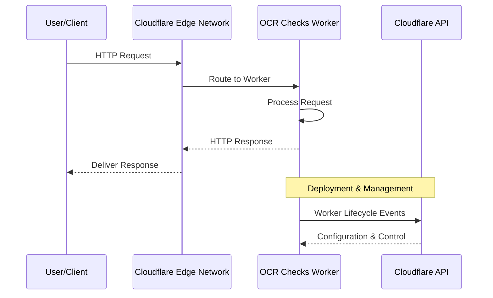

#### Cloudflare Workers Interface Details

1. **Runtime Interface**
   - Environment: V8 Isolate
   - Integration: ES Module exports
   - Request Handling: Event-driven model
   - Resource Limits: CPU and time constraints

2. **Deployment Interface**
   - Tool: Wrangler CLI
   - Configuration: wrangler.toml
   - Authentication: Cloudflare API token
   - Environments: dev, staging, production

3. **Secrets Management Interface**
   - API: Cloudflare Worker Secrets
   - Access: Environment-scoped
   - Storage: Secure and encrypted
   - Usage: Runtime access via environment

## Integration Patterns

The OCR Checks Server implements several integration patterns to facilitate communication with external systems and clients.

### REST API Pattern

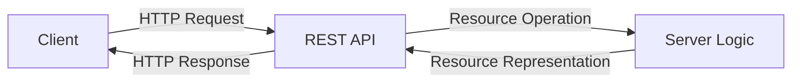

The RESTful API pattern includes:
- Resource-based URL structure
- Standard HTTP methods (POST, GET)
- JSON response format
- Stateless request handling
- Standard HTTP status codes

### Adapter Pattern

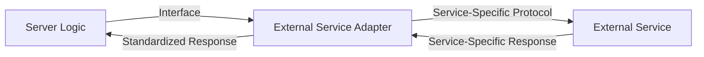

The adapter pattern is used for:
- Mistral AI integration (OCR Provider, JSON Extractor)
- Environment-specific configuration
- API format conversions

### Facade Pattern

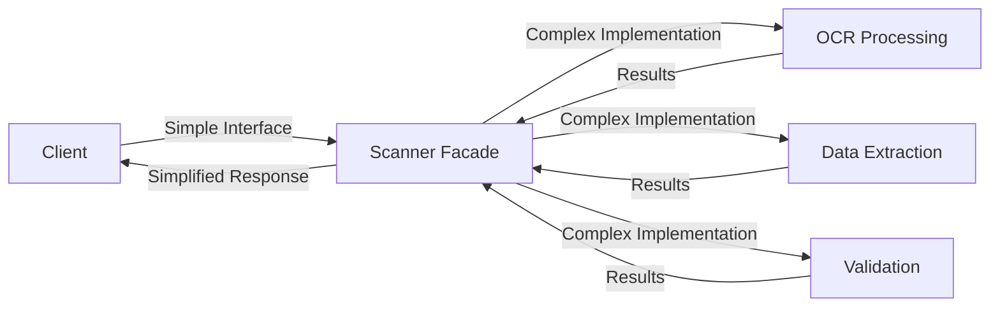

The facade pattern is implemented through:
- Scanner Factory providing a unified interface
- Check and Receipt scanners encapsulating complex processing
- Simplified API endpoints hiding implementation details

### Factory Pattern

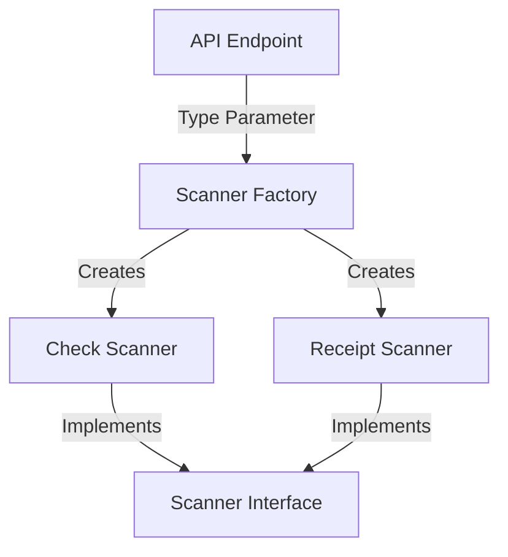

The factory pattern is used to:
- Create appropriate scanner instances based on document type
- Abstract away complex object creation
- Manage dependencies for scanner instances
- Enable extensibility for new document types

## Client Libraries

The OCR Checks Server provides client libraries to simplify integration for specific platforms.

### Swift Client Library

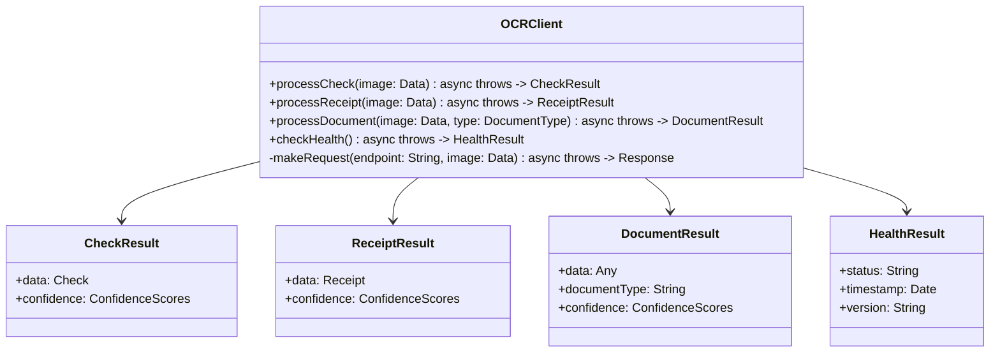

#### Swift Client Features

1. **Modern Swift Design**
   - Swift concurrency (async/await)
   - Type-safe models
   - Error handling with Swift's throwing functions
   - Swift Package Manager support

2. **API Integration**
   - Complete API coverage
   - Environment configuration (dev, staging, production)
   - Automatic HEIC conversion
   - Response parsing and type conversion

3. **Usage Example**

```swift
// Swift client usage example
import NolockOCR

// Initialize the client
let client = OCRClient(environment: .production)

// Process a check image
do {
    let image = try Data(contentsOf: checkImageURL)
    let result = try await client.processCheck(image: image)
    
    // Access the extracted check data
    let check = result.data
    print("Check #\(check.checkNumber)")
    print("Amount: $\(check.amount)")
    print("Date: \(check.date)")
    print("Payee: \(check.payee)")
    
    // Access confidence scores
    print("OCR Confidence: \(result.confidence.ocr)")
    print("Extraction Confidence: \(result.confidence.extraction)")
    print("Overall Confidence: \(result.confidence.overall)")
} catch {
    print("Error processing check: \(error)")
}
```

### NolockCapture Package

The NolockCapture package works alongside the Swift client to provide advanced document capture capabilities:

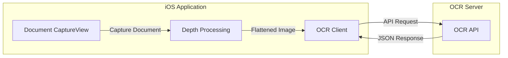

#### NolockCapture Features

1. **Advanced Capture**
   - Depth-aware document capture
   - LiDAR or dual camera support
   - 3D point cloud processing
   - Document plane detection

2. **Image Enhancement**
   - Perspective correction
   - Document flattening
   - Lighting normalization
   - OCR-optimized preprocessing

3. **Integration with OCR Client**
   - Seamless workflow from capture to OCR
   - Type-safe data models
   - Consistent error handling
   - Progressive enhancement design

## Integration Examples

### Mobile Integration Example

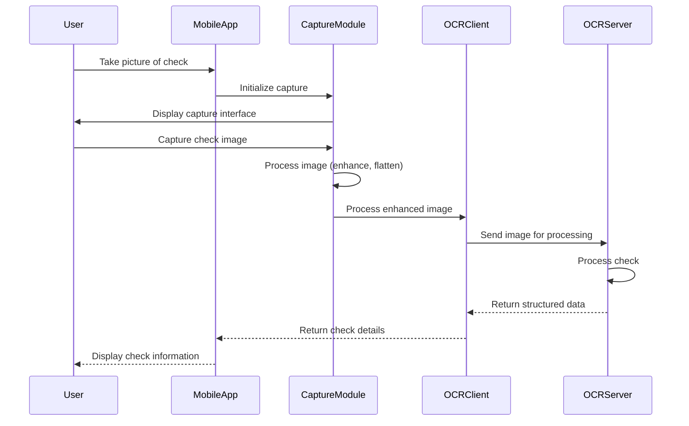

### Web Integration Example

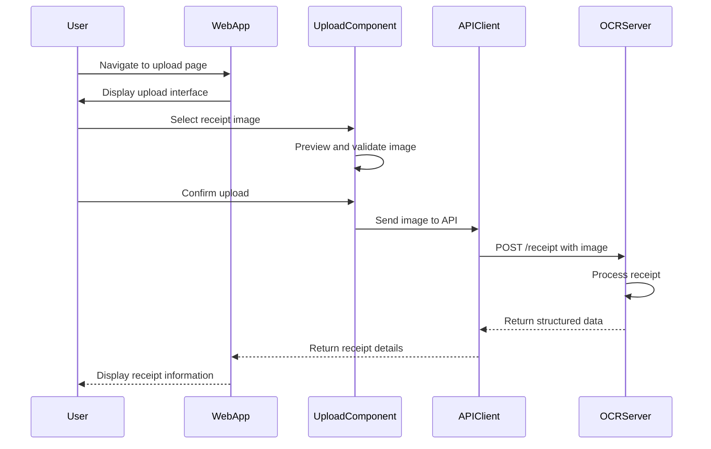

### Third-Party Integration Example

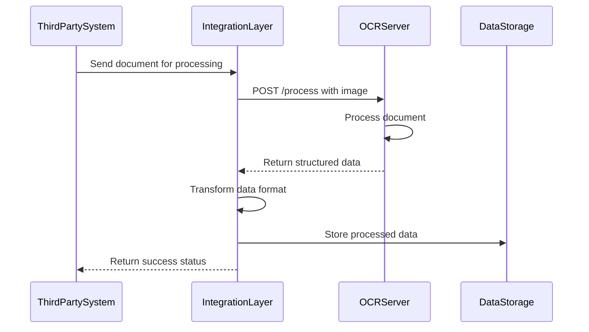

## API Evolution and Versioning

The OCR Checks Server implements an API versioning strategy to enable evolution while maintaining backward compatibility.

### Versioning Strategy

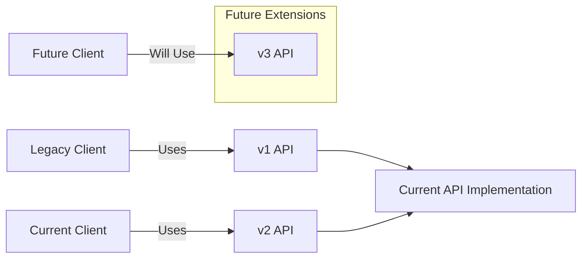

The versioning approach includes:
1. **Semantic Versioning**
   - Major version for breaking changes
   - Minor version for backward-compatible features
   - Patch version for backward-compatible bug fixes

2. **Response Compatibility**
   - Maintain backward compatibility when possible
   - Add new fields without removing existing ones
   - Provide deprecated field warnings

3. **Documentation Updates**
   - OpenAPI specification evolution
   - Swagger UI documentation
   - Changelog maintenance

### API Lifecycle Management

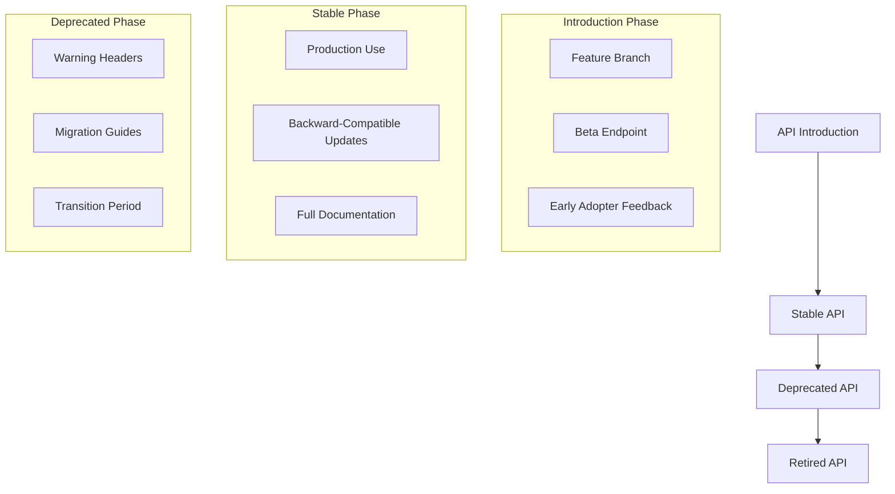

The API lifecycle includes:
1. **Introduction Phase**
   - New features developed in feature branches
   - Beta testing in staging environment
   - Documentation draft for early adopters

2. **Stable Phase**
   - Full production support
   - Backward-compatible enhancements
   - Complete documentation

3. **Deprecation Phase**
   - Announcement of upcoming retirement
   - Migration guides provided
   - Transition period for client updates

---

[Home](index.md) | [Up](index.md) | [Previous](10_Security_Architecture.md) | [Next](12_Operational_Concerns.md)