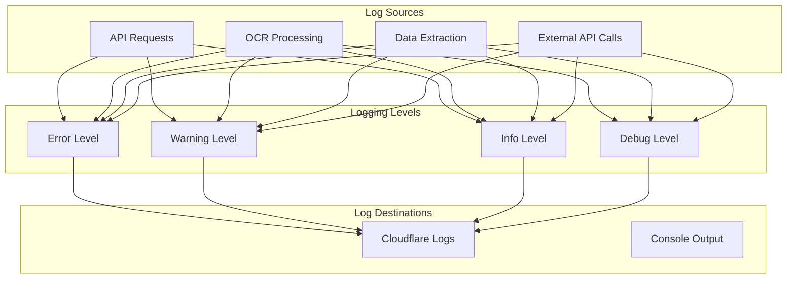
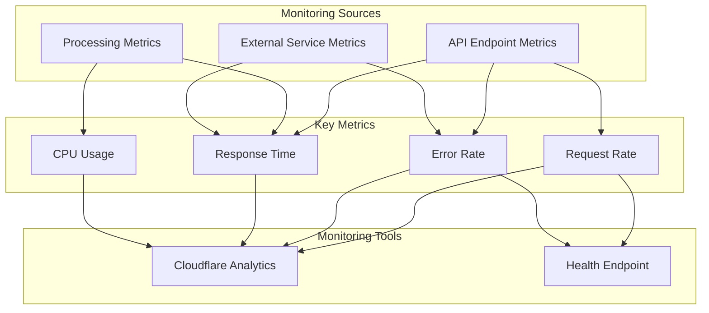
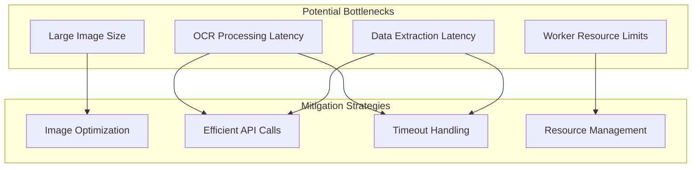
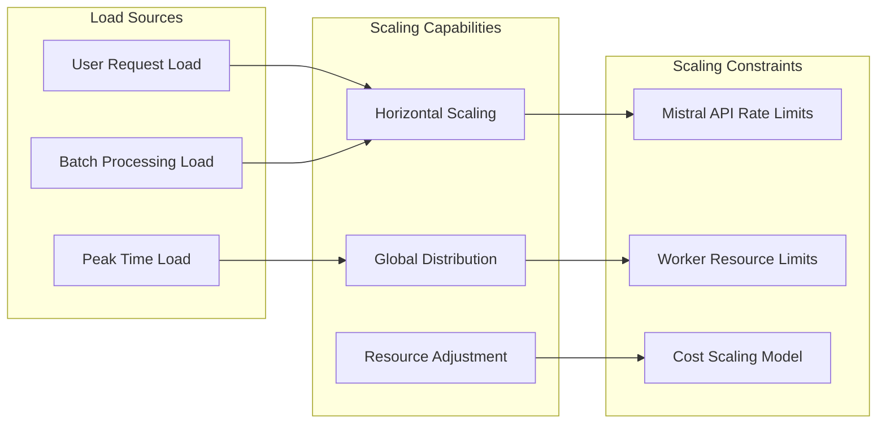
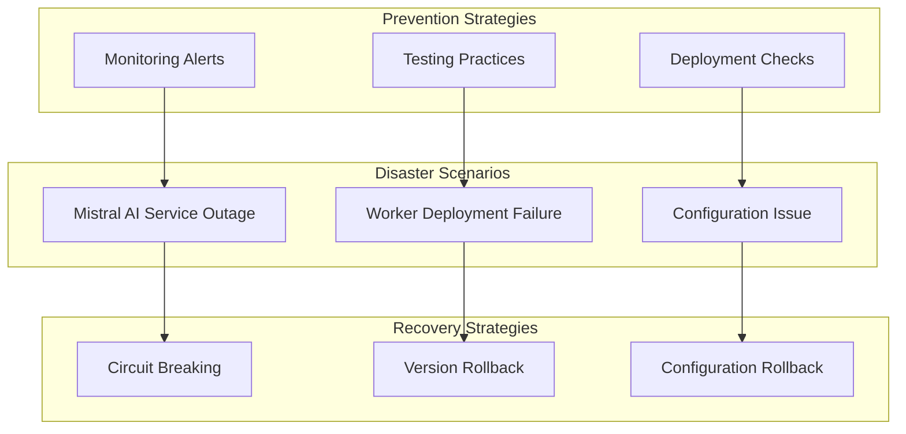
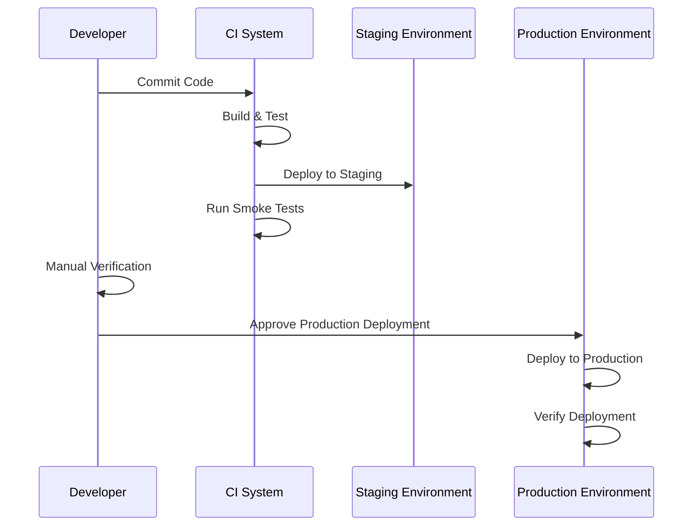
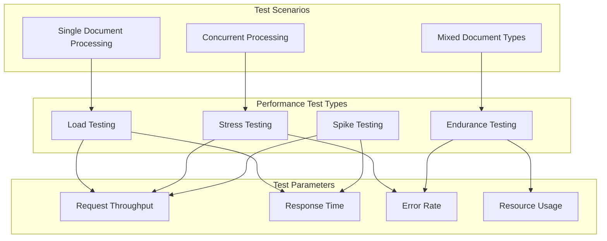

# Software Architecture Document – Operational Concerns

[Home](index.md) | [Up](index.md) | [Previous](11_Integration_External_Interfaces.md) | [Next](13_Architectural_Decision_Log.md)

## Monitoring and Logging

The OCR Checks Server implements comprehensive monitoring and logging to ensure operational visibility and facilitate troubleshooting.

### Logging Strategy



#### Logging Configuration

Logging is configured through the Worker environment variables:

```toml
# Development environment
[env.dev]
vars = { ENVIRONMENT = "development", MISTRAL_DEBUG = true }

# Staging environment
[env.staging]
vars = { ENVIRONMENT = "staging", MISTRAL_DEBUG = true }

# Production environment
[env.production]
vars = { ENVIRONMENT = "production", MISTRAL_DEBUG = false }

# Enable Cloudflare Worker logs
[observability.logs]
enabled = true
```

#### Logging Implementation

The system uses a centralized logging interface through the `IoE` interface:

```typescript
// IO interface for logging and error handling
interface IoE {
  log(message: string, context?: any): void;
  error(message: string, context?: any): void;
  debug(message: string, context?: any): void;
}

// Implementation for Cloudflare Workers
export const workerIoE: IoE = {
  log: (message, context = {}) => {
    console.log(`[INFO] ${message}`, context);
  },
  error: (message, context = {}) => {
    console.error(`[ERROR] ${message}`, context);
  },
  debug: (message, context = {}) => {
    // Only log debug messages in environments with MISTRAL_DEBUG=true
    if (process.env.MISTRAL_DEBUG === 'true') {
      console.debug(`[DEBUG] ${message}`, context);
    }
  }
};
```

### Monitoring Approach



#### Key Monitoring Metrics

1. **Request Metrics**
   - Request rate (requests per minute)
   - Request volume by endpoint
   - Request volume by client type
   - Geographic distribution of requests

2. **Performance Metrics**
   - Response time (average, median, 95th percentile)
   - CPU usage (average, peak)
   - Memory usage (average, peak)
   - External API latency

3. **Error Metrics**
   - Error rate (errors per minute)
   - Error types and distribution
   - 4xx vs 5xx error rates
   - External service error rates

#### Monitoring Tools

1. **Cloudflare Analytics Dashboard**
   - Real-time metrics visualization
   - Historical trend analysis
   - Request and error monitoring
   - Performance tracking

2. **Health Endpoint**
   - Real-time system status
   - API key validation
   - Version information
   - Timestamp for uptime tracking

## Performance Considerations

The OCR Checks Server architecture addresses several performance considerations to ensure efficient operation.

### Performance Bottlenecks



#### Performance Optimization Strategies

1. **Image Handling Optimization**
   - Format conversion when beneficial
   - Size limit enforcement
   - Efficient binary handling

2. **API Call Optimization**
   - Timeout configuration (15 seconds for Mistral API)
   - Retry strategies with backoff
   - Connection error handling

3. **Resource Utilization**
   - Memory efficient data structures
   - Minimal dependency footprint
   - Optimized processing pipeline

### Performance Monitoring

The system includes specific performance monitoring capabilities:

1. **Response Time Tracking**
   - Total request processing time
   - OCR processing time
   - Data extraction time
   - External API latency

2. **Resource Usage Tracking**
   - CPU usage monitoring
   - Memory consumption patterns
   - Request queue depth

3. **Bottleneck Identification**
   - Error correlation with performance metrics
   - Performance degradation patterns
   - External service impact analysis

## Scalability

The OCR Checks Server architecture is designed for scalability to handle varying load conditions.

### Scalability Model



#### Scalability Approaches

1. **Horizontal Scaling**
   - Stateless design enables unlimited horizontal scaling
   - Cloudflare Workers automatically scales to demand
   - No shared resources between requests

2. **Global Distribution**
   - Requests routed to nearest Cloudflare edge location
   - Global distribution of processing load
   - Reduced latency for worldwide users

3. **Resource Adjustment**
   - Worker resource limits can be adjusted for paid plans
   - CPU time and execution duration configurable
   - Environment-specific resource allocation

#### Scaling Limitations

1. **Mistral AI Rate Limits**
   - API rate limits may constrain throughput
   - Retry strategy handles transient rate limiting
   - Future consideration: request queuing system

2. **Worker Execution Limits**
   - CPU time: 50ms per request
   - Execution duration: 30 seconds maximum
   - Memory constraints

### Load Testing and Capacity Planning

The system's capacity planning approach includes:

1. **Load Testing Methodology**
   - Simulated request patterns
   - Gradual load increase
   - Performance degradation monitoring

2. **Capacity Estimation**
   - Current capacity: 10+ concurrent requests
   - Daily processing volume: 1000+ documents
   - Peak handling capability: 100+ requests per minute

3. **Scaling Triggers**
   - Response time degradation
   - Error rate increase
   - Resource utilization thresholds

## Disaster Recovery

The OCR Checks Server implements disaster recovery mechanisms to ensure system resilience.

### Recovery Scenarios



#### Recovery Plans

1. **Mistral AI Service Disruption**
   - Circuit breaking prevents cascading failures
   - Clear error messages for temporary unavailability
   - Automatic retry with exponential backoff
   - Health check endpoint reflects external service status

2. **Worker Deployment Issues**
   - Version rollback capability
   - Cloudflare Workers version history
   - Deployment verification with smoke tests
   - Multiple environment deployment strategy

3. **Configuration Problems**
   - Configuration validation before deployment
   - Environment-specific configuration
   - Strict schema validation for configuration
   - Safe default values where appropriate

### Backup and Restore

The system's stateless nature changes the backup approach:

1. **Code and Configuration Backup**
   - Source code in Git repository
   - Configuration in version control
   - Multiple remote repository copies

2. **Deployment Versioning**
   - Cloudflare Workers maintains deployment versions
   - Ability to roll back to previous versions
   - Version tagging for easy reference

3. **No Data Backup Required**
   - No persistent data stored
   - Client responsible for document storage
   - Stateless architecture eliminates data loss risk

### Business Continuity

The business continuity strategy includes:

1. **Service Level Objectives**
   - Availability target: 99.9%
   - Maximum tolerable downtime: 43 minutes/month
   - Error rate target: <0.1% of requests

2. **Recovery Time Objectives**
   - Worker deployment issues: < 10 minutes
   - Configuration problems: < 15 minutes
   - External service disruption: Dependent on service restoration

3. **Communication Plan**
   - Status page for service status
   - API status reflected in health endpoint
   - Notification mechanism for planned maintenance

## Operational Procedures

The OCR Checks Server requires specific operational procedures for maintenance and administration.

### Deployment Procedures



1. **Standard Deployment Process**
   - Code review and approval
   - Automated testing
   - Staging deployment and verification
   - Production deployment with approval

2. **Emergency Deployment Process**
   - Expedited review for critical fixes
   - Focused testing on affected areas
   - Direct production deployment with verification
   - Post-deployment monitoring

3. **Deployment Verification**
   - Smoke testing after deployment
   - Health endpoint verification
   - Error rate monitoring
   - Performance impact assessment

### Monitoring Procedures

The operational monitoring procedures include:

1. **Routine Monitoring**
   - Daily performance review
   - Error rate trends
   - Usage pattern analysis
   - External service dependency health

2. **Alert Response Procedures**
   - Error rate spike investigation
   - Performance degradation analysis
   - External service disruption handling
   - Configuration issue remediation

3. **Reporting Procedures**
   - Weekly performance summary
   - Monthly service level reporting
   - Usage trend analysis
   - Capacity planning updates

### Maintenance Procedures

Regular maintenance procedures include:

1. **Dependency Updates**
   - Regular security updates
   - Dependency version management
   - Compatibility testing
   - Phased update approach

2. **Configuration Management**
   - Environment configuration review
   - Secret rotation
   - Rate limit adjustment
   - Resource allocation optimization

3. **Performance Tuning**
   - Response time optimization
   - Resource usage efficiency
   - External service interaction patterns
   - Timeout and retry configuration

## Health Checks and Diagnostics

The OCR Checks Server implements health checking and diagnostic capabilities to verify system status.

### Health Check Implementation

```mermaid
graph TD
    subgraph "Health Check Components"
        Status[Basic Status]
        Dependencies[Dependency Status]
        Configuration[Configuration Check]
        Version[Version Information]
    end
    
    subgraph "Health Check Endpoint"
        HealthAPI[/health Endpoint]
        HealthResponse[Health Response]
    end
    
    subgraph "Diagnostic Methods"
        ScannerCreation[Scanner Creation Test]
        APIKeyValidation[API Key Validation]
        DeploymentVerification[Deployment Verification]
    end
    
    Status --> HealthAPI
    Dependencies --> HealthAPI
    Configuration --> HealthAPI
    Version --> HealthAPI
    
    HealthAPI --> ScannerCreation
    HealthAPI --> APIKeyValidation
    HealthAPI --> DeploymentVerification
    
    ScannerCreation --> HealthResponse
    APIKeyValidation --> HealthResponse
    DeploymentVerification --> HealthResponse
```

The health check endpoint (`/health`) provides:

```typescript
// Health check endpoint implementation
app.get('/health', (c) => {
  try {
    // Validate DI
    var diContainer = ScannerFactory.createDIContainer(workerIoE, c.env.MISTRAL_API_KEY);

    // Verify scanner creation
    ScannerFactory.createMistralCheckScanner(workerIoE, c.env.MISTRAL_API_KEY);
    ScannerFactory.createScannerByType(workerIoE, c.env.MISTRAL_API_KEY, 'check');
    ScannerFactory.createMistralReceiptScanner(workerIoE, c.env.MISTRAL_API_KEY);
    ScannerFactory.createScannerByType(workerIoE, c.env.MISTRAL_API_KEY, 'receipt');

    // Get API key information
    var apiKey = diContainer.getMistralApiKey();

    // Create health response
    return new Response(JSON.stringify({
      status: 'ok',
      timestamp: new Date().toISOString(),
      version: pkg.version,
      apiKey: apiKey ? apiKey.slice(0, 4) + '...' : `Invalid Mistral API Key: ${apiKey}`
    }), {
      status: 200,
      headers: { 'Content-Type': 'application/json' }
    });
  } catch (error) {
    console.error('Error processing health check:', error);
    return new Response(JSON.stringify({ 
      status: 'error',
      message: 'Health check failed',
      timestamp: new Date().toISOString(),
      version: pkg.version,
      error: error.message
    }), {
      status: 500,
      headers: { 'Content-Type': 'application/json' }
    });
  }
});
```

#### Health Check Response

The health check returns a JSON response with:
- `status`: Current system status ('ok' or 'error')
- `timestamp`: Current server time in ISO 8601 format
- `version`: Application version number
- `apiKey`: First 4 characters of the API key (for verification)

### Diagnostic Procedures

The system includes several diagnostic capabilities:

1. **Component Verification**
   - DI container initialization check
   - Scanner creation testing
   - API key validation

2. **Configuration Diagnostics**
   - Environment setting validation
   - Secret availability verification
   - Runtime configuration check

3. **Connectivity Diagnostics**
   - Implicit external service connectivity check
   - Network path verification
   - Route availability verification

### Automated Health Monitoring

The system supports automated health monitoring through:

1. **External Monitoring**
   - Regular polling of health endpoint
   - Response code monitoring
   - Response content validation
   - Response time tracking

2. **Integrated Monitoring**
   - Cloudflare health checks
   - Automatic alerting
   - Status dashboard integration
   - Uptime tracking

## Performance Testing

The OCR Checks Server undergoes specific performance testing to ensure it meets operational requirements.

### Performance Test Types



1. **Load Testing**
   - Purpose: Verify normal load handling
   - Approach: Gradual increase in concurrent users
   - Metrics: Response time, throughput, error rate
   - Success criteria: Response time < 3 seconds, zero errors

2. **Stress Testing**
   - Purpose: Find breaking points
   - Approach: Increase load beyond expected maximum
   - Metrics: Maximum throughput, error onset point
   - Success criteria: Graceful degradation, no crashes

3. **Endurance Testing**
   - Purpose: Verify sustained performance
   - Approach: Continuous load for extended periods
   - Metrics: Resource usage trends, error rates over time
   - Success criteria: Stable performance, no memory issues

### Performance Test Implementation

The system includes dedicated performance tests:

```typescript
// Performance test implementation (pseudocode)
describe('Server Performance Tests', () => {
  it('should handle 10 concurrent document processing requests', async () => {
    // Create 10 concurrent requests
    const requests = Array(10).fill().map(() => 
      client.processDocument(testImage, 'check')
    );
    
    // Wait for all requests to complete
    const startTime = Date.now();
    const results = await Promise.all(requests);
    const endTime = Date.now();
    
    // Verify all requests succeeded
    expect(results.every(r => r.status === 'success')).toBe(true);
    
    // Verify performance metrics
    const totalTime = endTime - startTime;
    const averageTime = totalTime / 10;
    expect(averageTime).toBeLessThan(3000); // Less than 3 seconds per request
  });
  
  // Additional performance tests...
});
```

### Performance Benchmarks

The system maintains performance benchmarks for:

1. **Response Time Benchmarks**
   - Check processing: < 3 seconds
   - Receipt processing: < 3 seconds
   - Health check: < 100ms

2. **Throughput Benchmarks**
   - Sustained requests: 10+ per minute
   - Burst capability: 30+ per minute
   - Daily capacity: 1000+ documents

3. **Resource Usage Benchmarks**
   - CPU time: < 50ms per request
   - Memory footprint: Within Worker limits
   - External API calls: Minimized and efficient

---

[Home](index.md) | [Up](index.md) | [Previous](11_Integration_External_Interfaces.md) | [Next](13_Architectural_Decision_Log.md)