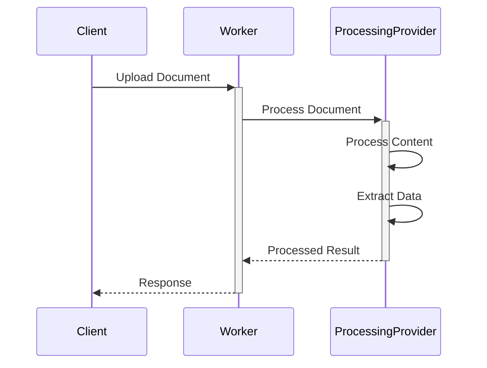

# OCR Checks Server Architecture

> Copyright © 2025 [Nolock.social](https://nolock.social). All rights reserved.  
> Authored by: [O2.services](https://o2.services)  
> Contact: [sales@o2.services](mailto:sales@o2.services)  
> Licensed under the [GNU Affero General Public License v3.0 or later](https://www.gnu.org/licenses/agpl-3.0.html) (AGPL-3.0-or-later)

## Overview

The OCR Checks Server is a Cloudflare Worker application that processes images of paper checks to extract structured data. The system is designed with a functional programming approach, leveraging the `functionalscript` library for IO operations and error handling.

## System Components

### 1. Core Components

#### Worker Entry Point (`src/index.ts`)
- Main Cloudflare Worker handler
- Implements a RESTful API with dedicated endpoints:
  - `/process` - Universal document processing with type parameter
  - `/check` - Check-specific processing 
  - `/receipt` - Receipt-specific processing
  - `/health` - Server status and version information
- Manages document processing pipeline
- Implements CORS and robust request validation
- Provides detailed error handling and reporting

#### Processing Pipeline
- Handles document processing
- Manages API communication
- Uses functional programming patterns with `IoE` interface

### 2. Type System

#### IO Interface (`IoE`)
- Extends the base `Io` type from `functionalscript`
- Adds enhanced `fetch` capabilities for API communication
- Provides `atob` for base64 encoding
- Maintains compatibility with functional programming patterns

#### Data Types
- `CheckData`: Extracted check information
- `Result<T, E>`: Error handling from `functionalscript`

### 3. Testing Infrastructure

The project follows a structured testing approach with different test categories organized in dedicated directories.

#### Test Types and Directory Structure

- **Unit Tests**: Located in `tests/unit/` directory
  - Tests individual components in isolation
  - Follows `.test.ts` naming convention
  - Mocks all external dependencies
  - Tests core functionality with precise assertions

- **Functional Tests**: Located in `tests/functional/` directory
  - Tests components in a functional programming style
  - Follows `.f.test.ts` naming convention
  - Uses functional composition patterns
  - Verifies pure function behavior

- **Semi-Integration Tests**: Located in `tests/semi/` directory
  - Tests with real dependencies but without a web server
  - Uses `.test.js` naming convention
  - Connects to actual external services (like Mistral API)
  - Processes real image files from `tests/fixtures/images`
  - Saves results to `tests/fixtures/expected` for validation

- **Integration Tests**: Located in `tests/integration/` directory
  - Tests complete worker functionality in a live environment
  - Uses Jasmine framework with extended timeouts for API calls
  - Tests web server endpoints and responses
  - Validates full end-to-end workflow

#### Test Fixtures and Data

- **Test Images**: Located in `tests/fixtures/images/`
  - Contains sample check images for testing
  - Used by semi-integration and integration tests

- **Expected Results**: Located in `tests/fixtures/expected/`
  - Contains reference data for test validation
  - Stores OCR results for comparison and verification

#### Mocking Strategy
- Uses custom mock functions for unit and functional tests
- Implements a comprehensive mock of the `IoE` interface
- Mocks include network calls, file operations, and environment variables
- External clients (like Mistral AI) are mocked in unit/functional tests

#### Test Runners (in `scripts/` directory)
- `scripts/run-unit-tests.js`: Runs unit tests
- `scripts/run-functional-tests.js`: Runs functional tests 
- `scripts/run-semi-tests.js`: Runs semi-integration tests
- `scripts/run-tests.js`: Universal runner for all test types
- `scripts/run-receipt-scanner-test.js`: Specialized tests for receipt scanning
- `scripts/start-server.js`: Utility for starting the server for integration tests with improved process management:
  - Server PID tracking via .server-pid file
  - Automatic cleanup of previous server instances
  - Clean shutdown after tests complete
  - Signal handlers for graceful termination
  - Enhanced error reporting and logging

#### Running Tests
- `npm test`: Run all tests (unit, functional, semi, integration)
- `npm run test:unit`: Run only unit tests
- `npm run test:functional`: Run only functional tests
- `npm run test:semi`: Run only semi-integration tests
- `npm run test:integration`: Run only integration tests

## UML Diagrams

### Sequence Diagram

## Data Flow

1. **Document Upload**
   - Client sends document via HTTP POST
   - Worker validates content type and size

2. **Document Processing**
   - Document converted to appropriate format
   - Processed by selected provider
   - Data extracted and structured

3. **Response Handling**
   - Data formatted and validated
   - Error handling and validation
   - JSON response returned to client

## Error Handling

- Uses `Result` type from `functionalscript`
- Implements `asyncTryCatch` for async operations
- Validates API responses
- Handles processing errors

## Dependencies

- `functionalscript`: Core functional programming utilities
- `hono`: Web framework for Cloudflare Workers
- `sharp`: Image processing (if needed for preprocessing)

## Development Workflow

1. **Local Development**
   - `npm run dev`: Start local worker
   - `npm run dev:watch`: Start local worker with live reload
   - `npm start-server`: Start the server for development

2. **Testing Workflow**
   - `npm test`: Run all tests (unit, functional, semi, integration)
   - `npm run test:unit`: Run only unit tests
   - `npm run test:functional`: Run only functional tests
   - `npm run test:semi`: Run only semi-integration tests
   - `npm run test:integration`: Run only integration tests

3. **Code Quality**
   - `npm run lint`: Run ESLint on TypeScript files
   - `npm run lint:fix`: Run ESLint and automatically fix issues

4. **Deployment**
   - Uses Wrangler for deployment (`npm run deploy`)
   - Environment variables managed via `wrangler.toml`
   - CI/CD automation via GitHub Actions
   - Detailed deployment instructions in [Cloudflare Deployment Guide](./cloudflare-deployment-guide.md)
   
5. **Project Organization**
   - Source code in `src/` directory
   - Test files organized by type in `tests/` directory
   - Test fixtures in `tests/fixtures/` directory
   - Utility scripts in `scripts/` directory

## Security Considerations

- API key management via environment variables
- Input validation and sanitization
- CORS configuration
- Rate limiting (if implemented)

## Future Considerations

- Processing optimization
- Caching strategies
- Rate limiting implementation
- Additional providers support
- Batch processing capabilities 