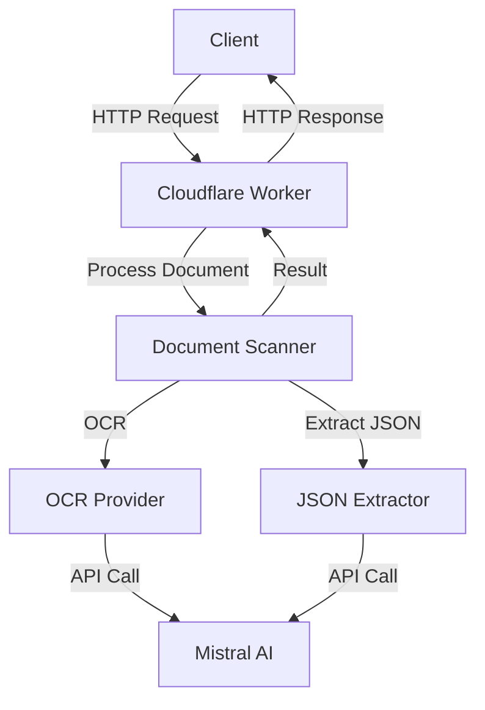
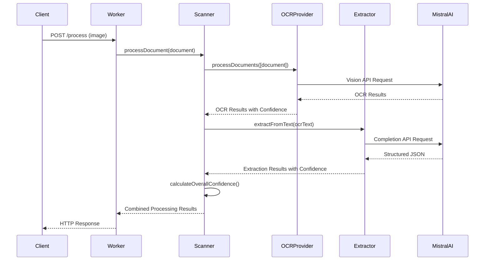
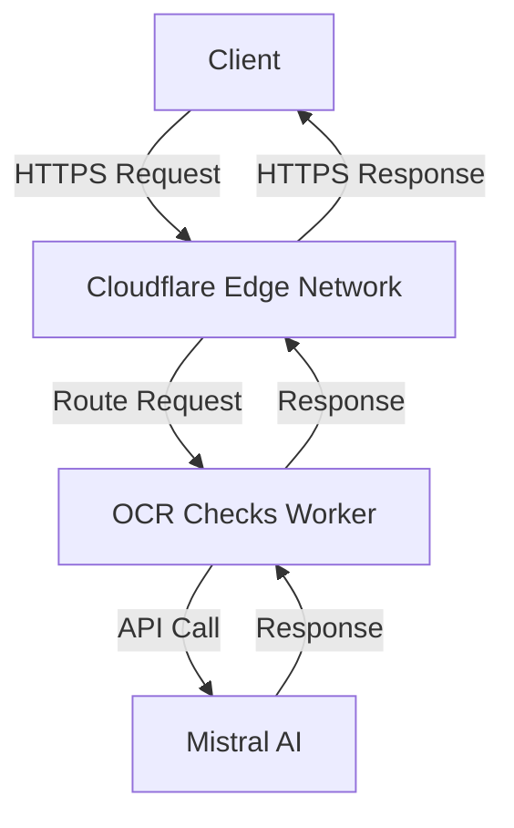

# 📄 Technical Architecture Design: OCR Checks Server

---
**🏠 [Home](../../../README.md)** | **📚 [Documentation](../../README.md)** | **⚙️ [Features](../index.md)** | **📄 [Check Processing](./)**
---

## 1. System Overview

The OCR Checks Server is a Cloudflare Worker application that processes images of checks, receipts, and other documents to extract structured data. The system leverages Mistral AI for both Optical Character Recognition (OCR) and JSON extraction, providing a unified API for document processing.

### 1.1 Key Capabilities

- **OCR Processing**: Converts document images to text with confidence scoring
- **JSON Extraction**: Transforms OCR text into structured data based on predefined schemas
- **Unified Processing**: Single API for end-to-end document handling
- **Extensible Architecture**: Modular design that supports multiple processor types
- **Confidence Scoring**: Provides reliability metrics for processed results

### 1.2 High-Level Architecture

## 2. Core Components

### 2.1 Cloudflare Worker (Entry Point)

The main worker entry point [`src/index.ts`](../src/index.ts) serves as the HTTP interface for the application. It:

- Handles incoming HTTP requests
- Validates input documents
- Instantiates and uses the document scanner
- Formats and returns the processing results
- Implements error handling and CORS policy

The worker exposes two primary endpoints:
- `/` - Legacy endpoint for basic check processing
- `/process` - Unified document processing endpoint with enhanced capabilities

### 2.2 Document Scanner

The [`ReceiptScanner`](../src/scanner/receipt-scanner.ts) class is the core component that orchestrates the document processing pipeline:

- Accepts document inputs (images, potentially PDFs)
- Coordinates OCR and JSON extraction processes
- Combines results and calculates confidence scores
- Handles error states throughout the processing flow

### 2.3 OCR Provider

The OCR Provider ([`MistralOCRProvider`](../src/ocr/mistral.ts)) is responsible for:

- Converting document images to text
- Communicating with the Mistral AI vision API
- Providing confidence scores for the OCR process
- Processing batches of documents efficiently

### 2.4 JSON Extractor

The JSON Extractor ([`MistralJsonExtractorProvider`](../src/json/mistral.ts)) is responsible for:

- Transforming OCR text into structured data
- Validating extracted data against schemas
- Providing confidence scores for extraction quality
- Handling different document types with appropriate schemas

### 2.5 Specialized Extractors

Specialized extractors (like [`ReceiptExtractor`](../src/json/extractors/receipt-extractor.ts)) handle specific document types:

- Apply domain-specific knowledge to extraction processes
- Normalize data based on document type requirements
- Provide document-specific validation rules
- Enhance extraction quality through domain context

## 3. Architectural Patterns

### 3.1 Dependency Injection

The application uses InversifyJS for dependency injection, which:

- Decouples component creation from usage
- Simplifies testing through component substitution
- Provides a clean approach to managing dependencies
- Supports singleton and other lifecycle management

Key files:
- [`src/di/container.ts`](../src/di/container.ts) - Contains the DI container implementation
- [`src/di/index.ts`](../src/di/index.ts) - Provides exports for the DI system
- [`src/scanner/factory.ts`](../src/scanner/factory.ts) - Factory utilizing the DI container

### 3.2 Functional Programming

The application incorporates functional programming concepts:

- Uses the `functionalscript` library for error handling
- Employs the [`Result<T, E>`](../src/scanner/types.ts) type for explicit error paths
- Implements pure functions where possible
- Separates data transformation from side effects

### 3.3 Factory Pattern

The [`ScannerFactory`](../src/scanner/factory.ts) simplifies the creation of complex object graphs:

- Abstracts away the dependency configuration details
- Provides simple, static methods for common use cases
- Integrates with the DI container for dependency resolution
- Allows for future expansion to different scanner implementations

## 4. Data Flow

### 4.1 Document Processing Flow

### 4.2 Data Processing Steps

1. **Document Reception**
   - Worker receives HTTP POST with document image
   - Validates content type and size
   - Extracts document metadata

2. **OCR Processing**
   - Document is sent to Mistral AI vision API
   - Text is extracted from the image
   - Confidence score is generated for OCR quality

3. **JSON Extraction**
   - OCR text is sent to Mistral AI completion API with schema
   - Structured data is extracted based on document type
   - Extraction confidence score is calculated

4. **Result Compilation**
   - OCR and extraction results are combined
   - Overall confidence score is calculated
   - Final response is formatted and returned

## 5. Error Handling

The system employs a robust error handling approach:

- Uses the `Result<T, E>` type from `functionalscript` for explicit error paths
- Implements proper error propagation through the component chain
- Provides meaningful error messages with context
- Handles API communication errors and retry mechanisms
- Returns appropriate HTTP status codes based on error types

## 6. Testing Strategy

The application follows a comprehensive testing approach:

### 6.1 Test Types

- **Unit Tests**: Test individual components in isolation
  - Located in [`tests/unit/`](../tests/unit/) directory
  - Use mock dependencies
  - Focus on component logic

- **Functional Tests**: Test functional programming patterns
  - Located in [`tests/functional/`](../tests/functional/) directory
  - Focus on data transformations
  - Test pure functions

- **Semi-Integration Tests**: Test with real dependencies
  - Located in [`tests/semi/`](../tests/semi/) directory
  - Use actual external services
  - Process real images

- **Integration Tests**: Test complete system
  - Located in [`tests/integration/`](../tests/integration/) directory
  - Test end-to-end workflows
  - Validate real-world scenarios

### 6.2 Testing Infrastructure

- **Test Runners**: Located in [`scripts/`](../scripts/) directory
- **Test Fixtures**: Located in [`tests/fixtures/`](../tests/fixtures/) directory
  - Test images in [`tests/fixtures/images/`](../tests/fixtures/images/)
  - Expected results in [`tests/fixtures/expected/`](../tests/fixtures/expected/)
- **Jasmine Framework**: Used for structured test definitions

## 7. Deployment Architecture

The application is deployed as a Cloudflare Worker:

### 7.1 Deployment Workflow

1. **Local Development**
   - `npm run dev` - Start local worker
   - `npm run dev:watch` - Start with live reload

2. **Testing**
   - Various test commands for different test types
   - Validation before deployment

3. **Deployment**
   - `npm run deploy` - Deploy using Wrangler
   - Environment variables managed via [`wrangler.toml`](../wrangler.toml)

### 7.2 Environment Configuration

- **Wrangler Configuration**: Stored in [`wrangler.toml`](../wrangler.toml)
- **API Keys**: Managed as environment variables
- **Runtime Settings**: Configured through Cloudflare Workers dashboard

## 8. Performance Considerations

### 8.1 Current Optimizations

- **Cloudflare Edge Network**: Global distribution for low-latency access
- **Efficient Processing Pipeline**: Streamlined data flow
- **Parallel Processing**: Where applicable for batch operations
- **Minimal Dependencies**: Lightweight worker implementation

### 8.2 Future Optimizations

- **Caching Strategy**: Implement caching for repeated document processing
- **Batch Processing**: Optimize for multiple document processing
- **Rate Limiting**: Implement smart throttling for API calls
- **Resource Optimization**: Tune worker resource usage
- **Processing Pipeline Optimization**: Further refine the processing flow

## 9. Security Considerations

- **API Key Management**: Secure storage of Mistral API keys
- **Input Validation**: Thorough validation of user inputs
- **CORS Configuration**: Properly configured cross-origin policy
- **Error Handling**: Secure error responses that don't leak implementation details
- **Data Handling**: Proper management of sensitive document data

## 10. Scalability

The system is designed for scalability through:

- **Stateless Architecture**: No persistent state in the worker
- **Cloudflare's Global Network**: Automatic scaling across edge locations
- **Independent Processing**: Each request is processed independently
- **Efficient Resource Usage**: Minimized worker resource consumption
- **Modular Components**: Easily scaled or replaced as needed

## 11. Future Enhancements

1. **Additional Document Types**: Support for more document formats
2. **Enhanced Schema System**: More flexible schema definitions
3. **Alternative AI Providers**: Support for other OCR and extraction services
4. **Webhook Integration**: Async processing with callback notifications
5. **Document Queue**: Support for long-running document processing
6. **Feedback Loop**: Mechanism for improving extraction quality
7. **Multi-Page Document Support**: Enhanced handling of multi-page documents
8. **User-Defined Schemas**: Allow customization of extraction schemas

---
**🏠 [Home](../../../README.md)** | **📚 [Documentation](../../README.md)** | **⚙️ [Features](../index.md)** | **📄 [Check Processing](./)** | **⬆️ [Top](#-technical-architecture-design-ocr-checks-server)**
---