# Cloudflare Workers AI JSON Extractor - Technical Architecture Design

## Overview

This document describes the technical architecture for implementing a `CloudflareLlama33JsonExtractor` that leverages Cloudflare Workers AI's native `@cf/meta/llama-3.3-70b-instruct-fp8-fast` model for structured JSON extraction from markdown text. This design replaces external Mistral AI API calls with Cloudflare's edge-native AI processing due to **Mistral AI service instability issues** that were causing frequent timeout errors and unreliable JSON extraction responses.

## Architectural Goals

1. **Resolve Mistral AI Instability**: Address frequent timeout errors, connection failures, and unreliable responses from Mistral AI service
2. **Eliminate External Dependencies**: Replace unstable Mistral API calls with reliable Cloudflare's native AI models
3. **Maintain Interface Compatibility**: Implement the existing `JsonExtractor` interface without breaking changes
4. **Improve Reliability**: Leverage edge-native processing for consistent, stable responses
5. **Reduce Complexity**: Simplify retry logic and timeout management by eliminating external service calls
6. **Cost Optimization**: Use Cloudflare's competitive pricing model ($0.011/1K neurons)

## System Architecture


## GitHub Project Implementation Status

The implementation follows a structured GitHub project with clear hierarchy and story point allocation:

```mermaid
graph TB
    subgraph "Epic (13 points)"
        E1["Epic #1<br/>Add CloudflareLlama33JsonExtractor Implementation<br/>📊 13 pts | 🔄 In Progress"]
    end
    
    subgraph "User Stories (19 points total)"
        US2["User Story #2<br/>Shared anti-hallucination utilities<br/>📊 3 pts | ✅ Done"]
        US3["User Story #3<br/>Shared confidence calculation utilities<br/>📊 3 pts | ✅ Done"]
        US4["User Story #4<br/>CloudflareLlama33JsonExtractor implementation<br/>📊 8 pts | 🔄 In Progress"]
        US5["User Story #5<br/>DI container configuration for multiple extractors<br/>📊 5 pts | 🔄 In Progress"]
    end
    
    subgraph "Engineering Tasks - Completed (12 points)"
        T6["Task #6<br/>Extract AntiHallucinationDetector utility<br/>📊 3 pts | ✅ Done"]
        T7["Task #7<br/>Extract JsonExtractionConfidenceCalculator utility<br/>📊 3 pts | ✅ Done"] 
        T8["Task #8<br/>Implement CloudflareLlama33JsonExtractor class<br/>📊 3 pts | ✅ Done"]
        T9["Task #9<br/>Configure DI container for multiple extractors<br/>📊 3 pts | ✅ Done"]
    end
    
    subgraph "Engineering Tasks - Pending (9 points)"
        T10["Task #10<br/>Create JSON extractor factory pattern<br/>📊 3 pts | 📋 Todo"]
        T11["Task #11<br/>Add performance benchmarking tests<br/>📊 3 pts | 📋 Todo"]
        T12["Task #12<br/>Add end-to-end integration tests<br/>📊 3 pts | 📋 Todo"]
    end

    %% Epic Dependencies
    E1 --> US2
    E1 --> US3  
    E1 --> US4
    E1 --> US5
    
    %% User Story Dependencies
    US2 --> T6
    US3 --> T7
    US4 --> T8
    US4 --> T11
    US4 --> T12
    US5 --> T9
    US5 --> T10
    
    %% Styling by status
    classDef doneStyle fill:#e8f5e8,stroke:#1b5e20,stroke-width:2px,color:#000
    classDef inProgressStyle fill:#fff3e0,stroke:#f57f17,stroke-width:2px,color:#000
    classDef todoStyle fill:#fafafa,stroke:#616161,stroke-width:2px,color:#000
    
    class US2,US3,T6,T7,T8,T9 doneStyle
    class E1,US4,US5 inProgressStyle
    class T10,T11,T12 todoStyle
```



### Project Status Summary

- **Total Story Points**: 13 points (Epic represents hierarchical sum with GitHub constraints)
- **User Story Points**: 19 points total (sum of child engineering task points)
- **Completed**: 6 points (32% - User Stories #2, #3 fully complete)
- **In Progress**: 13 points (68% - User Stories #4, #5 with mixed task completion)
- **Engineering Tasks**: 12 of 21 points complete (57% task-level completion)

### Story Point Calculation Method

- **Engineering Tasks**: Fixed at 3 points each (7 tasks × 3 = 21 points)
- **User Stories**: Sum of child engineering task points
  - US #2: Task #6 = 3 points ✅
  - US #3: Task #7 = 3 points ✅
  - US #4: Tasks #8+#11+#12 = 9 points (GitHub: 8 pts) 🔄
  - US #5: Tasks #9+#10 = 6 points (GitHub: 5 pts) 🔄
- **Epic**: Sum of user story points = 19 points (GitHub: 13 pts) 🔄

*Note: GitHub's predefined options (1,2,3,5,8,13) limit exact representation of calculated sums*

### Implementation Progress

- ✅ **Core Implementation Complete**: All essential CloudflareLlama33JsonExtractor functionality is implemented
- ✅ **Shared Utilities**: Anti-hallucination detection and confidence calculation utilities extracted
- ✅ **DI Integration**: Dependency injection configured for multiple extractor support
- 🔄 **Enhancement Phase**: Factory patterns, benchmarking, and integration tests remain as optional improvements

## Component Design

### 1. CloudflareLlama33JsonExtractor Class


### 2. Dependency Injection Integration


## Implementation Details

### 3. Request Flow Architecture


### 4. Error Handling Architecture


## Technical Specifications

### Model Configuration

- **Model**: `@cf/meta/llama-3.3-70b-instruct-fp8-fast`
- **Capabilities**: 
  - JSON Schema mode support
  - 70B parameter model with fp8 optimization
  - Native Cloudflare edge processing
  - 128K context window
  - Advanced reasoning capabilities

### JSON Schema Integration

```typescript
interface CloudflareJsonSchema {
  type: "json_schema";
  json_schema: {
    name: string;
    description?: string;
    schema: Record<string, unknown>;
    strict?: boolean;
  };
}
```

### Performance Characteristics

| Metric | Current (Mistral API) | New (Cloudflare AI) |
|--------|----------------------|---------------------|
| Latency | 2-8 seconds | 1-3 seconds |
| Timeout Risk | High (30s limit) | Low (edge native) |
| Retry Complexity | Complex exponential backoff | Simple error handling |
| Cost Model | External API fees | $0.011/1K neurons |
| Network Hops | External → Mistral | Edge-native |

## Interface Compatibility

### Existing JsonExtractor Interface
```typescript
interface JsonExtractor {
  extract(request: JsonExtractionRequest): Promise<Result<JsonExtractionResult, Error>>;
}
```

### CloudflareLlama33JsonExtractor Implementation

```typescript
@injectable()
export class CloudflareLlama33JsonExtractor implements JsonExtractor {
  constructor(
    @inject(TYPES.CloudflareAi) private ai: Ai,
    @inject(TYPES.IoE) private io: IoE
  ) {}

  async extract(request: JsonExtractionRequest): Promise<Result<JsonExtractionResult, Error>> {
    // Implementation details
  }
}
```

## Scanner-Based Hallucination Detection

The implementation now uses a cleaner scanner-based hallucination detection architecture:


## Migration Strategy

### Phase 1: Implementation

1. Create `CloudflareLlama33JsonExtractor` class
2. Implement all `JsonExtractor` interface methods
3. Add comprehensive error handling and logging
4. Maintain existing anti-hallucination logic

### Phase 2: Integration

1. Update DI container configuration
2. Add feature flag for gradual rollout
3. Implement A/B testing capabilities
4. Monitor performance metrics

### Phase 3: Deployment

1. Deploy to staging environment
2. Run parallel testing with existing Mistral implementation
3. Validate response quality and performance
4. Gradual production rollout

## Configuration Management

### Environment Variables

```typescript
interface CloudflareAiConfig {
  model: string; // "@cf/meta/llama-3.3-70b-instruct-fp8-fast"
  timeout: number; // 25000ms (within Worker limits)
  maxRetries: number; // 2 (simple retry logic)
  enableLogging: boolean;
}
```

### DI Container Updates

```typescript
// New binding
container.bind<Ai>(TYPES.CloudflareAi).toConstantValue(env.AI);

// Updated JsonExtractor binding
container.bind<JsonExtractor>(TYPES.JsonExtractor)
  .to(CloudflareLlama33JsonExtractor)
  .inSingletonScope();
```

## Testing Strategy

### Unit Tests

- JSON schema validation
- Anti-hallucination detection
- Error handling scenarios
- Confidence calculation

### Integration Tests

- End-to-end extraction workflows
- Performance benchmarking vs Mistral
- Error recovery scenarios
- Schema compliance validation

### Load Testing

- Concurrent request handling
- Memory usage patterns
- Response time distribution
- Failure rate analysis

## Monitoring and Observability

### Key Metrics

- Request latency (p50, p95, p99)
- Success/failure rates
- JSON schema validation rates
- Anti-hallucination detection rates
- Token usage and costs

### Logging Strategy

```typescript
interface ExtractionLog {
  timestamp: string;
  requestId: string;
  model: string;
  inputLength: number;
  outputLength: number;
  processingTime: number;
  confidence: number;
  hallucinationDetected: boolean;
  error?: string;
}
```

## Security Considerations

1. **Data Privacy**: All processing occurs within Cloudflare's edge network
2. **Access Control**: Uses existing Cloudflare Workers AI authentication
3. **Input Validation**: Comprehensive sanitization of markdown input
4. **Output Validation**: JSON schema enforcement and structure validation
5. **Error Handling**: No sensitive data exposure in error messages

## Benefits Analysis

### Performance Benefits
- **Reduced Latency**: Edge-native processing eliminates external API calls
- **Improved Reliability**: No external service dependencies
- **Better Scalability**: Leverages Cloudflare's global edge network

### Operational Benefits
- **Simplified Deployment**: No external API key management
- **Reduced Complexity**: Eliminates complex retry strategies
- **Better Monitoring**: Native Cloudflare observability tools

### Cost Benefits
- **Predictable Pricing**: $0.011 per 1K neurons
- **No External Fees**: Eliminates Mistral API costs
- **Included in Workers**: Part of existing Cloudflare subscription

## Conclusion

The CloudflareLlama33JsonExtractor represents a significant architectural improvement that addresses current timeout and reliability issues while maintaining full compatibility with existing interfaces. The migration to Cloudflare Workers AI's native models provides better performance, reduced complexity, and improved cost predictability while preserving all existing anti-hallucination measures and quality controls.
