# CloudflareLlama33JsonExtractor - Execution Plan

## Project Overview
- **Total Story Points**: 43 points
- **Estimated Duration**: 4 weeks (3 developers)
- **Dependencies**: Hierarchical with parallel opportunities

## Kanban Board Recommended Flow

### Week 1: Foundation Phase


**Day 1-2**: Start #6 and #7 in parallel
**Day 3-4**: Complete #6 and #7, start #8
**Day 5**: Complete #8

### Week 2: Core Implementation

```mermaid
graph LR
    subgraph "Todo"
        T9[#9: Configure DI<br/>3 pts, Medium]
        T10[#10: Factory Pattern<br/>3 pts, Medium]
    end
    
    subgraph "In Progress"
        IP8[#8: Core Implementation<br/>Final integration]
    end
    
    subgraph "Done"
        D6[#6: ✅ AntiHallucination]
        D7[#7: ✅ Confidence Calc]
    end
    
    style IP8 fill:#ff9999
    style D6 fill:#99ff99
    style D7 fill:#99ff99
```



**Day 6-8**: Complete #8 with utilities integration
**Day 9-10**: Start #9 and #10 in parallel

### Week 3: Integration Phase


**Day 11-13**: Complete #9 and #10
**Day 14-15**: Prepare for testing phase

### Week 4: Validation Phase

```mermaid
graph LR
    subgraph "Todo"
    end
    
    subgraph "In Progress"
        IP11[#11: Performance Tests]
        IP12[#12: E2E Tests]
    end
    
    subgraph "Done"
        D9[#9: ✅ DI Config]
        D10[#10: ✅ Factory]
        D8[#8: ✅ Core Extractor]
        D6[#6: ✅ Utils]
        D7[#7: ✅ Utils]
    end
    
    style IP11 fill:#99ccff
    style IP12 fill:#99ccff
```



**Day 16-20**: Complete testing and validation

## Task Selection Algorithm in Practice

### Day 1 Decision Matrix

| Task | Priority | Dependencies | Story Points | Ready? | Selection Order |
|------|----------|--------------|--------------|--------|-----------------|
| #6 | High | None | 3 | ✅ Yes | **1st** |
| #7 | High | None | 3 | ✅ Yes | **2nd** |
| #8 | Critical | #6, #7 | 3 | ❌ No | Wait |
| #9 | Medium | #8 | 3 | ❌ No | Wait |

**Decision**: Start #6 and #7 simultaneously (parallel work possible)

### Day 3 Decision Matrix

| Task | Priority | Dependencies | Status | Ready? | Selection Order |
|------|----------|--------------|--------|--------|-----------------|
| #6 | High | None | Done ✅ | N/A | Completed |
| #7 | High | None | In Progress | N/A | Continue |
| #8 | Critical | #6✅, #7🔄 | Todo | 🔄 Partial | **Next** |
| #9 | Medium | #8 | Todo | ❌ No | Wait |

**Decision**: Start #8 as #7 is nearly complete and #6 provides necessary utility

### Daily Kanban Standup Example

**Day 5 Standup:**

**Developer A** (#6 - AntiHallucinationDetector):
- **Yesterday**: Completed unit tests, merged feature branch
- **Today**: Starting #8 (main extractor implementation)
- **Blockers**: None
- **Status**: #6 Todo → Done ✅

**Developer B** (#7 - ConfidenceCalculator):
- **Yesterday**: Finished implementation, running integration tests
- **Today**: Final review and merge, then available for #9
- **Blockers**: None
- **Status**: #7 In Progress → Done ✅

**Developer C** (Available):
- **Yesterday**: Code review for #6 and #7
- **Today**: Can start #9 (DI configuration) once #8 begins
- **Blockers**: Waiting for #8 to start
- **Status**: Ready for next task

## WIP Limits and Flow Control

### Current WIP Status
```
Todo: #9, #10, #11, #12 (4 items)
In Progress: #8 (1 item) ← Within limit
Done: #6, #7 (2 items)
```

### WIP Limit Rules
- **Engineering Tasks**: 1 per developer (focus)
- **User Stories**: 2 max (coordination)
- **Epic**: 1 (planning and oversight)

### Flow Optimization

**Scenario 1: Developer becomes available**
1. Check dependency matrix
2. Select highest priority available task
3. Ensure WIP limits not exceeded
4. Start work and update status

**Scenario 2: Task gets blocked**
1. Move to "Blocked" status (if available)
2. Document blocker in issue
3. Work on unblocking or switch to different task
4. Update team in standup

**Scenario 3: Task taking longer than expected**
1. Re-estimate remaining work
2. Consider breaking into smaller tasks
3. Pair programming to accelerate
4. Update stakeholders on impact

## Quality Gates and Definition of Done

### Engineering Task DoD Checklist
- [ ] GitFlow feature branch created
- [ ] TDD process followed (Red-Green-Refactor)
- [ ] Pair programming sessions conducted
- [ ] SOLID, KISS, DRY principles applied
- [ ] Unit tests pass
- [ ] Integration tests pass (if applicable)
- [ ] Code review completed
- [ ] Documentation updated
- [ ] Feature branch merged to develop
- [ ] No new technical debt introduced

### User Story DoD Checklist
- [ ] All child engineering tasks completed
- [ ] Acceptance criteria met
- [ ] End-to-end scenarios tested
- [ ] Performance within acceptable limits
- [ ] Security review completed (if applicable)
- [ ] Documentation complete
- [ ] Stakeholder approval obtained

### Epic DoD Checklist
- [ ] All user stories completed
- [ ] System integration testing passed
- [ ] Performance benchmarks met
- [ ] Security review completed
- [ ] Documentation complete and published
- [ ] Deployment ready
- [ ] Post-implementation review scheduled

## Risk Management and Contingencies

### High-Risk Scenarios

**Risk 1: CloudflareLlama33JsonExtractor (#8) complexity higher than estimated**
- **Probability**: Medium
- **Impact**: High (blocks everything else)
- **Mitigation**: Start early, pair programming, break into sub-tasks

**Risk 2: DI Configuration (#9) requires architecture changes**
- **Probability**: Low
- **Impact**: Medium
- **Mitigation**: Review existing patterns, consult with team lead

**Risk 3: Performance benchmarking (#11) reveals issues**
- **Probability**: Medium
- **Impact**: Medium
- **Mitigation**: Set clear performance targets, test early

### Contingency Plans

**If Week 1 slips:**
- Extend foundation phase by 2-3 days
- Consider reducing scope of performance testing
- Add developer to critical path

**If dependencies become complex:**
- Break tasks into smaller increments
- Add intermediate integration points
- Increase pair programming frequency

**If quality issues arise:**
- Implement additional review cycles
- Add specific quality gates
- Consider temporary code freeze for tech debt resolution

## Success Metrics

### Flow Metrics
- **Lead Time**: <3 days for engineering tasks
- **Cycle Time**: <2 days for engineering tasks
- **Throughput**: 2-3 tasks per developer per week
- **Blocked Time**: <10% of total time

### Quality Metrics
- **Defect Rate**: <5% of tasks require rework
- **Test Coverage**: >80% for new code
- **Code Review Coverage**: 100% of changes reviewed
- **Technical Debt**: No increase in debt ratio

### Business Metrics
- **Feature Completion**: All acceptance criteria met
- **Performance**: Response time <2s improvement
- **Reliability**: No regression in existing functionality
- **Maintainability**: Clear documentation and testing