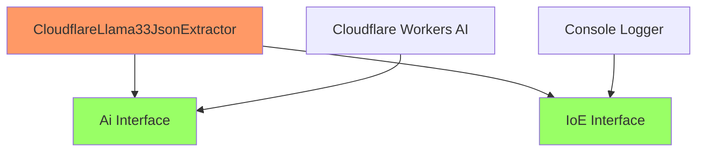
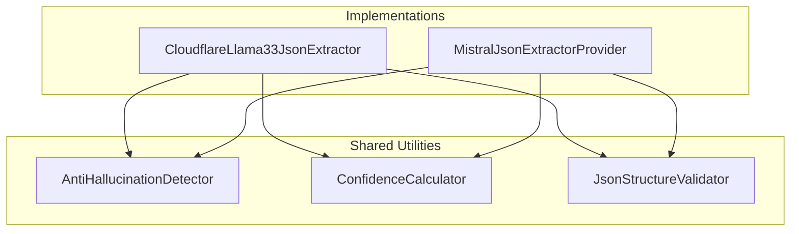

# CloudflareLlama33JsonExtractor - SOLID, KISS, DRY Validation

## Overview

This document validates the `CloudflareLlama33JsonExtractor` design against software engineering principles: **SOLID**, **KISS** (Keep It Simple, Stupid), and **DRY** (Don't Repeat Yourself).

## SOLID Principles Validation

### ✅ Single Responsibility Principle (SRP)

**Principle**: A class should have only one reason to change.

**Analysis**: 
- `CloudflareLlama33JsonExtractor` has **one clear responsibility**: Extract JSON from markdown using Cloudflare Workers AI
- **Single reason to change**: Changes to JSON extraction logic or Cloudflare AI integration
- **Separated concerns**:
  - AI communication: Delegated to `Ai` interface
  - Logging: Delegated to `IoE` interface
  - Schema validation: Isolated in `createJsonSchema()`
  - Anti-hallucination: Isolated in `detectHallucinations()`
  - Confidence calculation: Isolated in `calculateConfidence()`

**Verdict**: ✅ **COMPLIANT** - Clear single responsibility with well-separated concerns

### ✅ Open/Closed Principle (OCP)

**Principle**: Software entities should be open for extension, closed for modification.

**Analysis**:
- **Open for extension**: 
  - Implements `JsonExtractor` interface - new extractors can be added
  - Uses dependency injection - `Ai` and `IoE` can be swapped
  - Private methods can be overridden in subclasses
- **Closed for modification**:
  - Core interface remains stable
  - New AI models can be supported by changing configuration, not code
  - Anti-hallucination logic is modular and extensible

**Example Extension Scenarios**:
```typescript
// New model support - no code changes
const config = { model: "@cf/meta/llama-4-instruct" };

// New AI provider - implement new binding
class CustomAiProvider implements Ai { ... }

// Enhanced hallucination detection - extend class
class EnhancedCloudflareExtractor extends CloudflareLlama33JsonExtractor {
  protected detectHallucinations(json: Record<string, unknown>): boolean {
    // Enhanced detection logic
    return super.detectHallucinations(json) || customDetection(json);
  }
}
```

**Verdict**: ✅ **COMPLIANT** - Extensible without modification

### ✅ Liskov Substitution Principle (LSP)

**Principle**: Objects of a superclass should be replaceable with objects of a subclass.

**Analysis**:
- `CloudflareLlama33JsonExtractor` implements `JsonExtractor` interface
- **Behavioral substitutability**: Can replace `MistralJsonExtractorProvider` without breaking client code
- **Contract compliance**: 
  - Same input/output types: `JsonExtractionRequest` → `Promise<Result<JsonExtractionResult, Error>>`
  - Same error handling patterns
  - Same confidence scoring range (0-1)
  - Same anti-hallucination behavior

**Client Code Example**:
```typescript
// Works with any JsonExtractor implementation
class DocumentProcessor {
  constructor(private extractor: JsonExtractor) {}
  
  async process(markdown: string) {
    // This works equally with Mistral or Cloudflare implementations
    return await this.extractor.extract({ markdown });
  }
}
```

**Verdict**: ✅ **COMPLIANT** - Perfect substitutability

### ✅ Interface Segregation Principle (ISP)

**Principle**: Clients should not be forced to depend on interfaces they don't use.

**Analysis**:
- **Focused interface**: `JsonExtractor` has only one method: `extract()`
- **No fat interfaces**: Clients only depend on what they need
- **Granular dependencies**:
  - `Ai` interface: Only AI-specific methods
  - `IoE` interface: Only logging methods
  - `JsonSchema` type: Only schema-related properties

**Interface Design**:
```typescript
// Lean, focused interface
interface JsonExtractor {
  extract(request: JsonExtractionRequest): Promise<Result<JsonExtractionResult, Error>>;
}

// Separate, focused interfaces
interface Ai {
  run(model: string, input: Record<string, any>): Promise<any>;
}

interface IoE {
  error(message: string): void;
  log(message: string): void;
}
```

**Verdict**: ✅ **COMPLIANT** - Minimal, focused interfaces

### ✅ Dependency Inversion Principle (DIP)

**Principle**: High-level modules should not depend on low-level modules. Both should depend on abstractions.

**Analysis**:
- **Depends on abstractions**:
  - `Ai` interface (not concrete Cloudflare implementation)
  - `IoE` interface (not concrete logging implementation)
  - `JsonExtractor` interface (not concrete implementations)
- **Injected dependencies**: Uses constructor injection with `@inject()` decorators
- **Configurable**: Can swap implementations via DI container

**Dependency Flow**:


**Verdict**: ✅ **COMPLIANT** - Proper dependency inversion

## KISS Principle Validation

### ✅ Keep It Simple, Stupid

**Analysis**:

**Simplified Architecture**:
- **Eliminated complex retry logic**: No exponential backoff needed (edge-native)
- **Removed external API complexity**: No network timeout management
- **Single AI call**: Direct JSON schema mode (no parsing required)
- **Minimal error handling**: Cloudflare Workers AI has predictable error patterns

**Before (Complex)**:
```typescript
// Complex Mistral implementation
- External API calls with network timeouts
- Complex retry strategies (exponential backoff)
- Manual JSON parsing and validation
- Complex error handling for various network issues
- API key management across environments
```

**After (Simple)**:
```typescript
// Simple Cloudflare implementation
- Edge-native AI calls (no network issues)
- Simple error handling (AI or client errors only)
- Native JSON schema mode (no parsing needed)
- Built-in authentication via Workers binding
```

**Simple Method Structure**:
```typescript
async extract(request: JsonExtractionRequest): Promise<Result<JsonExtractionResult, Error>> {
  try {
    // 1. Construct messages
    const messages = this.constructMessages(request);
    
    // 2. Create schema config
    const schema = this.createJsonSchema(request.schema);
    
    // 3. Call AI (simple, no retries needed)
    const response = await this.ai.run(MODEL, { messages, response_format: schema });
    
    // 4. Process response
    const confidence = this.calculateConfidence(response, response.json);
    
    return ['ok', { json: response.json, confidence }];
  } catch (error) {
    return ['error', error];
  }
}
```

**Verdict**: ✅ **COMPLIANT** - Significantly simpler than current implementation

## DRY Principle Validation

### ⚠️ Partial Compliance - Opportunities for Improvement

**Analysis**:

**✅ What's DRY**:
- **Shared interfaces**: Reuses `JsonExtractor`, `JsonExtractionRequest`, `JsonExtractionResult`
- **Shared types**: Reuses `JsonSchema`, `Result` types
- **Anti-hallucination logic**: Can be extracted to shared utility
- **Confidence calculation**: Follows same patterns as Mistral implementation

**⚠️ Potential Code Duplication**:

1. **Anti-hallucination Detection**:
```typescript
// Current: Duplicated between MistralJsonExtractor and CloudflareJsonExtractor
private detectHallucinations(json: Record<string, unknown>): boolean {
  // Same suspicious pattern detection logic
  const suspiciousPatterns = ['1234', '5678', 'John Doe', etc...];
  // Same scoring algorithm
}
```

2. **Confidence Calculation**:
```typescript
// Similar confidence calculation logic across implementations
private calculateConfidence(response: any, json: Record<string, unknown>): number {
  // Similar confidence scoring patterns
}
```

3. **JSON Structure Validation**:
```typescript
// Similar validation logic
private validateJsonStructure(json: Record<string, unknown>): boolean {
  // Same validation rules
}
```

**🔧 DRY Improvements Needed**:

### Recommended Refactoring



**Extracted Shared Components**:

```typescript
// Shared anti-hallucination utility
@injectable()
export class AntiHallucinationDetector {
  detectSuspiciousPatterns(json: Record<string, unknown>): boolean {
    // Shared detection logic
  }
}

// Shared confidence calculator
@injectable()
export class JsonExtractionConfidenceCalculator {
  calculate(response: any, json: Record<string, unknown>, metadata: ConfidenceMetadata): number {
    // Shared confidence logic
  }
}

// Updated extractor
export class CloudflareLlama33JsonExtractor implements JsonExtractor {
  constructor(
    @inject(TYPES.CloudflareAi) private ai: Ai,
    @inject(TYPES.IoE) private io: IoE,
    @inject(TYPES.AntiHallucinationDetector) private hallucinationDetector: AntiHallucinationDetector,
    @inject(TYPES.ConfidenceCalculator) private confidenceCalculator: JsonExtractionConfidenceCalculator
  ) {}
}
```

**Verdict**: ⚠️ **NEEDS IMPROVEMENT** - Requires shared utility extraction

## Overall Assessment

| Principle | Status | Score | Notes |
|-----------|--------|-------|-------|
| **SRP** | ✅ Compliant | 10/10 | Single, clear responsibility |
| **OCP** | ✅ Compliant | 10/10 | Extensible without modification |
| **LSP** | ✅ Compliant | 10/10 | Perfect substitutability |
| **ISP** | ✅ Compliant | 10/10 | Lean, focused interfaces |
| **DIP** | ✅ Compliant | 10/10 | Proper dependency inversion |
| **KISS** | ✅ Compliant | 9/10 | Significantly simpler design |
| **DRY** | ⚠️ Partial | 6/10 | Needs shared utility extraction |

## Recommendations

### High Priority
1. **Extract shared utilities** for anti-hallucination detection and confidence calculation
2. **Create base abstract class** for common JSON extractor functionality
3. **Implement shared validation utilities** for JSON structure validation

### Medium Priority
1. **Add configuration abstraction** for model-specific settings
2. **Create factory pattern** for different AI model implementations
3. **Implement shared error handling patterns**

### Implementation Plan

```typescript
// 1. Create shared base class
abstract class BaseJsonExtractor implements JsonExtractor {
  constructor(
    protected io: IoE,
    protected hallucinationDetector: AntiHallucinationDetector,
    protected confidenceCalculator: JsonExtractionConfidenceCalculator
  ) {}
  
  abstract callAiModel(request: JsonExtractionRequest): Promise<any>;
  
  async extract(request: JsonExtractionRequest): Promise<Result<JsonExtractionResult, Error>> {
    // Shared extraction workflow
  }
}

// 2. Simplified implementations
export class CloudflareLlama33JsonExtractor extends BaseJsonExtractor {
  constructor(
    @inject(TYPES.CloudflareAi) private ai: Ai,
    ...sharedDependencies
  ) {
    super(...sharedDependencies);
  }
  
  protected async callAiModel(request: JsonExtractionRequest): Promise<any> {
    return await this.ai.run(MODEL, { /* config */ });
  }
}
```

## Conclusion

The `CloudflareLlama33JsonExtractor` design demonstrates **strong adherence to SOLID and KISS principles** but requires **DRY improvements** through shared utility extraction. The overall architecture is sound and provides a solid foundation for implementation.

**Final Score: 8.7/10** - Excellent design with clear improvement path.