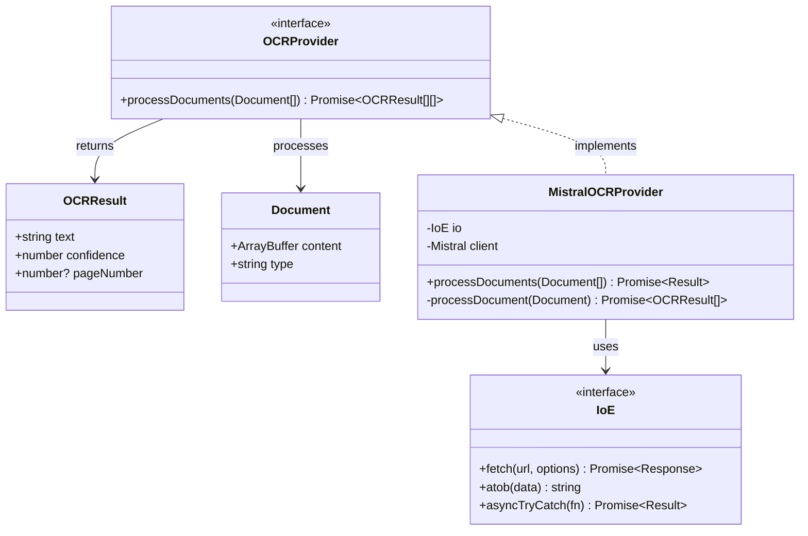
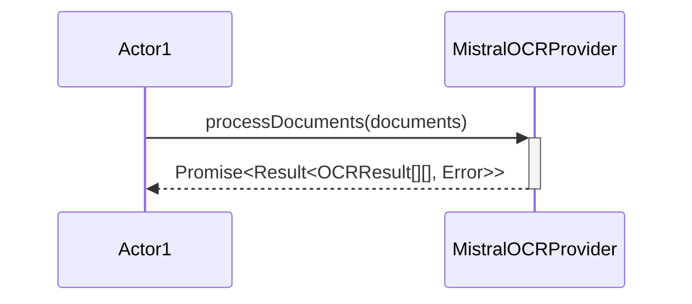

# OCR Processing Design

## Overview

The OCR Processing feature is designed to process images of paper checks using Mistral AI's vision capabilities to extract text. This document outlines the design and implementation details of this feature.

## Components

### 1. Core Types

```typescript
// Common OCR result type
type OCRResult = {
    text: string;
    confidence: number;
    pageNumber?: number;
}

// Document type for batch processing
type Document = {
    content: ArrayBuffer;
    type: 'image' | 'pdf';
}

// OCR provider interface
interface OCRProvider {
    processDocuments(documents: Document[]): Promise<OCRResult[][]>;
}

// Mistral-specific configuration
type MistralConfig = {
    /** API key for Mistral */
    apiKey: string
    /** Model to use for OCR */
    model?: string
}
```

### 2. Implementation

```typescript
class MistralOCRProvider implements OCRProvider {
    private readonly io: IoE
    private readonly client: Mistral

    /**
     * Creates a new Mistral OCR provider instance
     * @param io I/O interface for network operations
     * @param client Mistral client instance
     */
    constructor(io: IoE, client: Mistral) {
        this.io = io
        this.client = client
    }

    async processDocuments(documents: Document[]): Promise<Result<OCRResult[][], Error>> {
        return this.io.asyncTryCatch(async () => {
            // Process each document using Mistral API
            const results = await Promise.all(
                documents.map(doc => this.processDocument(doc))
            );
            
            // Returns array of results for each document
            // Each document's results array contains results for each page
            return results;
        });
    }
    
    private async processDocument(document: Document): Promise<OCRResult[]> {
        // Convert document to base64 encoding
        // Send to Mistral OCR API with model 'mistral-ocr-latest'
        // Process and format the response
        // Return OCR results with confidence scores
    }
}
```

## UML Diagrams

### Class Diagram


### Sequence Diagram



## Processing Flow

1. **Document Upload**
   - Client sends check image via HTTP POST
   - Worker validates content type and size

2. **Document Processing**
   - Image converted to appropriate format
   - Document processed by Mistral OCR
   - Text extracted with confidence scores

3. **Result Generation**
   - Structure OCR results
   - Handle any conversion errors
   - Return formatted result

## Error Handling

- API communication errors
- Invalid document format
- Processing failures
- Rate limiting issues

## Testing Strategy

The OCR functionality is tested at multiple levels to ensure reliability:

### Unit Tests (`tests/unit/ocr/`)
- Located in `tests/unit/ocr/mistral.test.ts`
- Tests individual components in isolation
- Mocks the Mistral API client
- Verifies:
  - Document processing logic
  - Error handling
  - Result conversion
  - Input validation

### Functional Tests (`tests/functional/ocr/`)
- Located in `tests/functional/ocr/mistral.f.test.ts`
- Tests functional programming patterns
- Focuses on data transformations
- Verifies the functional composition aspects

### Semi-Integration Tests (`tests/semi/ocr/`)
- Located in `tests/semi/ocr/mistral.test.js` 
- Uses real Mistral API client
- Processes actual check images
- Tests with real dependencies but without a web server
- Saves results to `tests/fixtures/expected/mistral-ocr-results.json`

### Integration Tests (`tests/integration/`)
- End-to-end OCR flow
- Tests the complete API endpoints
- Image processing with real server
- Performance verification

## Future Enhancements

1. **Processing Improvements**
   - Enhanced image preprocessing
   - Better format handling
   - Additional document types

2. **Performance**
   - Response caching
   - Batch processing
   - Rate limit optimization

3. **Monitoring**
   - Processing success rates
   - Response times
   - Error tracking 