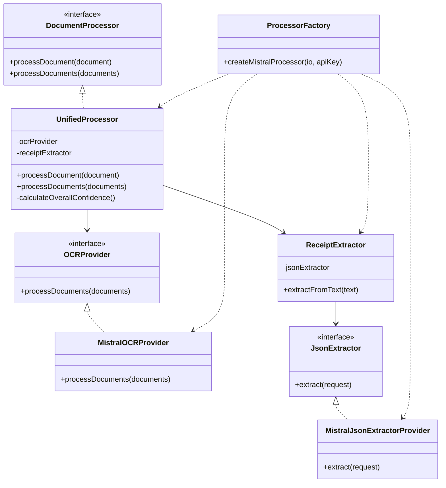
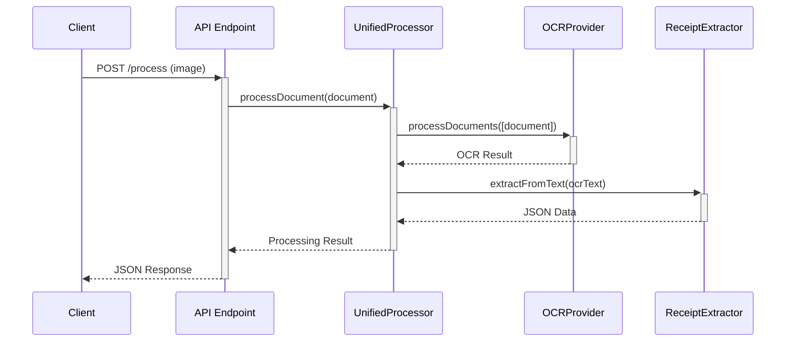

# Unified Processor

The Unified Processor is a component that encapsulates both OCR and JSON extraction in a single, cohesive process. It simplifies the workflow for processing documents by providing a unified interface that handles all steps of the document processing pipeline.

## Architecture

The Unified Processor follows SOLID principles:

1. **Single Responsibility Principle**: Each component has a single responsibility
   - OCRProvider: Handles OCR processing
   - JsonExtractor: Handles JSON extraction
   - UnifiedProcessor: Orchestrates the workflow

2. **Open/Closed Principle**: The system is open for extension but closed for modification
   - New document types can be added without modifying existing code
   - New extractors can be implemented without changing the processor

3. **Liskov Substitution Principle**: Components are interchangeable
   - Any OCRProvider implementation can be used
   - Any JsonExtractor implementation can be used

4. **Interface Segregation**: Interfaces are specific to needs
   - DocumentProcessor interface defines only what's needed
   - OCRProvider and JsonExtractor have focused interfaces

5. **Dependency Inversion**: Components depend on abstractions
   - UnifiedProcessor depends on OCRProvider and extractor interfaces
   - Components are passed via constructor injection

## Component Diagram



## Sequence Diagram



## Usage

### API Endpoint

The new `/process` endpoint accepts document uploads and returns structured data:

```http
POST /process?format=image&filename=receipt.jpg
Content-Type: image/jpeg

[Binary Image Data]
```

### Response Format

```json
{
  "data": {
    "merchant": {
      "name": "Example Store",
      "address": "123 Main St"
    },
    "timestamp": "2023-01-01T12:34:56Z",
    "totals": {
      "subtotal": 42.99,
      "tax": 3.44,
      "total": 46.43
    },
    "currency": "USD",
    "items": [
      {
        "description": "Product 1",
        "quantity": 2,
        "unitPrice": 12.99,
        "totalPrice": 25.98
      },
      {
        "description": "Product 2",
        "quantity": 1,
        "unitPrice": 17.01,
        "totalPrice": 17.01
      }
    ]
  },
  "confidence": {
    "ocr": 0.95,
    "extraction": 0.89,
    "overall": 0.92
  }
}
```

### Using the Processor Programmatically

```typescript
// Create processor
const processor = ProcessorFactory.createMistralProcessor(workerIoE, MISTRAL_API_KEY);

// Create document
const document: Document = {
  content: imageBuffer,
  type: DocumentType.Image,
  name: 'receipt.jpg'
};

// Process document
const result = await processor.processDocument(document);

// Handle result
if (result[0] === 'ok') {
  const data = result[1];
  console.log('Extracted data:', data.json);
  console.log('OCR confidence:', data.ocrConfidence);
  console.log('Extraction confidence:', data.extractionConfidence);
  console.log('Overall confidence:', data.overallConfidence);
} else {
  console.error('Error:', result[1]);
}
```

## Testing

The Unified Processor is fully testable with unit, functional, and integration tests:

- **Unit Tests**: Test individual components with mocks
- **Functional Tests**: Test pure functions and logic
- **Integration Tests**: Test end-to-end workflow with real API calls

## Future Improvements

1. **Batch Processing Optimization**: Improve performance for multiple documents
2. **Additional Document Types**: Support for PDFs and other formats
3. **Custom Extractors**: Support for different data structures (checks, invoices, etc.)
4. **Configurable Confidence Weighting**: Allow customization of confidence calculation
5. **Caching Layer**: Add caching for improved performance
6. **Error Recovery**: Add retry logic and partial result handling