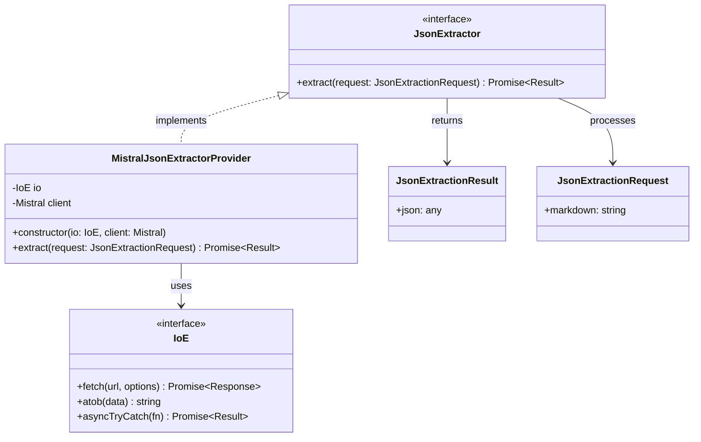
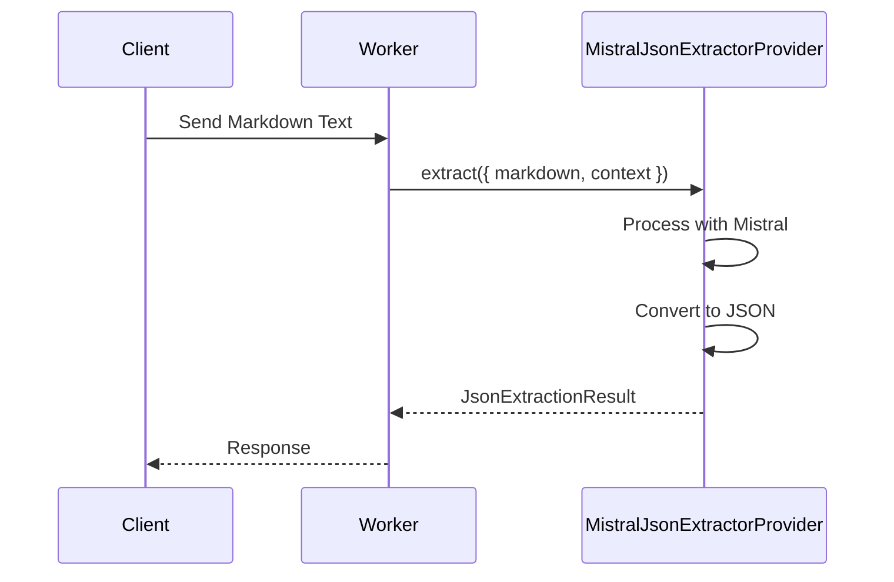

# JSON Extraction Design

## Overview

The JSON Extraction feature is designed to process markdown text output from the OCR system and extract structured JSON data using Mistral AI's capabilities. This document outlines the design and implementation details of this feature.

## Components

### 1. Core Types

```typescript
// Result of JSON extraction
type JsonExtractionResult = {
    /** Extracted JSON data */
    json: any
}

// Request for JSON extraction
type JsonExtractionRequest = {
    /** Markdown text to process */
    markdown: string
}

// JSON extractor interface
interface JsonExtractor {
    extract(request: JsonExtractionRequest): Promise<Result<JsonExtractionResult, Error>>
}

// Mistral-specific configuration
type MistralJsonConfig = {
    /** API key for Mistral */
    apiKey: string
    /** Model to use for JSON extraction */
    model?: string
}
```

### 2. Implementation

```typescript
class MistralJsonExtractorProvider implements JsonExtractor {
    private readonly client: Mistral
    private readonly io: IoE

    /**
     * Creates a new Mistral JSON extractor instance
     * @param io I/O interface for network operations
     * @param client Mistral client instance
     */
    constructor(io: IoE, client: Mistral) {
        this.io = io
        this.client = client
    }

    async extract(request: JsonExtractionRequest): Promise<Result<JsonExtractionResult, Error>> {
        // Implementation using Mistral API
        // Convert markdown to structured JSON
    }
}
```

## UML Diagrams

### Class Diagram



### Sequence Diagram



## Processing Flow

1. **Text Processing**
   - Receive markdown text from OCR
   - Prepare context for extraction
   - Format prompt for Mistral

2. **Mistral Processing**
   - Send text to Mistral API
   - Process response
   - Validate JSON structure

3. **Result Generation**
   - Structure extracted data as JSON
   - Handle any conversion errors
   - Return formatted result

## Error Handling

- API communication errors
- Invalid JSON response
- Context validation failures
- Rate limiting issues

## Testing Strategy

### Unit Tests
- API communication
- JSON validation
- Error handling
- Context processing

### Integration Tests
- End-to-end extraction flow
- Integration with OCR output
- Performance benchmarks

## Future Enhancements

1. **Extraction Improvements**
   - Enhanced prompt engineering
   - Better context handling
   - Schema validation

2. **Performance**
   - Response caching
   - Batch processing
   - Rate limit optimization

3. **Monitoring**
   - Extraction success rates
   - Response times
   - Error tracking 