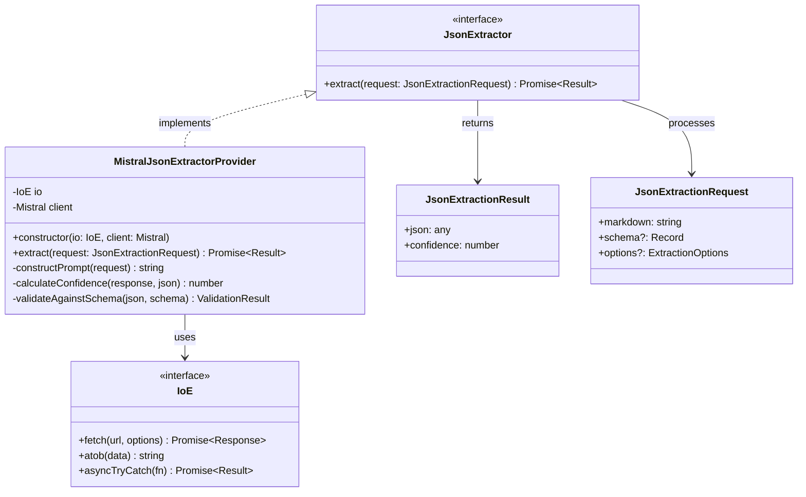
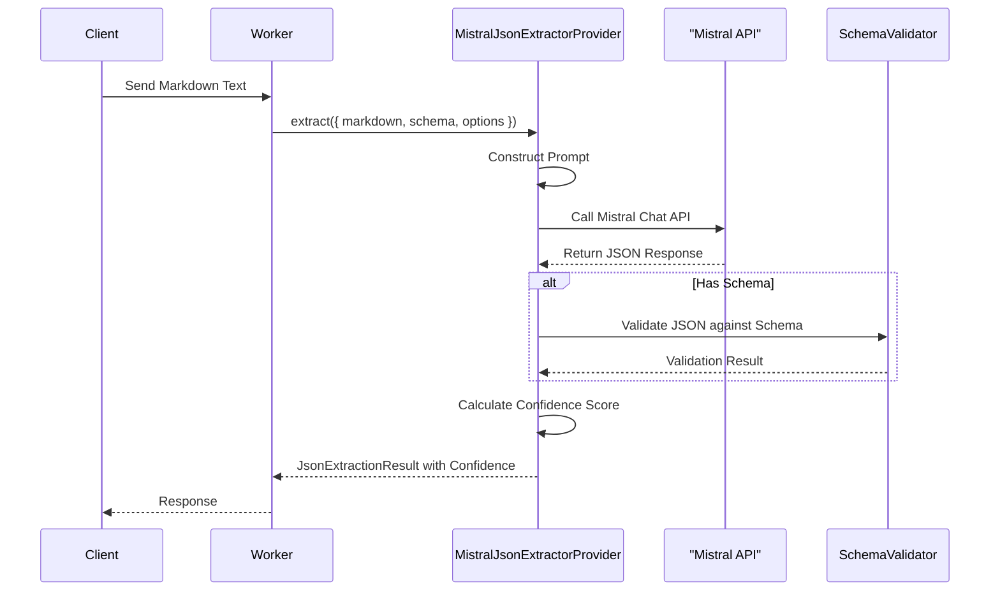

# JSON Extraction Design

## Overview

The JSON Extraction feature is designed to process markdown text output from the OCR system and extract structured JSON data using Mistral AI's capabilities. This document outlines the design and implementation details of this feature.

## Components

### 1. Core Types

```typescript
// Result of JSON extraction
type JsonExtractionResult = {
    /** Extracted JSON data */
    json: any;
    /** Confidence score (0-1) indicating extraction reliability */
    confidence: number;
}

// Request for JSON extraction
type JsonExtractionRequest = {
    /** Markdown text to process */
    markdown: string;
    /** Optional schema to validate against */
    schema?: Record<string, unknown>;
    /** Optional extraction options */
    options?: {
        /** Whether to throw an error or return partial results on validation failure */
        strictValidation?: boolean;
    };
}

// JSON extractor interface
interface JsonExtractor {
    extract(request: JsonExtractionRequest): Promise<Result<JsonExtractionResult, Error>>;
}
```

### 2. Implementation

```typescript
class MistralJsonExtractorProvider implements JsonExtractor {
    private readonly client: Mistral;
    private readonly io: IoE;

    /**
     * Creates a new Mistral JSON extractor instance
     * @param io I/O interface for network operations
     * @param client Mistral client instance
     */
    constructor(io: IoE, client: Mistral) {
        this.io = io;
        this.client = client;
    }

    async extract(request: JsonExtractionRequest): Promise<Result<JsonExtractionResult, Error>> {
        try {
            // Construct the prompt for Mistral
            const prompt = this.constructPrompt(request);
            
            // Call Mistral API
            const response = await this.client.chat.completions.create({
                model: 'mistral-large-latest',
                messages: [
                    {
                        role: 'system',
                        content: 'You are a JSON extraction specialist. Extract structured data from the provided text and return it as valid JSON.'
                    },
                    {
                        role: 'user',
                        content: prompt
                    }
                ],
                response_format: { type: 'json_object' }
            });
            
            // Parse the response
            const jsonContent = JSON.parse(response.choices[0].message.content);
            
            // Validate against schema if provided
            if (request.schema) {
                const validationResult = this.validateAgainstSchema(jsonContent, request.schema);
                if (!validationResult.success && request.options?.strictValidation) {
                    return { success: false, error: new Error(`JSON validation failed: ${validationResult.error}`) };
                }
            }
            
            // Calculate confidence score
            const confidence = this.calculateConfidence(response, jsonContent);
            
            return { 
                success: true, 
                data: {
                    json: jsonContent,
                    confidence
                }
            };
        } catch (error) {
            return { 
                success: false, 
                error: error instanceof Error 
                    ? error 
                    : new Error('Unknown error during JSON extraction') 
            };
        }
    }
    
    private constructPrompt(request: JsonExtractionRequest): string {
        let prompt = `Extract the following information from this markdown text as JSON:\n\n${request.markdown}\n\n`;
        
        if (request.schema) {
            prompt += `Please format the response according to this schema:\n${JSON.stringify(request.schema, null, 2)}\n\n`;
        }
        
        prompt += "Provide your response as a valid JSON object only.";
        return prompt;
    }
    
    private calculateConfidence(response: any, extractedJson: any): number {
        // Base confidence on multiple factors
        const factors = [
            // 1. Model finish reason (1.0 if "stop", 0.5 if other)
            response.choices[0].finish_reason === 'stop' ? 1.0 : 0.5,
            
            // 2. JSON structure completeness (0.0-1.0)
            Object.keys(extractedJson).length > 0 ? 1.0 : 0.3,
            
            // 3. Additional confidence factors can be added here
            // such as schema validation percentage, field completeness, etc.
        ];
        
        // Average the factors for final confidence score
        const confidenceScore = factors.reduce((sum, factor) => sum + factor, 0) / factors.length;
        
        // Return normalized score between 0 and 1, rounded to 2 decimal places
        return Math.round(confidenceScore * 100) / 100;
    }
    
    private validateAgainstSchema(json: any, schema: Record<string, unknown>): { success: boolean; error?: string } {
        // Simple schema validation implementation
        // In production, use a proper schema validation library
        try {
            // Check if all required fields are present
            for (const [key, value] of Object.entries(schema)) {
                if (value === 'required' && !(key in json)) {
                    return { success: false, error: `Missing required field: ${key}` };
                }
            }
            return { success: true };
        } catch (error) {
            return { 
                success: false, 
                error: error instanceof Error ? error.message : 'Unknown validation error'
            };
        }
    }
}
```

## Example Usage

```typescript
// Create the extractor
const io = new IoProvider();
const mistralClient = new Mistral(process.env.MISTRAL_API_KEY);
const jsonExtractor = new MistralJsonExtractorProvider(io, mistralClient);

// Extract JSON from OCR output
const ocrText = "Check #1234\nDate: 01/15/2024\nPay to: John Smith\nAmount: $500.00\nMemo: Consulting services";
const schema = {
    checkNumber: 'string',
    date: 'string',
    payee: 'string',
    amount: 'number',
    memo: 'string'
};

const result = await jsonExtractor.extract({
    markdown: ocrText,
    schema,
    options: {
        strictValidation: true
    }
});

if (result.success) {
    console.log('Extracted JSON:', result.data.json);
    console.log('Confidence:', result.data.confidence);
    
    // Example decision based on confidence
    if (result.data.confidence < 0.7) {
        console.warn('Low confidence extraction, may require manual review');
    }
} else {
    console.error('Extraction failed:', result.error);
}
```

## UML Diagrams

### Class Diagram



### Sequence Diagram



## Processing Flow

1. **Request Processing**
   - Receive markdown text from OCR
   - Check for schema and extraction options
   - Construct optimized prompt for Mistral

2. **Mistral Processing**
   - Send tailored prompt to Mistral API
   - Request JSON format for response
   - Process response from API

3. **Response Processing**
   - Parse JSON response from Mistral
   - Validate against schema if provided
   - Calculate confidence score based on extraction quality factors

4. **Result Generation**
   - Structure extracted data as JSON
   - Apply transformations if needed (e.g., type conversion)
   - Return structured result with confidence score

## Error Handling

### API Communication Errors
- Network timeout handling with automatic retries
- API rate limiting with exponential backoff
- Authentication errors with token refresh

### JSON Processing Errors
- Invalid JSON response handling
- Schema validation failures
- Partial extraction results when appropriate

### Context Validation Failures
- Source markdown format validation
- Context relevance checking
- Empty or missing data handling

### System Errors
- Memory limitations handling
- Dependency failures
- Logging and monitoring integration

## Testing Strategy

### Unit Tests
- API communication mocking
- JSON structure validation
- Error handling for all error types
- Schema validation
- Prompt construction logic
- Confidence calculation accuracy

### Functional Tests
- End-to-end extraction with known inputs
- Confidence score verification
- Option parameter handling
- Performance under different configurations

### Integration Tests
- Complete extraction pipeline testing
- Performance benchmarks with real API
- Rate limiting and retry handling
- Error propagation through system

### Manual/Exploratory Tests
- Edge case handling (unusual markdown formats)
- Extreme input sizes
- API version compatibility

## Performance Considerations

### Optimization Strategies
- Batching multiple extractions when possible
- Prompt optimizations for token efficiency
- Model selection based on complexity/performance tradeoffs

### Caching
- Implement result caching with TTL for repeated extractions
- Cache invalidation strategies
- Memory efficient cache implementation

### Monitoring
- Track extraction success rates by input type
- Measure response times across different models
- Log token usage for cost optimization
- Monitor confidence scores across different input types

## Future Enhancements

1. **Extraction Improvements**
   - Advanced prompt engineering with few-shot examples
   - Multi-stage extraction for complex documents
   - Domain-specific extraction models
   - Enhanced confidence scoring with field-level confidence

2. **Performance Optimization**
   - Parallel processing for batch extractions
   - Adaptive model selection based on input complexity
   - Preemptive rate limit management
   - Progressive enhancement of extraction results

3. **Integration Improvements**
   - Webhook notifications for completed extractions
   - Stream results for long-running extractions
   - Integration with data validation pipelines
   - Export capabilities to various formats

4. **Monitoring & Observability**
   - Detailed metrics on extraction quality
   - Cost tracking and optimization
   - Anomaly detection for extraction failures
   - Automated testing with continuous integration