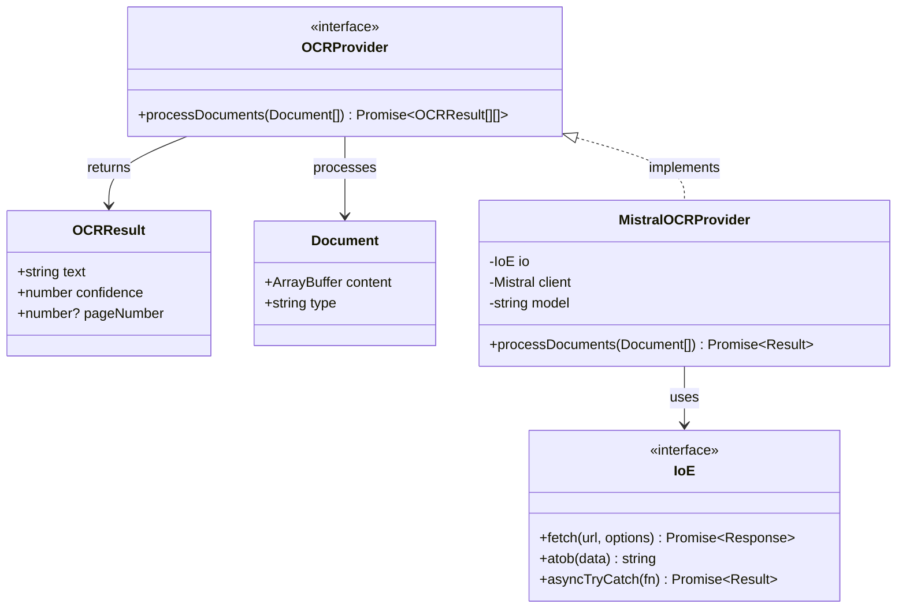
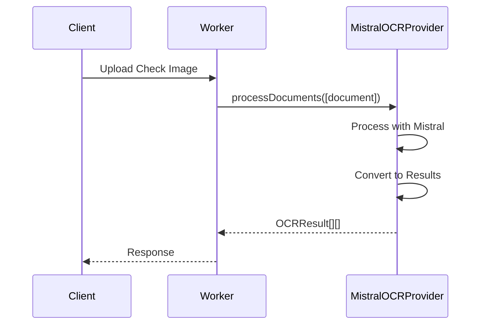

# OCR Processing Design

## Overview

The OCR Processing feature is designed to process images of paper checks using Mistral AI's vision capabilities to extract text. This document outlines the design and implementation details of this feature.

## Components

### 1. Core Types

```typescript
// Common OCR result type
type OCRResult = {
    text: string;
    confidence: number;
    pageNumber?: number;
}

// Document type for batch processing
type Document = {
    content: ArrayBuffer;
    type: 'image' | 'pdf';
}

// OCR provider interface
interface OCRProvider {
    processDocuments(documents: Document[]): Promise<OCRResult[][]>;
}

// Mistral-specific configuration
type MistralConfig = {
    /** API key for Mistral */
    apiKey: string
    /** Model to use for OCR */
    model?: string
}
```

### 2. Implementation

```typescript
class MistralOCRProvider implements OCRProvider {
    private readonly client: Mistral
    private readonly model: string
    private readonly io: IoE

    /**
     * Creates a new Mistral OCR provider instance
     * @param io I/O interface for network operations
     * @param config Provider configuration
     * @param client Optional Mistral client instance (for testing)
     */
    constructor(io: IoE, config: MistralConfig, client?: Mistral) {
        this.io = io
        this.client = client ?? new Mistral({ apiKey: config.apiKey })
        this.model = config.model ?? 'mistral-ocr-latest'
    }

    async processDocuments(documents: Document[]): Promise<Result<OCRResult[][], Error>> {
        // Implementation using Mistral API
        // Returns array of results for each document
        // Each document's results array contains results for each page
    }
}
```

## UML Diagrams

### Class Diagram


### Sequence Diagram


## Processing Flow

1. **Document Upload**
   - Client sends check image via HTTP POST
   - Worker validates content type and size

2. **Document Processing**
   - Image converted to appropriate format
   - Document processed by Mistral OCR
   - Text extracted with confidence scores

3. **Result Generation**
   - Structure OCR results
   - Handle any conversion errors
   - Return formatted result

## Error Handling

- API communication errors
- Invalid document format
- Processing failures
- Rate limiting issues

## Testing Strategy

### Unit Tests
- API communication
- Document processing
- Error handling
- Result conversion

### Integration Tests
- End-to-end OCR flow
- Image processing
- Performance benchmarks

## Future Enhancements

1. **Processing Improvements**
   - Enhanced image preprocessing
   - Better format handling
   - Additional document types

2. **Performance**
   - Response caching
   - Batch processing
   - Rate limit optimization

3. **Monitoring**
   - Processing success rates
   - Response times
   - Error tracking 