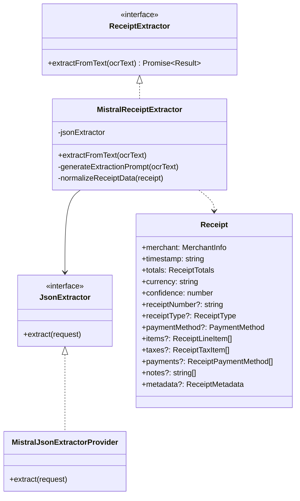

# Receipt Extractors

This document describes the receipt extractor architecture in the OCR Checks Server.

## Overview

Receipt extractors are components responsible for processing OCR text and extracting structured receipt data according to a defined schema. The system uses a modular design with interfaces to allow for different implementations and easier testing.

## Architecture



## Components

### ReceiptExtractor Interface

The core interface that all receipt extractors must implement:

```typescript
interface ReceiptExtractor {
  extractFromText(ocrText: string): Promise<Result<{ 
    json: Receipt, 
    confidence: number 
  }, string>>;
}
```

This interface follows the Interface Segregation Principle (ISP) from SOLID, providing a focused contract for extractors.

### MistralReceiptExtractor

The primary implementation of the receipt extractor interface, using Mistral AI for extraction:

```typescript
class MistralReceiptExtractor implements ReceiptExtractor {
  constructor(jsonExtractor: JsonExtractor) {
    this.jsonExtractor = jsonExtractor;
  }

  async extractFromText(ocrText: string): Promise<Result<{ json: Receipt, confidence: number }, string>> {
    // Implementation details...
  }
}
```

Key features:
- Implements the ReceiptExtractor interface
- Uses a JsonExtractor for the actual extraction work
- Handles schema validation
- Normalizes the extracted data

### Legacy Adapter

For backward compatibility, a legacy adapter wraps the new MistralReceiptExtractor:

```typescript
class ReceiptExtractor {
  constructor(jsonExtractor: JsonExtractor) {
    this.implementation = new MistralReceiptExtractor(jsonExtractor);
  }

  async extractFromText(ocrText: string): Promise<['ok', { json: Receipt, confidence: number }] | ['error', string]> {
    return this.implementation.extractFromText(ocrText);
  }
}
```

## Usage Example

```typescript
// Create the dependencies
const jsonExtractor = new MistralJsonExtractorProvider(io, mistralClient);

// Create the receipt extractor
const receiptExtractor = new MistralReceiptExtractor(jsonExtractor);

// Extract data from OCR text
const result = await receiptExtractor.extractFromText(ocrText);

// Handle the result
if (result[0] === 'ok') {
  const data = result[1];
  console.log('Extracted receipt:', data.json);
  console.log('Confidence:', data.confidence);
} else {
  console.error('Extraction failed:', result[1]);
}
```

## Testing

The receipt extractor architecture is designed for testability:

1. **Unit Testing**: The interfaces make it easy to create mock implementations for testing
2. **Integration Testing**: The modular design allows for testing the full extraction pipeline

## Future Enhancements

1. **Additional Extractors**: Implement other extractors for different receipt formats or providers
2. **Extraction Templates**: Allow custom extraction templates for different receipt types
3. **Pre/Post Processing**: Add hooks for custom pre/post processing of OCR text and results
4. **Confidence Tuning**: Improve confidence scoring for better accuracy