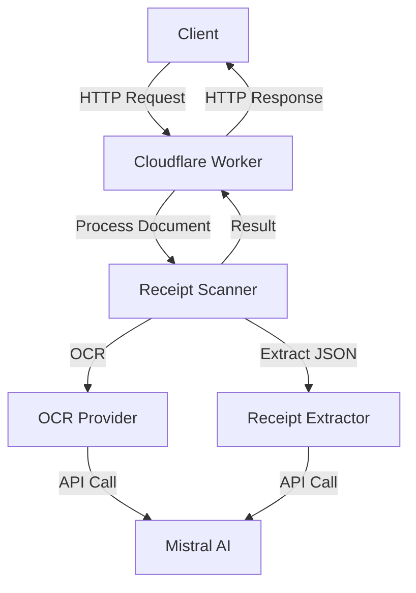
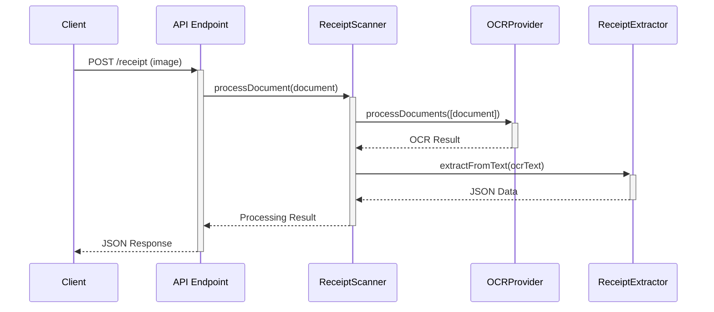

# OCR Receipts Server Design Document

## 1. Overview

The OCR Receipts Server is a Cloudflare Worker application designed to process images of receipts, extract structured data, and return formatted information in a consistent JSON format. The system leverages Mistral AI's multimodal capabilities for both Optical Character Recognition (OCR) and structured data extraction.

### 1.1 Business Objectives

- Provide a scalable, reliable service for receipt data extraction
- Support various receipt formats (retail, restaurant, utility bills, etc.)
- Deliver high-quality structured data with confidence scores
- Enable easy integration with financial management and expense tracking systems
- Provide a consistent API interface compatible with the existing OCR Checks Server

### 1.2 Core Features

- **Receipt Image Processing**: Accept and process images of receipts in various formats
- **OCR Technology**: Use Mistral AI to extract text from receipt images
- **Structured Data Extraction**: Convert OCR text to structured JSON data
- **Data Validation**: Validate extracted data against receipt schema
- **Confidence Scoring**: Provide reliability metrics for extracted data
- **Multi-Format Support**: Process different receipt formats (retail, restaurant, utility, etc.)
- **Error Handling**: Robust error handling and reporting

## 2. System Architecture

The OCR Receipts Server follows a modular, component-based architecture that enables flexibility, maintainability, and extensibility. The architecture is designed to adhere to SOLID principles.

### 2.1 High-Level Architecture



### 2.2 Component Design

#### 2.2.1 API Layer (Cloudflare Worker)

The Cloudflare Worker serves as the entry point for the system:

- Handles HTTP requests and routes them to appropriate handlers
- Manages CORS and request validation
- Parses input parameters and document content
- Routes requests to document scanners
- Formats and returns API responses
- Implements error handling and logging

Endpoints:
- `POST /receipt` - Primary endpoint for receipt processing
- `POST /process?type=receipt` - Universal processing endpoint with document type parameter

#### 2.2.2 Scanner Layer

The Receipt Scanner orchestrates the processing workflow:

- Accepts receipt document inputs
- Manages OCR processing
- Coordinates structured data extraction
- Calculates confidence scores
- Processes documents in batches

The scanner implements the `DocumentScanner` interface to ensure compatibility with the existing system.

#### 2.2.3 OCR Layer

The OCR Provider handles image-to-text conversion:

- Interfaces with Mistral AI's vision API
- Processes image data
- Returns OCR results with confidence scores
- Supports various image formats
- Handles multi-page documents

#### 2.2.4 Extraction Layer

The Receipt Extractor handles structured data extraction:

- Processes OCR text
- Applies receipt schema
- Extracts structured data
- Validates against schema requirements
- Normalizes data for consistency
- Identifies receipt type and applies specialized extraction rules

#### 2.2.5 Schema Layer

The Receipt Schema defines data structure and validation rules:

- Defines required and optional fields
- Specifies data types and formats
- Enforces validation constraints
- Supports various receipt formats
- Provides TypeScript type definitions

### 2.3 Dependency Injection

The system uses InversifyJS for dependency injection:

- Decouples component creation from usage
- Supports component substitution for testing
- Enables flexible configuration
- Manages component lifecycles

### 2.4 Factory Pattern

A ScannerFactory provides convenient creation methods:

- Creates fully configured scanner instances
- Abstracts dependency configuration
- Supports multiple scanner types
- Enables document type-based scanner selection

## 3. Processing Flow

### 3.1 Receipt Processing Sequence



### 3.2 Processing Steps

1. **Document Reception**
   - System receives HTTP POST with receipt image
   - Validates content type and document format
   - Creates document object with metadata

2. **OCR Processing**
   - Image is sent to Mistral AI vision API
   - AI extracts text content from image
   - OCR results are returned with confidence score

3. **Data Extraction**
   - OCR text is processed for structured extraction
   - Receipt type is identified
   - Receipt schema is applied
   - Data is validated against schema requirements
   - Structured data is returned with confidence score

4. **Result Compilation**
   - OCR and extraction results are combined
   - Overall confidence score is calculated
   - Final response is formatted
   - Result is returned to client

## 4. Data Model

### 4.1 Input Document

```typescript
interface Document {
  content: ArrayBuffer;
  type: DocumentType; // Image or PDF
  name?: string;
}
```

### 4.2 Receipt Schema

The Receipt schema includes:

- Merchant information (name, address, phone, etc.)
- Receipt details (number, type, timestamp)
- Financial information (totals, tax, tip, etc.)
- Line items (products, services, etc.)
- Payment methods
- Additional metadata

See [Receipt Schema Documentation](receipt-schema.md) for full details.

### 4.3 Processing Result

```typescript
interface ProcessingResult {
  json: Receipt;
  ocrConfidence: number;
  extractionConfidence: number;
  overallConfidence: number;
  rawText?: string;
}
```

### 4.4 API Response

```json
{
  "data": {
    "merchant": {
      "name": "ACME Store",
      "address": "123 Main St"
    },
    "timestamp": "2023-01-01T12:34:56Z",
    "totals": {
      "subtotal": 42.99,
      "tax": 3.44,
      "total": 46.43
    },
    "currency": "USD",
    "items": [
      {
        "description": "Product 1",
        "quantity": 2,
        "unitPrice": 12.99,
        "totalPrice": 25.98
      }
    ]
  },
  "confidence": {
    "ocr": 0.95,
    "extraction": 0.89,
    "overall": 0.92
  }
}
```

## 5. Error Handling

### 5.1 Error Types

- **Input Validation Errors**: Invalid content type, missing parameters
- **OCR Processing Errors**: Failed image processing, API errors
- **Extraction Errors**: Schema validation, parsing failures
- **System Errors**: Unexpected exceptions, timeouts

### 5.2 Error Responses

All errors return a consistent JSON format:

```json
{
  "error": "Error message describing the issue",
  "code": "ERROR_CODE",
  "details": { 
    "additional": "information" 
  }
}
```

HTTP status codes:
- 400 Bad Request: Client errors (invalid input)
- 422 Unprocessable Entity: Document processing errors
- 500 Internal Server Error: System errors

### 5.3 Error Logging

- All errors are logged with context information
- Processing failures include diagnostic information
- API errors include response details

## 6. Implementation Approach

### 6.1 Development Methodology

- Test-Driven Development (TDD) approach
- SOLID principles adherence
- Functional programming patterns where appropriate
- Component-based implementation

### 6.2 Technology Stack

- **Runtime**: Cloudflare Workers (JavaScript/TypeScript)
- **Framework**: Hono (lightweight web framework)
- **Dependency Injection**: InversifyJS
- **API Integration**: Mistral AI
- **Error Handling**: Functional Result pattern
- **Testing**: Jasmine

### 6.3 Testing Strategy

- **Unit Tests**: Test individual components in isolation
- **Functional Tests**: Test functional programming patterns
- **Semi-Integration Tests**: Test with real dependencies
- **Integration Tests**: Test complete flow with HTTP endpoints

### 6.4 Security Considerations

- API key management via environment variables
- Input validation for all client data
- Proper error handling without information leakage
- Content type restrictions
- Size limits for uploads

## 7. Performance Considerations

### 7.1 Optimizations

- Cloudflare's global edge network for low-latency access
- Efficient document processing pipeline
- Parallel processing for batch operations
- Minimal dependencies for lightweight worker

### 7.2 Scalability

- Stateless architecture for horizontal scalability
- Independent request processing
- Efficient resource utilization
- Cloudflare's global distribution

### 7.3 Monitoring

- Response time tracking
- Error rate monitoring
- Confidence score trends
- API usage metrics

## 8. Integration and Compatibility

### 8.1 API Compatibility

The OCR Receipts Server maintains API compatibility with the OCR Checks Server:

- Consistent endpoint patterns
- Compatible response formats
- Shared document processing interfaces
- Unified error handling approach

### 8.2 Integration Points

- Financial management systems
- Expense tracking software
- Accounting systems
- Mobile apps for receipt scanning
- Enterprise document management systems

### 8.3 Extension Points

- Additional document types
- Custom extractors for specialized receipts
- Webhook notifications
- Batch processing capabilities
- Data export options

## 9. Deployment and Operations

### 9.1 Deployment Model

- Cloudflare Workers deployment
- Environment-specific configurations
- Continuous integration and deployment

### 9.2 Environment Configuration

- API keys and credentials
- Logging settings
- Feature flags
- Performance parameters

### 9.3 Monitoring and Alerting

- Error rate thresholds
- Performance monitoring
- Usage tracking
- Confidence score monitoring

## 10. Future Considerations

### 10.1 Enhancement Opportunities

- **Multi-Page Receipt Support**: Enhanced handling for multi-page receipts
- **Historical Analysis**: Trend detection across multiple receipts
- **Receipt Classification**: Automatic categorization of receipts
- **Enhanced Confidence Models**: More sophisticated confidence scoring
- **Specialized Extractors**: Domain-specific extraction for different industries
- **Feedback Loop**: Mechanism for improving extraction accuracy based on feedback

### 10.2 Integration Opportunities

- **ERP Systems**: Direct integration with enterprise resource planning systems
- **Accounting Software**: QuickBooks, Xero, and other accounting platforms
- **Expense Management**: Integration with expense tracking and reimbursement systems
- **Banking Platforms**: Integration with banking and financial management tools
- **Mobile Applications**: SDKs for mobile app integration

## 11. Conclusion

The OCR Receipts Server provides a robust, scalable solution for receipt data extraction, leveraging modern AI capabilities while maintaining a clean, maintainable architecture. The system is designed to be compatible with the existing OCR Checks Server while focusing specifically on the unique challenges of receipt processing.

By adhering to SOLID principles, following a TDD approach, and implementing a component-based architecture, the system will be maintainable, extensible, and reliable, providing high-quality receipt data extraction services with confidence scoring and comprehensive error handling.