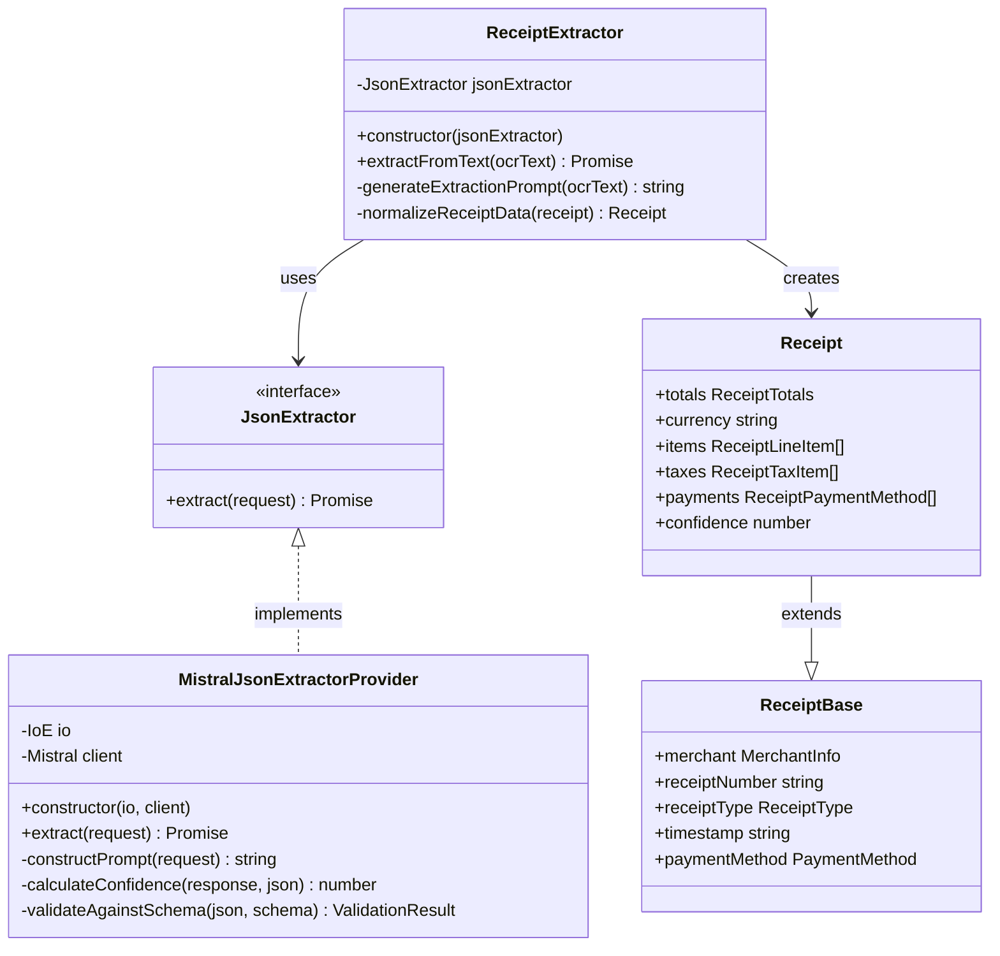
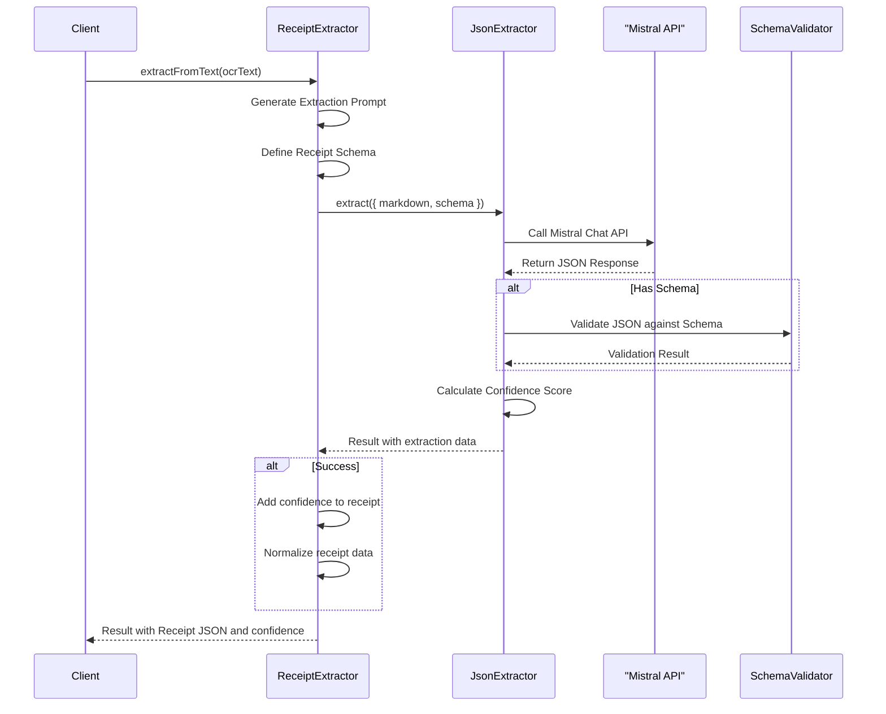

# Receipt Schema Implementation

This document describes the implementation of the JSON schema for receipt data extraction, based on the actual code in the OCRChecksServer project.

## Implementation Overview

The receipt schema has been implemented using a combination of:

1. JSON Schema definition (compatible with JSON Schema Draft-07)
2. TypeScript interfaces and enums for type safety
3. Extraction processor to handle OCR text conversion to structured data

## Schema Components

### Core Types and Interfaces

The schema is structured around a central `Receipt` interface with related interfaces for component elements:

```typescript
export interface ReceiptBase {
  merchant: MerchantInfo;
  receiptNumber?: string;
  receiptType?: ReceiptType;
  timestamp: string;
  paymentMethod?: PaymentMethod | string;
}

export interface Receipt extends ReceiptBase {
  totals: ReceiptTotals;
  currency?: string;  // Optional as of v1.25.0
  items?: ReceiptLineItem[];
  taxes?: ReceiptTaxItem[];
  payments?: ReceiptPaymentMethod[];
  notes?: string[];
  metadata?: ReceiptMetadata;
  confidence: number;
}
```

### Type-Safe Enums

For improved type safety, the implementation uses TypeScript string-based enums instead of simple string literals:

```typescript
export enum ReceiptType {
  Sale = 'sale',
  Return = 'return',
  Refund = 'refund',
  Estimate = 'estimate',
  Proforma = 'proforma',
  Other = 'other'
}

export enum PaymentMethod {
  Credit = 'credit',
  Debit = 'debit',
  Cash = 'cash',
  Check = 'check',
  GiftCard = 'gift_card',
  StoreCredit = 'store_credit',
  MobilePayment = 'mobile_payment',
  Other = 'other'
}

export enum CardType {
  Visa = 'visa',
  Mastercard = 'mastercard',
  Amex = 'amex',
  Discover = 'discover',
  DinersClub = 'diners_club',
  JCB = 'jcb',
  UnionPay = 'union_pay',
  Other = 'other'
}

export enum TaxType {
  Sales = 'sales',
  VAT = 'vat',
  GST = 'gst',
  PST = 'pst',
  HST = 'hst',
  Excise = 'excise',
  Service = 'service',
  Other = 'other'
}

export enum ReceiptFormat {
  Retail = 'retail',
  Restaurant = 'restaurant',
  Service = 'service',
  Utility = 'utility',
  Transportation = 'transportation',
  Accommodation = 'accommodation',
  Other = 'other'
}

export enum UnitOfMeasure {
  Each = 'ea',
  Kilogram = 'kg',
  Gram = 'g',
  Pound = 'lb',
  Ounce = 'oz',
  Liter = 'l',
  Milliliter = 'ml',
  Gallon = 'gal',
  Piece = 'pc',
  Pair = 'pr',
  Pack = 'pk',
  Box = 'box',
  Other = 'other'
}
```

### Structured Component Interfaces

The schema groups related fields into logical components:

```typescript
export interface MerchantInfo {
  name: string;
  address?: string;
  phone?: string;
  website?: string;
  taxId?: string;
  storeId?: string;
  chainName?: string;
}

export interface ReceiptTotals {
  subtotal?: number;
  tax?: number;
  tip?: number;
  discount?: number;
  total: number;
}

export interface ReceiptLineItem {
  description: string;
  sku?: string;
  quantity?: number;
  unit?: UnitOfMeasure | string;
  unitPrice?: number;
  totalPrice: number;
  discounted?: boolean;
  discountAmount?: number;
  category?: string;
}

export interface ReceiptTaxItem {
  taxName: string;
  taxType?: TaxType | string;
  taxRate?: number;
  taxAmount: number;
}

export interface ReceiptPaymentMethod {
  method: PaymentMethod;
  cardType?: CardType | string;
  lastDigits?: string;
  amount: number;
  transactionId?: string;
}

export interface ReceiptMetadata {
  confidenceScore: number;
  currency?: string;
  languageCode?: string;
  timeZone?: string;
  receiptFormat?: ReceiptFormat;
  sourceImageId?: string;
  warnings?: string[];
}
```

## JSON Schema Definition

The implementation includes a JSON Schema definition for validating receipt data:

```typescript
export const receiptSchema = {
  "$schema": "http://json-schema.org/draft-07/schema#",
  "title": "Receipt",
  "description": "Schema for receipt data extracted from images",
  "type": "object",
  "required": ["merchant", "timestamp", "totals", "confidence"],
  "properties": {
    "merchant": {
      "type": "object",
      "required": ["name"],
      "description": "Information about the merchant",
      "properties": {
        "name": {
          "type": "string",
          "description": "Name of the merchant or store"
        },
        // Additional merchant properties...
      }
    },
    // Additional receipt properties...
    "confidence": {
      "type": "number",
      "description": "Overall confidence score (0-1)",
      "minimum": 0,
      "maximum": 1
    }
  }
};
```

## Extraction Implementation

The receipt extraction process is implemented in the `ReceiptExtractor` class, which:

1. Takes OCR text as input
2. Applies a structured extraction prompt tailored for receipts
3. Uses a JSON extractor (based on Mistral AI) to process the text
4. Validates the extraction against the JSON schema
5. Normalizes the extracted data
6. Returns the structured receipt data with confidence scores

```typescript
export class ReceiptExtractor {
  private jsonExtractor: JsonExtractor;

  constructor(jsonExtractor: JsonExtractor) {
    this.jsonExtractor = jsonExtractor;
  }

  async extractFromText(ocrText: string): Promise<Result<{ json: Receipt, confidence: number }, string>> {
    // Define schema for extraction
    const receiptSchema: JsonSchema = {/* schema definition */};
    
    // Generate extraction prompt
    const extractionPrompt = this.generateExtractionPrompt(ocrText);
    
    // Extract JSON using the extractor
    const result = await this.jsonExtractor.extract({
      markdown: extractionPrompt,
      schema: receiptSchema
    });
    
    // Handle extraction result and normalize data
    if (result.error) {
      return { error: result.error instanceof Error ? result.error.message : String(result.error) };
    }
    
    // Process and normalize data
    const extractedData = result.value.json as Receipt;
    extractedData.confidence = result.value.confidence;
    
    const normalizedData = this.normalizeReceiptData(extractedData);
    
    return { 
      value: {
        json: normalizedData,
        confidence: result.value.confidence
      }
    };
  }

  private generateExtractionPrompt(ocrText: string): string {
    // Custom prompt engineering for receipt extraction
    return `
      # Receipt Data Extraction
      
      Below is the text extracted from a receipt image using OCR. Please extract the relevant information into a structured JSON format.
      
      ## OCR Text:
      
      ${ocrText}
      
      ## Instructions:
      
      Extract the following information:
      - Merchant information (grouped under "merchant" object)
      - Receipt number and date/time
      - Items purchased with quantities, unit prices, and total prices
      - Financial totals (grouped under "totals" object)
      - Payment method details
      - Any other relevant information from the receipt
      
      For numerical values, extract them as numbers without currency symbols.
      For the date, convert it to ISO 8601 format (YYYY-MM-DDThh:mm:ssZ) if possible.
      For the currency, use the standard 3-letter ISO currency code (e.g., USD, EUR, GBP).
    `;
  }

  private normalizeReceiptData(receipt: Receipt): Receipt {
    // Data normalization logic
    const normalized = { ...receipt };
    
    // Ensure currency is uppercase
    if (normalized.currency) {
      normalized.currency = normalized.currency.toUpperCase();
    }
    
    // Normalize timestamp if provided but not in ISO format
    if (normalized.timestamp && !normalized.timestamp.includes('T')) {
      try {
        const date = new Date(normalized.timestamp);
        if (!isNaN(date.getTime())) {
          normalized.timestamp = date.toISOString();
        }
      } catch (e) {
        // Keep original if conversion fails
      }
    }
    
    // Additional normalization logic can be added here
    
    return normalized;
  }
}
```

## Error Handling

The implementation uses the `Result` type for proper error handling:

```typescript
type Result<T, E> = { value: T, error?: undefined } | { error: E, value?: undefined };
```

This pattern allows for explicit error handling without throwing exceptions, making it easier to:

1. Process and capture extraction errors
2. Provide specific error messages to clients
3. Maintain a consistent error handling approach throughout the application

## Validation Features

The implemented schema includes several validation features:

1. **Field Requirements**:
   - Required fields: merchant, timestamp, totals, confidence
   - Optional but recommended fields: currency
   - Required sub-fields: merchant.name, totals.total

2. **Value Constraints**:
   - Numerical minimums (e.g., all prices must be >= 0)
   - Maximum values for confidence scores (0-1)
   - Pattern validation for currency codes (3-letter uppercase)
   - Pattern validation for last digits (4 digits)
   - Format validation for timestamps (ISO 8601)

3. **Enum Validation**:
   - Receipt type values must match defined enum values
   - Payment methods must match defined enum values
   - Card types must match defined enum values
   - Tax types must match defined enum values
   - Receipt formats must match defined enum values
   - Units of measure must match defined enum values

## Integration with JSON Extraction System

The receipt extraction system is integrated with the general JSON extraction framework:



## Usage Example

```typescript
import { ReceiptExtractor } from './json/receipt-extractor';
import { JsonExtractor } from './json/types';
import type { Result } from 'functionalscript/types/result/module.f.js';

// Initialize with the JSON extractor
const jsonExtractor: JsonExtractor = /* your implementation */;
const receiptExtractor = new ReceiptExtractor(jsonExtractor);

// Extract receipt data from OCR text
const ocrText = `GROCERY STORE
123 Main St, Anytown
Tel: (555) 123-4567
Date: 09/15/2023 14:30
-------------------
1x Milk $3.99
2x Bread $4.50
1x Eggs $2.99
-------------------
Subtotal: $11.48
Tax (8%): $0.92
Total: $12.40
-------------------
PAID: VISA ****1234
Thank you for shopping!`;

const result = await receiptExtractor.extractFromText(ocrText);

if (!result.error) {
  console.log('Receipt data extracted:', result.value.json);
  console.log('Confidence score:', result.value.confidence);
  
  // Access structured receipt data
  const receipt = result.value.json;
  console.log(`Merchant: ${receipt.merchant.name}`);
  console.log(`Total Amount: ${receipt.totals.total} ${receipt.currency}`);
  console.log(`Date: ${receipt.timestamp}`);
  console.log(`Payment Method: ${receipt.paymentMethod}`);
  
  // Process line items
  if (receipt.items && receipt.items.length > 0) {
    console.log('Items purchased:');
    receipt.items.forEach(item => {
      console.log(`- ${item.description}: ${item.totalPrice}`);
    });
  }
} else {
  console.error('Extraction failed:', result.error);
}
```

## Processing Flow



## Benefits of Current Implementation

1. **Type Safety**: TypeScript interfaces and enums provide compile-time type checking
2. **Validation**: JSON Schema validation ensures data integrity at runtime
3. **Modularity**: Component interfaces allow for flexible extension
4. **Error Handling**: Functional Result pattern provides clear error handling
5. **Normalization**: Automatic data cleanup and standardization
6. **Documentation**: Self-documenting schema with descriptions
7. **Integration**: Seamless integration with the broader JSON extraction system

## Next Steps

1. **Enhanced Validation**: Add cross-field validation (e.g., subtotal + tax ≈ total)
2. **Field Confidence**: Add field-level confidence scores
3. **Extraction Improvements**: Optimize prompts for specific receipt types
4. **Performance Tuning**: Optimize large-scale receipt processing
5. **Business Logic**: Add domain-specific validation rules
6. **Integration Testing**: Expand test coverage with real-world receipt samples