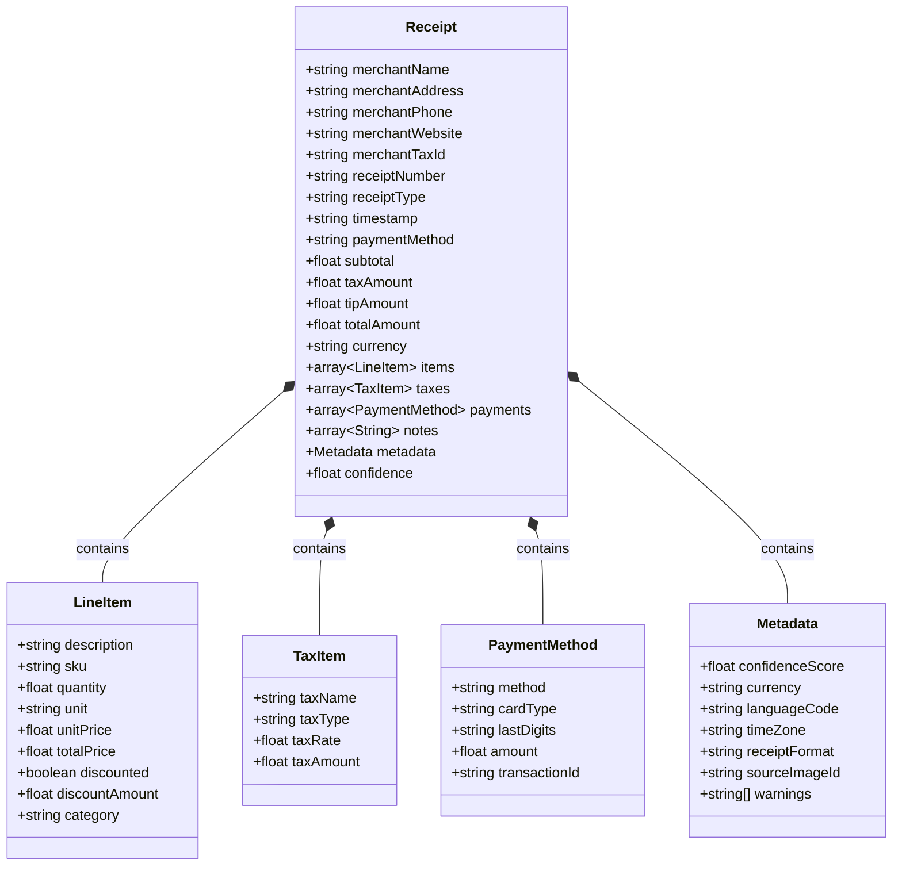
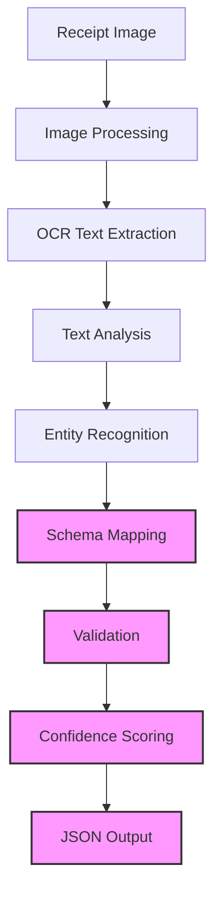

# Receipt JSON Schema Design

This document outlines the JSON schema design for receipt data extraction, which will be used to extract structured information from receipt images.

## Overview

The receipt schema is designed to capture common elements found in retail, restaurant, and service receipts. The schema is structured to accommodate variations in receipt formats while maintaining a consistent data model.

## Schema Design



## Schema Details

### Receipt Object

| Field | Type | Description | Required |
|-------|------|-------------|----------|
| merchantName | string | Name of the merchant or store | Yes |
| merchantAddress | string | Physical address of the merchant | No |
| merchantPhone | string | Contact phone number | No |
| merchantWebsite | string | Website URL | No |
| merchantTaxId | string | Tax identification number (VAT/GST ID) | No |
| receiptNumber | string | Receipt or invoice number | No |
| receiptType | string | Type of receipt (e.g., "sale", "return", "refund") | No |
| timestamp | string | Date and time of transaction (ISO 8601 format) | Yes |
| paymentMethod | string | Method of payment (e.g., "cash", "credit", "debit") | No |
| subtotal | number | Pre-tax total amount | No |
| taxAmount | number | Total tax amount | No |
| tipAmount | number | Tip/gratuity amount | No |
| totalAmount | number | Total amount including tax and tip | Yes |
| currency | string | 3-letter ISO currency code | Yes |
| items | array | List of line items on the receipt | No |
| taxes | array | Breakdown of taxes | No |
| payments | array | Details about payment methods used | No |
| notes | array | Additional notes or comments | No |
| metadata | object | Additional information about the extraction | No |
| confidence | number | Overall confidence score (0-1) | Yes |

### LineItem Object

| Field | Type | Description | Required |
|-------|------|-------------|----------|
| description | string | Item description or name | Yes |
| sku | string | Stock keeping unit or product code | No |
| quantity | number | Quantity purchased | No |
| unit | string | Unit of measurement (e.g., "ea", "kg") | No |
| unitPrice | number | Price per unit | No |
| totalPrice | number | Total price for this line item | Yes |
| discounted | boolean | Whether the item was discounted | No |
| discountAmount | number | Amount of discount applied | No |
| category | string | Product category | No |

### TaxItem Object

| Field | Type | Description | Required |
|-------|------|-------------|----------|
| taxName | string | Name of tax (e.g., "VAT", "GST", "Sales Tax") | Yes |
| taxType | string | Type of tax | No |
| taxRate | number | Tax rate as decimal (e.g., 0.1 for 10%) | No |
| taxAmount | number | Tax amount | Yes |

### PaymentMethod Object

| Field | Type | Description | Required |
|-------|------|-------------|----------|
| method | string | Payment method (e.g., "credit", "cash") | Yes |
| cardType | string | Type of card (e.g., "Visa", "Mastercard") | No |
| lastDigits | string | Last 4 digits of payment card | No |
| amount | number | Amount paid with this method | Yes |
| transactionId | string | Payment transaction ID | No |

### Metadata Object

| Field | Type | Description | Required |
|-------|------|-------------|----------|
| confidenceScore | number | Overall confidence of extraction (0-1) | Yes |
| currency | string | ISO currency code detected | No |
| languageCode | string | ISO language code of the receipt | No |
| timeZone | string | Time zone identifier | No |
| receiptFormat | string | Format type (e.g., "retail", "restaurant") | No |
| sourceImageId | string | Reference to the source image | No |
| warnings | array | List of warning messages | No |

## Example

```json
{
  "merchantName": "ACME Supermarket",
  "merchantAddress": "123 Main St, Anytown, CA 90210",
  "merchantPhone": "(555) 123-4567",
  "receiptNumber": "T-59385",
  "timestamp": "2025-04-28T15:30:45Z",
  "subtotal": 42.97,
  "taxAmount": 3.44,
  "totalAmount": 46.41,
  "currency": "USD",
  "items": [
    {
      "description": "Organic Bananas",
      "quantity": 1.20,
      "unit": "kg",
      "unitPrice": 2.99,
      "totalPrice": 3.59
    },
    {
      "description": "Whole Milk",
      "quantity": 2,
      "unitPrice": 3.49,
      "totalPrice": 6.98
    },
    {
      "description": "Sliced Bread",
      "quantity": 1,
      "unitPrice": 4.29,
      "totalPrice": 4.29,
      "discounted": true,
      "discountAmount": 0.50
    }
  ],
  "taxes": [
    {
      "taxName": "CA State Tax",
      "taxRate": 0.08,
      "taxAmount": 3.44
    }
  ],
  "payments": [
    {
      "method": "credit",
      "cardType": "Visa",
      "lastDigits": "1234",
      "amount": 46.41,
      "transactionId": "TX78965412"
    }
  ],
  "metadata": {
    "confidenceScore": 0.92,
    "languageCode": "en-US",
    "receiptFormat": "retail",
    "sourceImageId": "receipt-20250428-001.jpg"
  },
  "confidence": 0.92
}
```

## Schema Validation

The schema validation will be implemented using JSON Schema Draft-07, which provides:

1. Type validation for all properties
2. Required field validation
3. Format validation for dates and other standardized strings
4. Range validation for numerical fields (e.g., confidence scores)

## Implementation Guidelines

When implementing the receipt schema extraction:

1. **Confidence Scores**: Each extracted field should have an associated confidence score, with the overall confidence representing a weighted average.

2. **Missing Data**: Fields marked as non-required can be omitted if not detected in the receipt or if the confidence score is below a threshold.

3. **Data Normalization**:
   - Currency values should be normalized to numeric values (not strings with currency symbols)
   - Dates should be normalized to ISO 8601 format
   - Text fields should have extraneous whitespace removed

4. **Validation**: Implement JSON Schema validation to ensure the output conforms to the specified schema.

## Integration with OCR Pipeline

The receipt schema will be integrated with the existing OCR pipeline:



The receipt schema processor will be implemented as a new module in the project structure, following the existing patterns for OCR extraction.

## Error Handling

The schema implementation should include robust error handling:

1. **Validation Errors**: When the extracted data doesn't conform to the schema, detailed error messages should be returned.

2. **Confidence Thresholds**: Fields with confidence scores below configurable thresholds should be flagged or omitted.

3. **Required Fields**: If required fields cannot be extracted with sufficient confidence, the system should return an appropriate error message.

## Next Steps

1. Implement JSON Schema definition file based on this design
2. Create test cases with sample receipt images
3. Develop the extraction logic for mapping OCR output to schema
4. Implement validation and confidence scoring
5. Integrate with the existing OCR pipeline
6. Add API documentation for the receipt processing endpoint