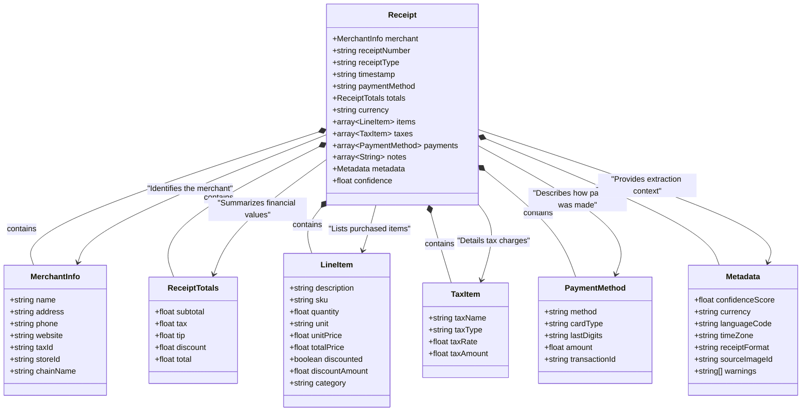
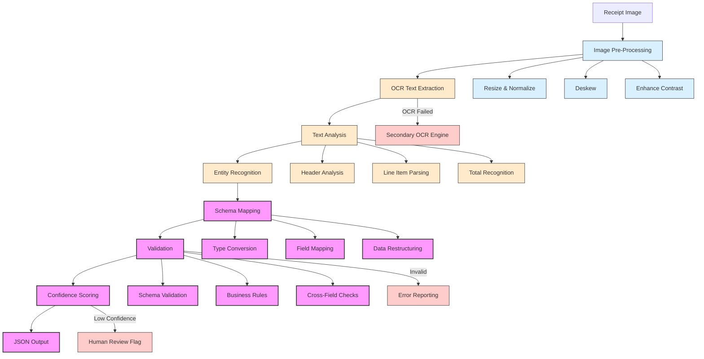

# Receipt JSON Schema Design

This document outlines the JSON schema design for receipt data extraction, which will be used to extract structured information from receipt images.

## Overview

The receipt schema is designed to capture common elements found in retail, restaurant, and service receipts. The schema is structured to accommodate variations in receipt formats while maintaining a consistent data model.

### Key Design Principles

1. **Hierarchical Organization**: Related fields are grouped into logical objects (e.g., merchant information, line items)
2. **Flexibility**: Optional fields accommodate different receipt formats while maintaining core required fields
3. **Validation**: Type constraints and pattern validation ensure data integrity
4. **Confidence Scoring**: All extracted data includes confidence metrics for reliability assessment

## String-Based Enums

The schema uses TypeScript string-based enums for consistency and type safety:

### Receipt Type
```typescript
enum ReceiptType {
  Sale = 'sale',
  Return = 'return',
  Refund = 'refund',
  Estimate = 'estimate',
  Proforma = 'proforma',
  Other = 'other'
}
```

### Payment Method
```typescript
enum PaymentMethod {
  Credit = 'credit',
  Debit = 'debit',
  Cash = 'cash',
  Check = 'check',
  GiftCard = 'gift_card',
  StoreCredit = 'store_credit',
  MobilePayment = 'mobile_payment',
  Other = 'other'
}
```

### Card Type
```typescript
enum CardType {
  Visa = 'visa',
  Mastercard = 'mastercard',
  Amex = 'amex',
  Discover = 'discover',
  DinersClub = 'diners_club',
  JCB = 'jcb',
  UnionPay = 'union_pay',
  Other = 'other'
}
```

### Tax Type
```typescript
enum TaxType {
  Sales = 'sales',
  VAT = 'vat',
  GST = 'gst',
  PST = 'pst',
  HST = 'hst',
  Excise = 'excise',
  Service = 'service',
  Other = 'other'
}
```

### Receipt Format
```typescript
enum ReceiptFormat {
  Retail = 'retail',
  Restaurant = 'restaurant',
  Service = 'service',
  Utility = 'utility',
  Transportation = 'transportation',
  Accommodation = 'accommodation',
  Other = 'other'
}
```

### Unit of Measure
```typescript
enum UnitOfMeasure {
  Each = 'ea',
  Kilogram = 'kg',
  Gram = 'g',
  Pound = 'lb',
  Ounce = 'oz',
  Liter = 'l',
  Milliliter = 'ml',
  Gallon = 'gal',
  Piece = 'pc',
  Pair = 'pr',
  Pack = 'pk',
  Box = 'box',
  Other = 'other'
}
```

## Schema Design



## Schema Details

### Receipt Object

| Field | Type | Description | Required |
|-------|------|-------------|----------|
| merchant | object | Information about the merchant | Yes |
| merchant.name | string | Name of the merchant or store | Yes |
| merchant.address | string | Physical address of the merchant | No |
| merchant.phone | string | Contact phone number | No |
| merchant.website | string | Website URL | No |
| merchant.taxId | string | Tax identification number (VAT/GST ID) | No |
| merchant.storeId | string | Store or branch identifier | No |
| merchant.chainName | string | Name of the store chain if applicable | No |
| receiptNumber | string | Receipt or invoice number | No |
| receiptType | string | Type of receipt (e.g., "sale", "return", "refund") | No |
| timestamp | string | Date and time of transaction (ISO 8601 format) | Yes |
| paymentMethod | string | Method of payment (e.g., "cash", "credit", "debit") | No |
| totals | object | Financial totals from the receipt | Yes |
| totals.subtotal | number | Pre-tax total amount | No |
| totals.tax | number | Total tax amount | No |
| totals.tip | number | Tip/gratuity amount | No |
| totals.discount | number | Total discount amount | No |
| totals.total | number | Final total amount including tax and tip | Yes |
| currency | string | 3-letter ISO currency code | Yes |
| items | array | List of line items on the receipt | No |
| taxes | array | Breakdown of taxes | No |
| payments | array | Details about payment methods used | No |
| notes | array | Additional notes or comments | No |
| metadata | object | Additional information about the extraction | No |
| confidence | number | Overall confidence score (0-1) | Yes |

### LineItem Object

| Field | Type | Description | Required |
|-------|------|-------------|----------|
| description | string | Item description or name | Yes |
| sku | string | Stock keeping unit or product code | No |
| quantity | number | Quantity purchased | No |
| unit | string | Unit of measurement (e.g., "ea", "kg") | No |
| unitPrice | number | Price per unit | No |
| totalPrice | number | Total price for this line item | Yes |
| discounted | boolean | Whether the item was discounted | No |
| discountAmount | number | Amount of discount applied | No |
| category | string | Product category | No |

### TaxItem Object

| Field | Type | Description | Required |
|-------|------|-------------|----------|
| taxName | string | Name of tax (e.g., "VAT", "GST", "Sales Tax") | Yes |
| taxType | string | Type of tax | No |
| taxRate | number | Tax rate as decimal (e.g., 0.1 for 10%) | No |
| taxAmount | number | Tax amount | Yes |

### PaymentMethod Object

| Field | Type | Description | Required |
|-------|------|-------------|----------|
| method | string | Payment method (e.g., "credit", "cash") | Yes |
| cardType | string | Type of card (e.g., "Visa", "Mastercard") | No |
| lastDigits | string | Last 4 digits of payment card | No |
| amount | number | Amount paid with this method | Yes |
| transactionId | string | Payment transaction ID | No |

### Metadata Object

| Field | Type | Description | Required |
|-------|------|-------------|----------|
| confidenceScore | number | Overall confidence of extraction (0-1) | Yes |
| currency | string | ISO currency code detected | No |
| languageCode | string | ISO language code of the receipt | No |
| timeZone | string | Time zone identifier | No |
| receiptFormat | string | Format type (e.g., "retail", "restaurant") | No |
| sourceImageId | string | Reference to the source image | No |
| warnings | array | List of warning messages | No |

## Example

```json
{
  "merchant": {
    "name": "ACME Supermarket",
    "address": "123 Main St, Anytown, CA 90210",
    "phone": "(555) 123-4567",
    "storeId": "1035"
  },
  "receiptNumber": "T-59385",
  "receiptType": "sale",
  "timestamp": "2025-04-28T15:30:45Z",
  "totals": {
    "subtotal": 42.97,
    "tax": 3.44,
    "total": 46.41
  },
  "currency": "USD",
  "items": [
    {
      "description": "Organic Bananas",
      "quantity": 1.20,
      "unit": "kg",
      "unitPrice": 2.99,
      "totalPrice": 3.59
    },
    {
      "description": "Whole Milk",
      "quantity": 2,
      "unitPrice": 3.49,
      "totalPrice": 6.98
    },
    {
      "description": "Sliced Bread",
      "quantity": 1,
      "unitPrice": 4.29,
      "totalPrice": 4.29,
      "discounted": true,
      "discountAmount": 0.50
    }
  ],
  "taxes": [
    {
      "taxName": "CA State Tax",
      "taxRate": 0.08,
      "taxAmount": 3.44
    }
  ],
  "payments": [
    {
      "method": "credit",
      "cardType": "Visa",
      "lastDigits": "1234",
      "amount": 46.41,
      "transactionId": "TX78965412"
    }
  ],
  "metadata": {
    "confidenceScore": 0.92,
    "languageCode": "en-US",
    "receiptFormat": "retail",
    "sourceImageId": "receipt-20250428-001.jpg"
  },
  "confidence": 0.92
}
```

## Schema Validation

The schema validation will be implemented using JSON Schema Draft-07, which provides:

1. Type validation for all properties
2. Required field validation
3. Format validation for dates and other standardized strings
4. Range validation for numerical fields (e.g., confidence scores)

## Implementation Guidelines

When implementing the receipt schema extraction:

### Extraction Strategy

1. **Two-Phase Extraction**:
   - Phase 1: Raw text extraction from receipt image using OCR
   - Phase 2: Structured data extraction from OCR text using LLM-based parsing

2. **Pre-Processing Steps**:
   - Image enhancement (contrast adjustment, deskewing, noise reduction)
   - OCR-specific optimizations (receipt orientation detection)
   - Text cleaning (removing artifacts, fixing common OCR errors)

### Data Quality

1. **Confidence Scoring**:
   - Each extracted field should have an associated confidence score
   - The overall confidence represents a weighted average of field confidences
   - Critical fields (merchant name, amount, date) should have higher weights
   - Confidence below 0.6 should trigger warnings or fallback strategies

2. **Missing Data Handling**:
   - Fields marked as non-required can be omitted if not detected
   - Required fields with low confidence should include a `_confidence` suffix
   - Implement fallback extraction for critical fields when primary extraction fails

3. **Data Normalization**:
   - Currency values: Convert to numeric values (not strings with currency symbols)
   - Dates: Normalize to ISO 8601 format (YYYY-MM-DDThh:mm:ssZ)
   - Merchant names: Remove common suffixes (Inc., LLC, Ltd.)
   - Text fields: Remove extraneous whitespace and normalize casing
   - Phone numbers: Format consistently (e.g., E.164 format)

4. **Validation**:
   - Use JSON Schema validation for structural validation
   - Implement business rule validation (e.g., subtotal + tax ≈ total)
   - Add cross-field validation (e.g., currency consistent with merchant country)

## Integration with OCR Pipeline

The receipt schema will be integrated with the existing OCR pipeline:



The receipt schema processor will be implemented as a new module in the project structure, following the existing patterns for OCR extraction.

## Error Handling

The schema implementation includes a comprehensive error handling strategy:

### Error Types

1. **OCR Errors**:
   - **Image Quality Issues**: Blurry, skewed, or low-contrast images
   - **OCR Engine Failures**: When OCR processing fails completely
   - **Text Recognition Errors**: Misrecognized characters or words

2. **Extraction Errors**:
   - **Schema Validation Errors**: Output doesn't conform to schema
   - **Missing Required Fields**: Critical fields not found in receipt
   - **Format Errors**: Data in unexpected formats (e.g., dates, currencies)
   - **Conflicting Data**: Inconsistent information (e.g., subtotal doesn't match items)

3. **Confidence Issues**:
   - **Low Overall Confidence**: When extraction confidence is below threshold
   - **Low Field Confidence**: When specific critical fields have low confidence
   - **Ambiguous Data**: Multiple possible interpretations of the same data

### Error Handling Strategies

1. **Graceful Degradation**:
   - Return partial data with confidence scores when full extraction fails
   - Include error details in metadata for debugging
   - Explicitly mark fields with low confidence

2. **Fallback Mechanisms**:
   - Secondary OCR engine for OCR failures
   - Multiple extraction attempts with different prompts
   - Human review flagging for critical errors

3. **Error Reporting**:
   - Structured error responses with error codes and descriptions
   - Detailed logging for debugging and improvement
   - Error analytics for identifying common failure patterns

## Implementation Roadmap

### Phase 1: Foundation (Complete)
1. ✓ Design schema structure with TypeScript interfaces
2. ✓ Implement JSON Schema definition and validation
3. ✓ Create unit tests for schema validation
4. ✓ Define extraction interface and basic implementation

### Phase 2: Core Functionality (In Progress)
1. ⟳ Enhance extraction prompt engineering
2. ⟳ Implement confidence scoring algorithm
3. ⟳ Add normalization and data cleaning
4. ⟳ Develop functional tests with sample receipts

### Phase 3: Integration & Optimization (Upcoming)
1. □ Integrate with OCR pipeline
2. □ Implement error handling strategies
3. □ Add cross-field validation
4. □ Performance optimization for large-scale processing

### Phase 4: Production Readiness (Planned)
1. □ Add API documentation for receipt endpoints
2. □ Implement monitoring and analytics
3. □ Add performance benchmarks
4. □ Conduct security review and hardening

## Use Cases & Examples

### Common Use Cases

1. **Financial Management Applications**
   - Expense tracking and categorization
   - Tax preparation and deduction identification
   - Budget analysis and spending patterns

2. **Business Operations**
   - Automated accounting and bookkeeping
   - Inventory management and reconciliation
   - Employee expense reimbursement processing

3. **Data Analysis**
   - Purchase behavior analysis
   - Price comparison across retailers
   - Spending trend analysis

### Example: Retail Receipt

```json
{
  "merchant": {
    "name": "Walmart Supercenter",
    "address": "5455 W Grand Pkwy S, Richmond, TX 77406",
    "phone": "(281) 232-8888",
    "storeId": "3430"
  },
  "receiptNumber": "2759-4532-9378-0251",
  "receiptType": "sale",
  "timestamp": "2025-04-25T14:22:35Z",
  "totals": {
    "subtotal": 127.84,
    "tax": 10.55,
    "total": 138.39
  },
  "currency": "USD",
  "items": [
    {
      "description": "Great Value Milk",
      "quantity": 2,
      "unitPrice": 3.48,
      "totalPrice": 6.96
    },
    {
      "description": "Organic Bananas",
      "quantity": 2.34,
      "unit": "lb",
      "unitPrice": 0.58,
      "totalPrice": 1.36
    },
    {
      "description": "iPhone Charger",
      "quantity": 1,
      "unitPrice": 19.99,
      "totalPrice": 19.99,
      "category": "Electronics"
    }
  ],
  "taxes": [
    {
      "taxName": "TX State Tax",
      "taxRate": 0.0825,
      "taxAmount": 10.55
    }
  ],
  "payments": [
    {
      "method": "credit",
      "cardType": "Mastercard",
      "lastDigits": "4832",
      "amount": 138.39
    }
  ],
  "metadata": {
    "confidenceScore": 0.94,
    "languageCode": "en-US",
    "sourceImageId": "receipt-20250425-231.jpg"
  },
  "confidence": 0.94
}
```

### Example: Restaurant Receipt

```json
{
  "merchant": {
    "name": "Trattoria Italia",
    "address": "742 Olive St, San Francisco, CA 94108",
    "phone": "(415) 555-7890",
    "website": "trattoriaitalia.com"
  },
  "receiptNumber": "ORDER-56982",
  "receiptType": "sale",
  "timestamp": "2025-04-27T20:15:45Z",
  "totals": {
    "subtotal": 78.50,
    "tax": 7.26,
    "tip": 15.70,
    "total": 101.46
  },
  "currency": "USD",
  "items": [
    {
      "description": "Margherita Pizza",
      "quantity": 1,
      "unitPrice": 18.95,
      "totalPrice": 18.95
    },
    {
      "description": "Spaghetti Carbonara",
      "quantity": 1,
      "unitPrice": 22.50,
      "totalPrice": 22.50
    },
    {
      "description": "Tiramisu",
      "quantity": 2,
      "unitPrice": 9.95,
      "totalPrice": 19.90
    },
    {
      "description": "House Wine",
      "quantity": 1,
      "unitPrice": 17.15,
      "totalPrice": 17.15
    }
  ],
  "taxes": [
    {
      "taxName": "CA Sales Tax",
      "taxRate": 0.0925,
      "taxAmount": 7.26
    }
  ],
  "payments": [
    {
      "method": "credit",
      "cardType": "Visa",
      "lastDigits": "3982",
      "amount": 101.46,
      "transactionId": "TX2938445"
    }
  ],
  "metadata": {
    "confidenceScore": 0.91,
    "receiptFormat": "restaurant",
    "sourceImageId": "receipt-20250427-105.jpg"
  },
  "confidence": 0.91
}
```