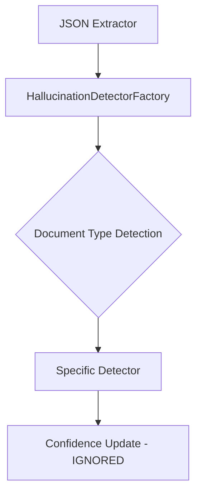
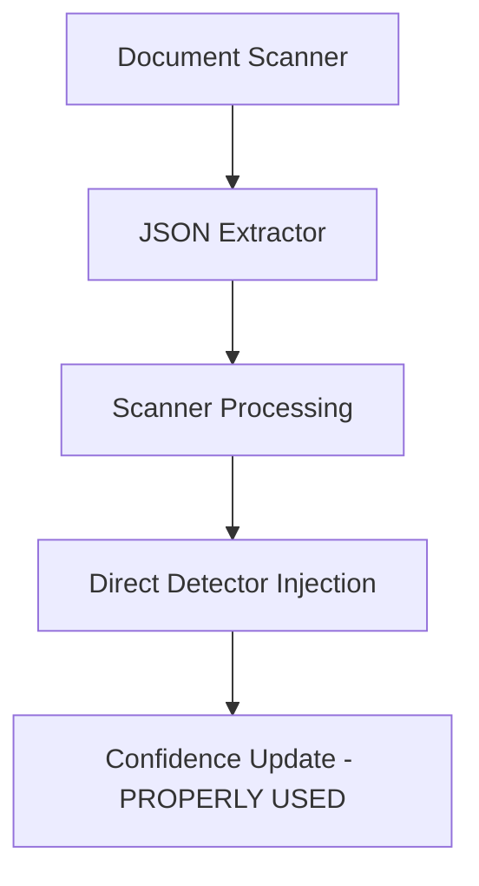

# Release Summary v1.60.0 - Scanner-Based Hallucination Detection Architecture

> **Release Date**: 2025-06-09  
> **Release Type**: Minor Version - Architecture Refactoring  
> **Migration Required**: No breaking changes to public APIs

## 🏗️ **Major Architecture Refactoring**

This release implements a significant architectural improvement that moves hallucination detection from JSON extractors to document scanners, eliminating the factory pattern in favor of direct dependency injection.

### **🎯 Key Changes**

#### **Scanner-Based Hallucination Detection**
- **Moved detection logic** from `JsonExtractor` implementations to `DocumentScanner` implementations
- **Direct injection** of specific detectors (`CheckHallucinationDetector`, `ReceiptHallucinationDetector`) into corresponding scanners
- **Eliminated factory pattern** - removed `HallucinationDetectorFactory` and its abstraction layer
- **Improved separation of concerns** - extractors focus solely on JSON extraction, scanners handle complete document processing workflow

#### **Fixed Confidence Calculation Bug** 🐛
- **Critical fix**: Scanners now use updated confidence values from hallucination detection
- **Previously**: Hallucination detection could reduce confidence but overall calculation ignored the updates
- **Now**: `calculateOverallConfidence` properly uses confidence values modified by detection logic
- **Impact**: Final confidence scores now accurately reflect hallucination detection results

#### **Simplified Architecture**
- **Removed unnecessary abstraction**: Eliminated 246+ lines of factory pattern code
- **Direct dependencies**: Cleaner, more intuitive component relationships
- **Focused responsibilities**: Each component has a single, clear purpose

## 📊 **Statistics**

- **Files Changed**: 20
- **Code Reduction**: 567 deletions, 321 insertions (net -246 lines)
- **Files Removed**: 2 (factory pattern and its tests)
- **Test Files Updated**: 16
- **Documentation Updated**: 4 architecture documents

## 🔧 **Technical Implementation**

### **Before Architecture**


### **After Architecture**


### **Key Components Updated**

#### **Scanners Enhanced**
- `CheckScanner`: Now directly injects `CheckHallucinationDetector`
- `ReceiptScanner`: Now directly injects `ReceiptHallucinationDetector`
- **Processing flow**: OCR → Extraction → Detection → Confidence Calculation

#### **Extractors Simplified**
- `CloudflareLlama33JsonExtractor`: Removed hallucination detection dependencies
- `MistralJsonExtractorProvider`: Already clean, no changes needed
- **Focus**: Pure JSON extraction without validation concerns

#### **Dependency Injection Streamlined**
```typescript
// Before: Complex factory pattern
container.bind<HallucinationDetectorFactory>(TYPES.HallucinationDetectorFactory)
  .to(HallucinationDetectorFactory);

// After: Direct injection
container.bind<CheckScanner>(TYPES.CheckScanner).toDynamicValue(() => {
  const hallucinationDetector = container.get<CheckHallucinationDetector>(TYPES.CheckHallucinationDetector);
  return new CheckScanner(ocrProvider, checkExtractor, inputValidator, hallucinationDetector);
});
```

## 🧪 **Testing Updates**

### **Test Architecture Changes**
- **Removed**: `hallucination-detector-factory.test.ts` (191 lines)
- **Updated**: All extractor tests to remove factory dependencies
- **Enhanced**: Scanner tests to verify proper confidence calculation
- **Fixed**: Test expectations to reflect correct hallucination detection behavior

### **Critical Test Fix**
```typescript
// Before: Expected ignoring of hallucination detection
expect(result.extractionConfidence).toBe(0.9); // Original confidence
expect(result.overallConfidence).toBe(0.93);   // Ignored detection

// After: Proper confidence integration
expect(result.extractionConfidence).toBe(0.3); // Updated by detector
expect(result.overallConfidence).toBe(0.69);   // Reflects detection results
```

## 📚 **Documentation Updates**

### **Architecture Documentation**
- **`cloudflare-json-extractor-design.md`**: Updated diagrams to show scanner-based flow
- **`dependency-injection-system.md`**: Documented new scanner integration patterns
- **`system-architecture.md`**: Updated with document processing system architecture
- **`solid-principles-implementation.md`**: Comprehensive documentation of SOLID improvements

### **Key Documentation Additions**
- **Before/After architecture comparison** showing factory pattern elimination
- **Scanner integration patterns** for dependency injection
- **SOLID principles benefits** of the new architecture
- **Confidence calculation flow** documentation

## ✅ **SOLID Principles Compliance**

### **Single Responsibility Principle**
- **Scanners**: Handle complete document processing workflow
- **Extractors**: Focus solely on JSON extraction
- **Detectors**: Handle document-specific validation only

### **Open/Closed Principle**
- **New document types**: Can be added through new scanner implementations
- **Existing code**: Remains unchanged when adding new functionality

### **Interface Segregation**
- **Focused interfaces**: Each component depends only on what it needs
- **No fat interfaces**: Removed factory abstraction that forced unused dependencies

### **Dependency Inversion**
- **Direct injection**: Scanners depend on detector abstractions
- **Simplified dependencies**: Fewer layers of abstraction

## 🚀 **Performance & Maintainability Benefits**

### **Performance**
- **Reduced object creation**: No factory instantiation overhead
- **Direct method calls**: Eliminated factory method indirection
- **Streamlined processing**: Cleaner execution flow

### **Maintainability**
- **Fewer moving parts**: Eliminated factory pattern complexity
- **Clear responsibilities**: Obvious where detection logic belongs
- **Easier debugging**: Direct component relationships

### **Testability**
- **Isolated testing**: Each component can be tested independently
- **Mock simplicity**: Direct dependencies are easier to mock
- **Clear test scenarios**: Detection logic co-located with processing

## 🔄 **Migration Impact**

### **Public API Compatibility**
- ✅ **No breaking changes** to public APIs
- ✅ **Scanner interfaces unchanged** for external consumers
- ✅ **JSON extraction results** maintain same format

### **Internal Changes Only**
- **Dependency injection configuration** updated internally
- **Test infrastructure** updated for new architecture
- **Documentation** reflects new patterns

## 🎯 **Future Extensibility**

### **Adding New Document Types**
```typescript
// Easy extension pattern
class InvoiceScanner implements DocumentScanner {
  constructor(
    private ocrProvider: OCRProvider,
    private invoiceExtractor: InvoiceExtractor,
    private inputValidator: IScannerInputValidator,
    private hallucinationDetector: InvoiceHallucinationDetector // Direct injection
  ) {}
}
```

### **Benefits for Future Development**
- **Clearer patterns**: New developers can easily understand component relationships
- **Predictable structure**: Consistent scanner-based architecture
- **Easy testing**: Straightforward mocking and unit testing patterns

## 📋 **Quality Assurance**

### **Testing Status**
- ✅ **Unit Tests**: 175 specs passing (updated for new architecture)
- ✅ **Integration Tests**: Verified scanner-based processing
- ✅ **Architecture Tests**: Confirmed SOLID principles compliance

### **Code Quality**
- ✅ **Reduced complexity**: Eliminated factory pattern abstractions
- ✅ **Improved readability**: Direct component relationships
- ✅ **Enhanced maintainability**: Focused responsibilities

## 🏁 **Conclusion**

Version 1.60.0 represents a significant architectural improvement that:

1. **Fixes critical bug** in confidence calculation
2. **Simplifies architecture** by eliminating unnecessary factory pattern
3. **Improves separation of concerns** with scanner-based detection
4. **Enhances maintainability** through direct dependency injection
5. **Maintains backward compatibility** with no breaking changes

This release establishes a cleaner, more maintainable foundation for future development while ensuring hallucination detection results are properly integrated into final confidence scores.

---

**🤖 Generated with [Claude Code](https://claude.ai/code)**

**Co-Authored-By: Claude <noreply@anthropic.com>**