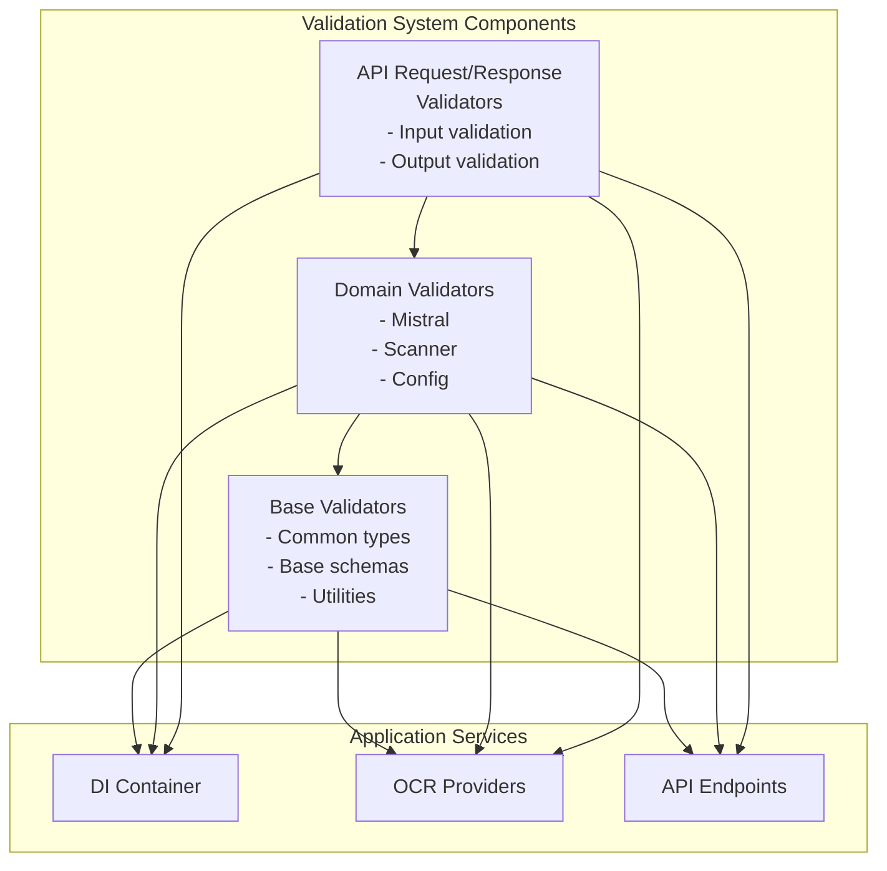
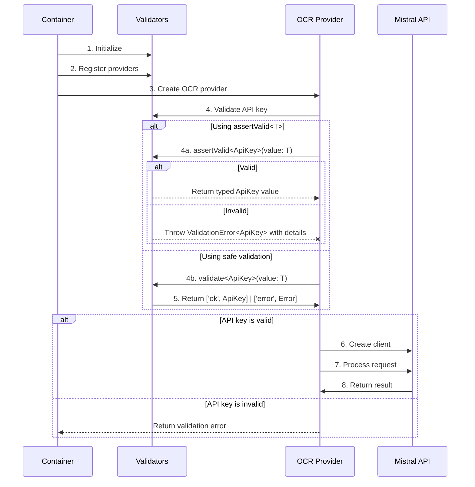
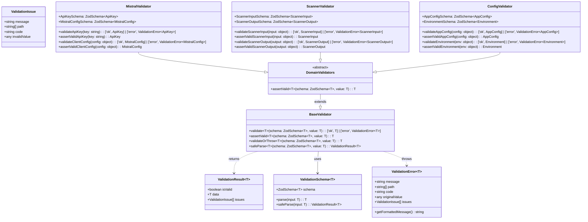

# Zod Validation System Design

## 1. Overview

This document outlines the design for implementing a robust validation system using Zod within the OCRChecksServer application. The system will provide type-safe validation for method arguments, configuration objects, and API payloads, focusing particularly on improving the Mistral API integration points where failures have been occurring.

## 2. Problem Statement

Currently, the application suffers from several validation-related issues:

1. **Inconsistent API Key Handling**: Different parts of the codebase access and validate the Mistral API key differently, leading to unexpected runtime errors.
2. **Late Validation**: Validation often happens at execution time rather than initialization time, resulting in failures deep in the processing flow.
3. **Error Message Quality**: Error messages lack specificity, making debugging difficult.
4. **Type Safety Gaps**: TypeScript's static type checking doesn't catch all runtime issues, especially with external APIs.
5. **Test Environment Discrepancies**: Validation behaves differently in test vs. production environments.

## 3. Goals and Non-Goals

### Goals

- Create a unified validation approach using Zod
- Provide early validation at object construction time
- Improve error messages with detailed validation failures
- Maintain TypeScript integration with inferred types
- Ensure consistent validation behavior across environments

### Non-Goals

- Rewriting the entire application's validation system at once
- Creating custom validation logic outside of Zod
- Validating third-party library internals
- Client-side validation (focus is on server-side)

## 4. UML Diagrams

### 4.1 Component Diagram



### 4.2 Sequence Diagram: API Key Validation Flow



### 4.3 Class Diagram: Validation System Architecture



## 5. Design Components

### 5.1 Directory Structure

```
src/
  validators/
    base.ts         - Common validation utilities and patterns
    mistral.ts      - Mistral-specific validation schemas
    config.ts       - Configuration object validation
    api/
      inputs.ts     - API request validation
      outputs.ts    - API response validation
    scanner/
      check.ts      - Check scanner validation
      receipt.ts    - Receipt scanner validation
    types.ts        - Shared validation types and interfaces
```

### 5.2 Core Validation Patterns

1. **Schema Definition**: Each module will define Zod schemas for its data structures
2. **Type Inference**: TypeScript types will be inferred from schemas using `z.infer<typeof Schema>`
3. **Validation Functions**: Strongly-typed functions that accept data and return either valid data or errors
4. **Construction-Time Validation**: Factory functions or decorators to validate at object creation
5. **Assert-Based Validation**: Generic methods that return validated value with proper type or throw detailed exceptions

### 5.3 Key Schema Definitions

#### Mistral Client Configuration Schema

```typescript
// Conceptual example - actual implementation in mistral.ts
export const MistralConfigSchema = z.object({
  apiKey: z.string().min(20, "API key must be at least 20 characters long"),
  baseUrl: z.string().url().optional(),
  timeout: z.number().positive().optional(),
  retryConfig: z.object({
    maxRetries: z.number().int().min(0),
    initialDelay: z.number().positive(),
    maxDelay: z.number().positive(),
  }).optional(),
});

// Strongly-typed configuration type derived from schema
export type MistralConfig = z.infer<typeof MistralConfigSchema>;
```

#### API Key Schema

```typescript
// Conceptual example - actual implementation in base.ts
export const ApiKeySchema = z.string()
  .min(20, "API key must be at least 20 characters long")
  .refine(key => !key.toLowerCase().includes("placeholder"), { 
    message: "API key appears to be a placeholder value" 
  });

// Strongly-typed API key type derived from schema
export type ApiKey = z.infer<typeof ApiKeySchema>;
```

### 5.4 Core Validation Functions

The validation system will provide two main validation approaches, both with strong TypeScript typing:

#### 1. Result-Based Validation

```typescript
/**
 * Validates input against a schema and returns a strongly-typed result tuple
 * 
 * @template T - The expected output type
 * @template I - The input type (inferred from the input value)
 * @param schema - The Zod schema to validate against
 * @param value - The value to validate (typed as T to allow appropriate input types)
 * @returns A tuple of ['ok', T] | ['error', ValidationError<T>] with proper typing
 */
function validate<T, I extends T>(schema: z.ZodSchema<T>, value: I): ['ok', T] | ['error', ValidationError<T>] {
  const result = schema.safeParse(value);
  
  if (result.success) {
    return ['ok', result.data];
  } else {
    return ['error', new ValidationError<T>(
      "Validation failed", 
      result.error.issues,
      value
    )];
  }
}
```

#### 2. Assert-Based Validation

```typescript
/**
 * Validates and returns the value with its proper type, or throws a strongly-typed exception
 * 
 * @template T - The expected output type
 * @template I - The input type (inferred from the input value)
 * @param schema - The Zod schema to validate against
 * @param value - The value to validate (typed as I to constrain input types)
 * @returns The validated value with its proper type T
 * @throws ValidationError<T> with detailed information if validation fails
 */
function assertValid<T, I extends T>(schema: z.ZodSchema<T>, value: I): T {
  const result = schema.safeParse(value);
  
  if (result.success) {
    return result.data;
  } else {
    throw new ValidationError<T>(
      "Validation failed", 
      result.error.issues,
      value
    );
  }
}
```

### 5.5 Strong Type Definitions

```typescript
/**
 * Strongly-typed validation result interface
 */
export interface ValidationResult<T> {
  /** Whether validation succeeded */
  readonly isValid: boolean;
  
  /** The validated data (only present if isValid=true) */
  readonly data: T | null;
  
  /** Any validation issues (only present if isValid=false) */
  readonly issues: ValidationIssue[];
}

/**
 * Detailed validation issue information
 */
export interface ValidationIssue {
  /** The error message */
  readonly message: string;
  
  /** Path to the invalid property */
  readonly path: string[];
  
  /** Error code (from Zod) */
  readonly code: string;
  
  /** The specific invalid value */
  readonly invalidValue?: any;
}

/**
 * Strongly-typed validation error class
 * @template T - The expected type that failed validation
 */
export class ValidationError<T> extends Error {
  /** The validation issues in detail */
  public readonly issues: ValidationIssue[];
  
  /** Path to the invalid property */
  public readonly path: string[];
  
  /** The original value that failed validation */
  public readonly originalValue: unknown;
  
  /** The expected type name (for debugging) */
  public readonly expectedType: string;
  
  constructor(
    message: string, 
    issues: ValidationIssue[], 
    originalValue: unknown,
    path: string[] = []
  ) {
    super(message);
    this.name = 'ValidationError';
    this.issues = issues;
    this.path = path;
    this.originalValue = originalValue;
    this.expectedType = this.getExpectedTypeName();
  }
  
  /**
   * Get the expected type name for better error messages
   */
  private getExpectedTypeName(): string {
    // In a real implementation, this would extract type information
    // from the Zod schema or TypeScript metadata
    return 'T';
  }
  
  /**
   * Get a formatted error message with details
   */
  public getFormattedMessage(): string {
    return `Validation Error: Expected ${this.expectedType}\n\nIssues:\n${this.formatIssues()}`;
  }
  
  /**
   * Format the validation issues for display
   */
  private formatIssues(): string {
    return this.issues.map(issue => 
      `- ${issue.path.join('.')}: ${issue.message}`
    ).join('\n');
  }
}
```

### 5.6 Validation Integration Points

1. **Dependency Injection Container**:
   - Validate configuration at container setup
   - Prevent invalid configurations from propagating
   - Use `assertValid<T>` to fail fast with strongly-typed errors

2. **MistralOCRProvider**:
   - Validate client and API key in constructor
   - Prevent creation of provider with invalid configuration
   - Example: `this.apiKey = assertValid<ApiKey, string>(ApiKeySchema, config.apiKey);`

3. **Request Processing**:
   - Validate inputs before processing
   - Return strongly-typed errors for invalid inputs
   - Use result-based validation for API responses

4. **Test Mocks**:
   - Ensure mocks respect validation rules
   - Simulate real validation behavior in tests
   - Use the same validators as production code

### 5.7 Error Handling Strategy

1. **Structured Error Responses**:
   - Use result tuples `['ok', T] | ['error', ValidationError<T>]` for validation outcomes
   - Include validation details in error messages

2. **Validation Error Types**:
   - Create specific error types for different validation failures
   - Allow consumers to handle different error cases appropriately

3. **Logging Integration**:
   - Log validation failures with context
   - Include validation path in errors for easier debugging

4. **Strongly-Typed ValidationError Class**:
   - Includes the expected type in error messages
   - Preserves the original value for debugging
   - Provides detailed formatted error messages

## 6. Implementation Strategy

### 6.1 Phase 1: Foundation

1. Create base validation utilities with strong typing
   - Implement `validate<T, I>` and `assertValid<T, I>` generic functions
   - Create strongly-typed ValidationError<T> class with detailed formatting
2. Define common schemas for shared types
3. Implement API key validation schema with proper type inference

### 6.2 Phase 2: Mistral Integration

1. Create MistralClient validation schema with strong typing
2. Update DI container to use validation
   - Use `assertValid<T, I>` for early detection of configuration issues
3. Modify MistralOCRProvider to validate at construction with proper types

### 6.3 Phase 3: API Validation

1. Implement request validation for endpoints with proper type inference
2. Add response validation for type safety
3. Integrate with existing error handling

### 6.4 Phase 4: Scanner Validation

1. Add validation for scanner inputs with strong typing
2. Improve scanner factory validation with proper types

## 7. Testing Strategy

1. **Unit Tests**:
   - Test each validator in isolation
   - Verify error messages are helpful
   - Test both `validate<T, I>` and `assertValid<T, I>` generic functions
   - Ensure `assertValid<T, I>` throws with proper error details
   - Test type inference works correctly (compile-time tests)

2. **Integration Tests**:
   - Test validation in the context of real objects
   - Verify correct behavior with valid/invalid inputs
   - Test error handling in complex scenarios
   - Ensure proper types flow through the system

3. **Validation Test Fixtures**:
   - Create fixtures with valid/invalid data
   - Use in tests to verify behavior
   - Include type-checking tests

## 8. Migration Plan

1. Implement alongside existing validation
2. Update one component at a time
3. Run tests after each change to verify behavior
4. Gradually replace direct property access with validated getters
5. Prioritize `assertValid<T, I>` usage in constructors and initialization code

## 9. Performance Considerations

- Cache validation results where appropriate
- Consider lazy validation for performance-critical paths
- Profile validation overhead in the request path
- Monitor the performance impact of throw/catch patterns with `assertValid<T, I>`
- Use type inference to eliminate unnecessary runtime type checks

## 10. Security Implications

- Improves security by ensuring consistent validation
- Prevents some types of injection by validating inputs
- Reduces risk of operating with invalid configuration
- Fail-fast with `assertValid<T, I>` prevents propagation of invalid data
- Strong typing reduces the risk of type-related security issues

## 11. Example Usage Patterns

### Example 1: Constructor Validation with Strong Typing

```typescript
class MistralOCRProvider {
  private readonly apiKey: ApiKey; // Strongly typed!
  private readonly client: MistralClient;
  
  constructor(config: object) {
    // Validate entire config object with strong typing
    const validConfig = assertValid<MistralConfig, object>(MistralConfigSchema, config);
    
    // Store validated values - they maintain their types
    this.apiKey = validConfig.apiKey; // TypeScript knows this is ApiKey type
    this.client = new MistralClient({
      apiKey: this.apiKey,
      baseUrl: validConfig.baseUrl,
      timeout: validConfig.timeout
    });
  }
}
```

### Example 2: Method Argument Validation with Type Inference

```typescript
class ScannerService {
  public async processDocument(input: object): Promise<ScannerResult> {
    // Validate input and throw detailed error if invalid
    // TypeScript knows validInput is ScannerInput type
    const validInput = assertValid<ScannerInput, object>(ScannerInputSchema, input);
    
    // Now process with confidence that the input is valid
    return this.scanner.process(validInput);
  }
  
  public async processDocumentSafe(input: object): Promise<['ok', ScannerResult] | ['error', ValidationError<ScannerInput>]> {
    // Use strongly-typed result-based validation for API endpoints
    const [status, result] = validate<ScannerInput, object>(ScannerInputSchema, input);
    
    if (status === 'error') {
      return ['error', result]; // TypeScript knows this is ValidationError<ScannerInput>
    }
    
    try {
      // TypeScript knows result is ScannerInput type
      const scanResult = await this.scanner.process(result);
      return ['ok', scanResult];
    } catch (err) {
      return ['error', new ValidationError<ScannerInput>(
        "Processing error", 
        [{ message: String(err), path: [], code: "PROCESSING_ERROR" }],
        input
      )];
    }
  }
}
```

### Example 3: Factory Pattern with Type Safety

```typescript
/**
 * Factory function that creates a provider with proper type validation
 */
function createMistralProvider<T extends Partial<MistralConfig>>(config: T): MistralOCRProvider {
  // Validate config and maintain type information
  const validConfig = assertValid<MistralConfig, T>(MistralConfigSchema, config);
  
  // Create provider with validated configuration
  return new MistralOCRProvider(validConfig);
}

// Usage:
const provider = createMistralProvider({
  apiKey: "mistral-api-key-12345678901234567890",
  timeout: 5000
}); // TypeScript infers the config type from the argument
```

### Example 4: String Validation with Derived Types

```typescript
// API key validation - takes string input, returns ApiKey type
function validateApiKey(key: string): ApiKey {
  return assertValid<ApiKey, string>(ApiKeySchema, key);
}

// Usage:
try {
  const apiKey = validateApiKey("my-api-key-12345678901234567890");
  // apiKey is now typed as ApiKey, not just string
  
  // This allows for better type safety in the API surface
  createClient(apiKey); // Can only accept ApiKey type, not any string
} catch (err) {
  if (err instanceof ValidationError) {
    console.error(err.getFormattedMessage());
  }
}
```

## 12. Conclusion

The Zod validation system will provide a consistent, type-safe approach to validation throughout the application. By focusing on the Mistral API integration points first, we can address current failures while establishing patterns for broader adoption.

This incremental approach allows us to improve reliability without major rewrites, while also enhancing developer experience through better error messages and stronger type safety. The `assertValid<T, I>` generic method provides a particularly powerful pattern for fail-fast validation that increases code quality by surfacing issues early in the execution flow, all while maintaining strong type information and enabling better compile-time checks.