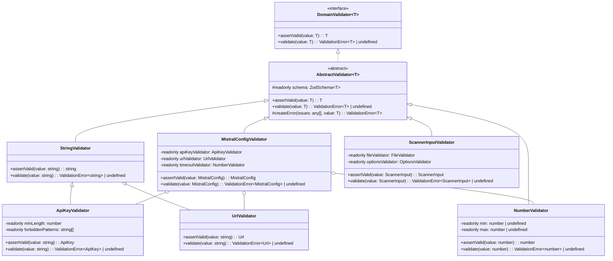

# Zod Validator Class Hierarchy Design

## Overview

This document outlines a more object-oriented approach to validation using Zod, with specialized validator classes and composition. Each validator is responsible for validating a specific type and can be composed together to build more complex validation hierarchies.

## Core Interface Design

```typescript
/**
 * Generic domain validator interface
 * 
 * @template T - The type this validator validates
 */
export interface DomainValidator<T> {
  /**
   * Validates the given value and returns it if valid
   * 
   * @param value - The value to validate (already typed as T)
   * @returns The validated value with guarantees it meets all validation rules
   * @throws ValidationError<T> if validation fails
   */
  assertValid(value: T): T;
  
  /**
   * Validates the given value and returns a validation error if invalid
   * 
   * @param value - The value to validate (already typed as T)
   * @returns ValidationError<T> if validation fails, undefined if valid
   */
  validate(value: T): ValidationError<T> | undefined;
}
```

## Class Hierarchy Diagram



## Composition Pattern

### Example: MistralConfigValidator

```typescript
/**
 * Validator for MistralConfig objects
 */
export class MistralConfigValidator extends AbstractValidator<MistralConfig> {
  private readonly apiKeyValidator: ApiKeyValidator;
  private readonly urlValidator: UrlValidator; 
  private readonly timeoutValidator: NumberValidator;
  
  constructor(
    apiKeyValidator: ApiKeyValidator,
    urlValidator: UrlValidator,
    timeoutValidator: NumberValidator
  ) {
    super();
    this.apiKeyValidator = apiKeyValidator;
    this.urlValidator = urlValidator;
    this.timeoutValidator = timeoutValidator;
    
    // Create the schema using Zod and the component validators
    // Schema is readonly to prevent modification after initialization
    this.schema = z.object({
      apiKey: z.string().refine(key => {
        // Use the component validator but catch the error
        try {
          this.apiKeyValidator.assertValid(key);
          return true;
        } catch (e) {
          return false;
        }
      }, "Invalid API key format"),
      baseUrl: z.string().url().optional().refine(url => {
        if (!url) return true;
        try {
          this.urlValidator.assertValid(url);
          return true;
        } catch (e) {
          return false;
        }
      }, "Invalid URL format"),
      timeout: z.number().positive().optional().refine(timeout => {
        if (!timeout) return true;
        try {
          this.timeoutValidator.assertValid(timeout);
          return true;
        } catch (e) {
          return false;
        }
      }, "Invalid timeout value")
    });
  }
  
  /**
   * Validates a MistralConfig object and returns it if valid
   * 
   * @param config - The config to validate
   * @returns The validated config
   * @throws ValidationError<MistralConfig> if validation fails
   */
  public override assertValid(config: MistralConfig): MistralConfig {
    // Use the parent's implementation that uses the schema
    const validConfig = super.assertValid(config);
    
    // Additional custom validations or business rules
    if (validConfig.timeout && validConfig.timeout > 60000) {
      throw this.createError([{
        code: "custom",
        message: "Timeout exceeds maximum allowed value",
        path: ["timeout"]
      }], config);
    }
    
    return validConfig;
  }
}
```

### Example: ApiKeyValidator

```typescript
/**
 * Validator for API keys
 */
export class ApiKeyValidator extends StringValidator {
  private readonly minLength: number;
  private readonly forbiddenPatterns: RegExp[];
  
  constructor(minLength = 20, forbiddenPatterns: string[] = ["placeholder", "api-key"]) {
    super();
    this.minLength = minLength;
    this.forbiddenPatterns = forbiddenPatterns.map(p => new RegExp(p, "i"));
    
    // Create the schema using Zod
    // Schema is readonly to prevent modification after initialization
    this.schema = z.string()
      .min(this.minLength, `API key must be at least ${this.minLength} characters long`)
      .refine(key => !this.containsForbiddenPattern(key), {
        message: "API key appears to be a placeholder value"
      });
  }
  
  /**
   * Checks if the key contains any forbidden patterns
   */
  private containsForbiddenPattern(key: string): boolean {
    return this.forbiddenPatterns.some(pattern => pattern.test(key));
  }
  
  /**
   * Validates an API key string and returns it if valid
   * 
   * @param key - The API key to validate
   * @returns The validated API key
   * @throws ValidationError<string> if validation fails
   */
  public override assertValid(key: string): ApiKey {
    // Use the parent's implementation that uses the schema
    const validKey = super.assertValid(key);
    
    // Additional custom validations or business rules
    if (validKey.includes("test") && process.env.NODE_ENV === "production") {
      throw this.createError([{
        code: "custom",
        message: "Test API keys cannot be used in production",
        path: []
      }], key);
    }
    
    // Return as ApiKey type
    return validKey as ApiKey;
  }
}
```

## Abstract Base Class

```typescript
/**
 * Abstract base class for validators
 */
export abstract class AbstractValidator<T> implements DomainValidator<T> {
  /**
   * The Zod schema for this validator
   * Readonly to prevent modification after initialization
   */
  protected readonly schema: z.ZodSchema<T>;
  
  /**
   * Validates a value of type T and returns it if valid
   * 
   * @param value - The value to validate
   * @returns The validated value
   * @throws ValidationError<T> if validation fails
   */
  public assertValid(value: T): T {
    const result = this.schema.safeParse(value);
    
    if (result.success) {
      return result.data;
    } else {
      throw this.createError(result.error.issues, value);
    }
  }
  
  /**
   * Validates a value of type T and returns a validation error if invalid
   * 
   * @param value - The value to validate
   * @returns ValidationError<T> if validation fails, undefined if valid
   */
  public validate(value: T): ValidationError<T> | undefined {
    const result = this.schema.safeParse(value);
    
    if (result.success) {
      return undefined;
    } else {
      return this.createError(result.error.issues, value);
    }
  }
  
  /**
   * Creates a ValidationError instance from Zod issues
   */
  protected createError(issues: any[], value: T): ValidationError<T> {
    return new ValidationError<T>(
      "Validation failed",
      issues.map(issue => ({
        message: issue.message,
        path: issue.path || [],
        code: issue.code || "custom",
        invalidValue: issue.path ? get(value, issue.path) : undefined
      })),
      value
    );
  }
}
```

## Factory for Validators

```typescript
/**
 * Factory for creating validators
 */
export class ValidatorFactory {
  private static instance: ValidatorFactory;
  
  // Singleton instances of validators
  private readonly apiKeyValidator: ApiKeyValidator;
  private readonly urlValidator: UrlValidator;
  private readonly numberValidator: NumberValidator;
  private readonly mistralConfigValidator: MistralConfigValidator;
  
  private constructor() {
    // Create base validators
    this.apiKeyValidator = new ApiKeyValidator();
    this.urlValidator = new UrlValidator();
    this.numberValidator = new NumberValidator();
    
    // Create composite validators
    this.mistralConfigValidator = new MistralConfigValidator(
      this.apiKeyValidator,
      this.urlValidator,
      this.numberValidator
    );
  }
  
  /**
   * Gets the singleton instance
   */
  public static getInstance(): ValidatorFactory {
    if (!ValidatorFactory.instance) {
      ValidatorFactory.instance = new ValidatorFactory();
    }
    return ValidatorFactory.instance;
  }
  
  /**
   * Gets the API key validator
   */
  public getApiKeyValidator(): ApiKeyValidator {
    return this.apiKeyValidator;
  }
  
  /**
   * Gets the Mistral config validator
   */
  public getMistralConfigValidator(): MistralConfigValidator {
    return this.mistralConfigValidator;
  }
  
  // Add more getters for other validators...
}
```

## Usage Examples

### Example 1: Validating an API Key

```typescript
// Get the validator
const apiKeyValidator = ValidatorFactory.getInstance().getApiKeyValidator();

try {
  // Validate the key
  const validKey = apiKeyValidator.assertValid("my-api-key-12345678901234567890");
  
  // Use the validated key (now typed as ApiKey, not just string)
  createClient(validKey);
} catch (error) {
  if (error instanceof ValidationError) {
    console.error(error.getFormattedMessage());
  }
}
```

### Example 2: Validating a Mistral Config

```typescript
// Get the validator
const configValidator = ValidatorFactory.getInstance().getMistralConfigValidator();

// Config to validate
const config: MistralConfig = {
  apiKey: "mistral-key-12345678901234567890",
  baseUrl: "https://api.mistral.ai",
  timeout: 5000
};

// Using the validation result approach
const validationError = configValidator.validate(config);
if (validationError) {
  console.error(validationError.getFormattedMessage());
  return;
}

// Config is valid, proceed with it
createMistralClient(config);
```

### Example 3: Using in a Constructor

```typescript
class MistralOCRProvider {
  private readonly config: MistralConfig;
  private readonly client: MistralClient;
  
  constructor(
    config: MistralConfig,
    private readonly configValidator: MistralConfigValidator
  ) {
    // Validate configuration
    this.config = this.configValidator.assertValid(config);
    
    // Create client with validated config
    this.client = new MistralClient(this.config);
  }
  
  // Methods that use the validated config...
}
```

## Benefits of This Approach

1. **Clear Responsibility Separation**: Each validator is responsible for a specific type
2. **Composition**: Complex validators are built by composing simpler ones
3. **Reusability**: Base validators can be reused across different contexts
4. **Strong Typing**: All methods work with strongly-typed inputs and outputs
5. **Extensibility**: Easy to add custom validation rules to each validator
6. **Testability**: Each validator can be tested in isolation
7. **Dependency Injection**: Validators can be injected into services
8. **Inheritance**: Common validation logic can be shared through inheritance
9. **Immutability**: Schemas are readonly to prevent accidental modification

## Integration with Dependency Injection

```typescript
// Register validators in DI container
container.bind<ApiKeyValidator>(TYPES.ApiKeyValidator)
  .to(ApiKeyValidator)
  .inSingletonScope();

container.bind<UrlValidator>(TYPES.UrlValidator)
  .to(UrlValidator)
  .inSingletonScope();

container.bind<MistralConfigValidator>(TYPES.MistralConfigValidator)
  .to(MistralConfigValidator)
  .inSingletonScope();

// Use validators in services
@injectable()
class MistralService {
  constructor(
    @inject(TYPES.MistralConfigValidator) private configValidator: MistralConfigValidator
  ) {}
  
  public configure(config: MistralConfig): void {
    const validConfig = this.configValidator.assertValid(config);
    // Use valid config...
  }
}
```

## Conclusion

This object-oriented approach to validation provides a clean, modular, and extensible system for validating data in the application. By using composition and inheritance, we can build complex validation rules from simple ones while maintaining strong typing throughout the system.

The approach leverages Zod's schema validation under the hood but provides a more OOP-friendly API that fits well with dependency injection frameworks and promotes reuse of validation logic. The use of readonly schemas ensures immutability of validation rules after initialization, making validators more predictable and thread-safe.