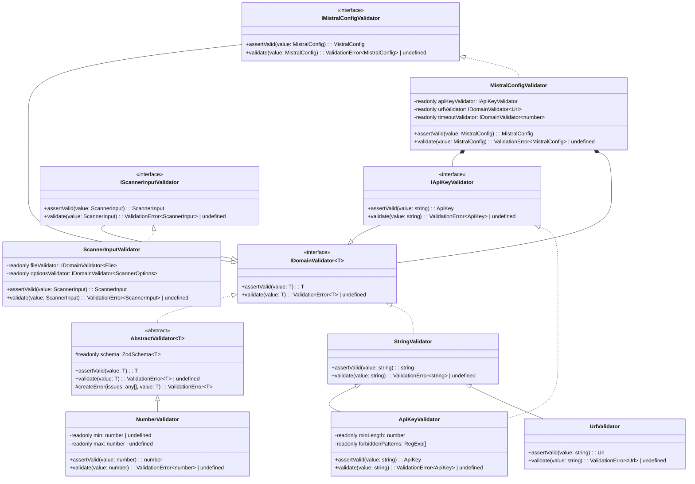

# Zod Validator Class Hierarchy Design

## Overview

This document outlines a more object-oriented approach to validation using Zod, with specialized validator classes and composition. Each validator is responsible for validating a specific type and can be composed together to build more complex validation hierarchies. The design strictly follows SOLID principles and KISS (Keep It Simple, Stupid) methodology, with a focus on dependency injection.

## Core Interface Design

```typescript
/**
 * Generic domain validator interface
 * 
 * @template T - The type this validator validates
 */
export interface IDomainValidator<T> {
  /**
   * Validates the given value and returns it if valid
   * 
   * @param value - The value to validate (already typed as T)
   * @returns The validated value with guarantees it meets all validation rules
   * @throws ValidationError<T> if validation fails
   */
  assertValid(value: T): T;
  
  /**
   * Validates the given value and returns a validation error if invalid
   * 
   * @param value - The value to validate (already typed as T)
   * @returns ValidationError<T> if validation fails, undefined if valid
   */
  validate(value: T): ValidationError<T> | undefined;
}
```

## SOLID Principles Implementation

### Single Responsibility Principle
Each validator has exactly one responsibility: validating a specific type of data. Additional concerns like logging, error formatting, or business logic should be handled elsewhere.

### Open/Closed Principle
Validators are designed to be open for extension but closed for modification:
- Base validators can be extended with new validation rules
- New validators can be created without modifying existing ones
- Validation schemas are readonly to prevent runtime modifications

### Liskov Substitution Principle
Child validators can be used anywhere their parent types are expected:
- StringValidator can be used wherever IDomainValidator<string> is required
- ApiKeyValidator can be used wherever IDomainValidator<ApiKey> is required

### Interface Segregation Principle
Interfaces are kept minimal and focused:
- IDomainValidator<T> has only the methods clients need
- No "fat interfaces" with rarely used methods
- Specialized validators like IApiKeyValidator would only add methods specific to API keys

### Dependency Inversion Principle
High-level components depend on abstractions, not concrete implementations:
- Services depend on IDomainValidator<T>, not specific validator classes
- Validators receive dependencies through constructor injection
- All dependencies are explicitly declared

## Class Hierarchy Diagram



## Composition with Dependency Injection

### Example: MistralConfigValidator

```typescript
/**
 * Interface for Mistral configuration validator
 */
export interface IMistralConfigValidator extends IDomainValidator<MistralConfig> {
  // Any additional methods specific to Mistral config validation
}

/**
 * Validator for MistralConfig objects
 */
@injectable()
export class MistralConfigValidator extends AbstractValidator<MistralConfig> implements IMistralConfigValidator {
  // Dependencies are injected through constructor
  constructor(
    @inject(TYPES.ApiKeyValidator) private readonly apiKeyValidator: IApiKeyValidator,
    @inject(TYPES.UrlValidator) private readonly urlValidator: IDomainValidator<Url>,
    @inject(TYPES.NumberValidator) private readonly timeoutValidator: IDomainValidator<number>
  ) {
    super();
    
    // Create the schema using Zod and the component validators
    // Schema is readonly to prevent modification after initialization
    this.schema = z.object({
      apiKey: z.string().refine(key => {
        // Use the component validator but catch the error
        try {
          this.apiKeyValidator.assertValid(key);
          return true;
        } catch (e) {
          return false;
        }
      }, "Invalid API key format"),
      baseUrl: z.string().url().optional().refine(url => {
        if (!url) return true;
        try {
          this.urlValidator.assertValid(url);
          return true;
        } catch (e) {
          return false;
        }
      }, "Invalid URL format"),
      timeout: z.number().positive().optional().refine(timeout => {
        if (!timeout) return true;
        try {
          this.timeoutValidator.assertValid(timeout);
          return true;
        } catch (e) {
          return false;
        }
      }, "Invalid timeout value")
    });
  }
  
  /**
   * Validates a MistralConfig object and returns it if valid
   * 
   * @param config - The config to validate
   * @returns The validated config
   * @throws ValidationError<MistralConfig> if validation fails
   */
  public override assertValid(config: MistralConfig): MistralConfig {
    // Use the parent's implementation that uses the schema
    const validConfig = super.assertValid(config);
    
    // Additional custom validations or business rules
    if (validConfig.timeout && validConfig.timeout > 60000) {
      throw this.createError([{
        code: "custom",
        message: "Timeout exceeds maximum allowed value",
        path: ["timeout"]
      }], config);
    }
    
    return validConfig;
  }
}
```

### Example: ApiKeyValidator

```typescript
/**
 * Interface for API key validators
 */
export interface IApiKeyValidator extends IDomainValidator<ApiKey> {
  // Any additional methods specific to API key validation
}

/**
 * Validator for API keys
 */
@injectable()
export class ApiKeyValidator extends StringValidator implements IApiKeyValidator {
  private readonly minLength: number;
  private readonly forbiddenPatterns: RegExp[];
  
  // Dependencies can be injected via constructor
  constructor(
    @inject(TYPES.ValidationConfig) config: { apiKeyMinLength: number, forbiddenPatterns: string[] }
  ) {
    super();
    this.minLength = config.apiKeyMinLength || 20;
    this.forbiddenPatterns = (config.forbiddenPatterns || ["placeholder", "api-key"])
      .map(p => new RegExp(p, "i"));
    
    // Create the schema using Zod
    // Schema is readonly to prevent modification after initialization
    this.schema = z.string()
      .min(this.minLength, `API key must be at least ${this.minLength} characters long`)
      .refine(key => !this.containsForbiddenPattern(key), {
        message: "API key appears to be a placeholder value"
      });
  }
  
  /**
   * Checks if the key contains any forbidden patterns
   */
  private containsForbiddenPattern(key: string): boolean {
    return this.forbiddenPatterns.some(pattern => pattern.test(key));
  }
  
  /**
   * Validates an API key string and returns it if valid
   * 
   * @param key - The API key to validate
   * @returns The validated API key
   * @throws ValidationError<string> if validation fails
   */
  public override assertValid(key: string): ApiKey {
    // Use the parent's implementation that uses the schema
    const validKey = super.assertValid(key);
    
    // Additional custom validations or business rules
    if (validKey.includes("test") && process.env.NODE_ENV === "production") {
      throw this.createError([{
        code: "custom",
        message: "Test API keys cannot be used in production",
        path: []
      }], key);
    }
    
    // Return as ApiKey type
    return validKey as ApiKey;
  }
}
```

## Abstract Base Class

```typescript
/**
 * Abstract base class for validators
 */
export abstract class AbstractValidator<T> implements IDomainValidator<T> {
  /**
   * The Zod schema for this validator
   * Readonly to prevent modification after initialization
   */
  protected readonly schema: z.ZodSchema<T>;
  
  /**
   * Validates a value of type T and returns it if valid
   * 
   * @param value - The value to validate
   * @returns The validated value
   * @throws ValidationError<T> if validation fails
   */
  public assertValid(value: T): T {
    const result = this.schema.safeParse(value);
    
    if (result.success) {
      return result.data;
    } else {
      throw this.createError(result.error.issues, value);
    }
  }
  
  /**
   * Validates a value of type T and returns a validation error if invalid
   * 
   * @param value - The value to validate
   * @returns ValidationError<T> if validation fails, undefined if valid
   */
  public validate(value: T): ValidationError<T> | undefined {
    const result = this.schema.safeParse(value);
    
    if (result.success) {
      return undefined;
    } else {
      return this.createError(result.error.issues, value);
    }
  }
  
  /**
   * Creates a ValidationError instance from Zod issues
   */
  protected createError(issues: any[], value: T): ValidationError<T> {
    return new ValidationError<T>(
      "Validation failed",
      issues.map(issue => ({
        message: issue.message,
        path: issue.path || [],
        code: issue.code || "custom",
        invalidValue: issue.path ? get(value, issue.path) : undefined
      })),
      value
    );
  }
}
```

## DI Container Integration

```typescript
/**
 * Type identifiers for dependency injection
 */
export const TYPES = {
  // Core validators
  StringValidator: Symbol("StringValidator"),
  NumberValidator: Symbol("NumberValidator"),
  
  // Domain-specific validators
  ApiKeyValidator: Symbol("ApiKeyValidator"),
  UrlValidator: Symbol("UrlValidator"),
  MistralConfigValidator: Symbol("MistralConfigValidator"),
  ScannerInputValidator: Symbol("ScannerInputValidator"),
  
  // Configuration
  ValidationConfig: Symbol("ValidationConfig")
};

/**
 * Register all validators in the DI container
 */
export function registerValidators(container: Container): void {
  // Register configuration
  container.bind<ValidationConfig>(TYPES.ValidationConfig).toConstantValue({
    apiKeyMinLength: 20,
    forbiddenPatterns: ["placeholder", "api-key", "test-key"]
  });
  
  // Register base validators
  container.bind<IDomainValidator<string>>(TYPES.StringValidator)
    .to(StringValidator)
    .inSingletonScope();
    
  container.bind<IDomainValidator<number>>(TYPES.NumberValidator)
    .to(NumberValidator)
    .inSingletonScope();
    
  // Register domain-specific validators
  container.bind<IApiKeyValidator>(TYPES.ApiKeyValidator)
    .to(ApiKeyValidator)
    .inSingletonScope();
    
  container.bind<IDomainValidator<Url>>(TYPES.UrlValidator)
    .to(UrlValidator)
    .inSingletonScope();
    
  container.bind<IMistralConfigValidator>(TYPES.MistralConfigValidator)
    .to(MistralConfigValidator)
    .inSingletonScope();
    
  container.bind<IScannerInputValidator>(TYPES.ScannerInputValidator)
    .to(ScannerInputValidator)
    .inSingletonScope();
}
```

## Usage Examples

### Example 1: Service with Injected Validator

```typescript
/**
 * Example service with injected validator
 */
@injectable()
class MistralService {
  constructor(
    @inject(TYPES.MistralConfigValidator) private readonly configValidator: IMistralConfigValidator,
    @inject(TYPES.Logger) private readonly logger: ILogger
  ) {}
  
  /**
   * Configures the service with validated configuration
   */
  public configure(config: MistralConfig): void {
    try {
      // Validate configuration
      const validConfig = this.configValidator.assertValid(config);
      
      // Use validated config
      this.setupClient(validConfig);
    } catch (error) {
      if (error instanceof ValidationError) {
        this.logger.error("Invalid configuration", { 
          error: error.getFormattedMessage(),
          issues: error.issues
        });
      }
      throw error;
    }
  }
  
  private setupClient(config: MistralConfig): void {
    // Implementation...
  }
}
```

### Example 2: Factory Method Pattern

```typescript
/**
 * Factory for creating clients with validated configs
 */
@injectable()
class MistralClientFactory {
  constructor(
    @inject(TYPES.MistralConfigValidator) private readonly configValidator: IMistralConfigValidator
  ) {}
  
  /**
   * Creates a client with validated configuration
   */
  public createClient(config: MistralConfig): MistralClient {
    // Validate configuration
    const validConfig = this.configValidator.assertValid(config);
    
    // Create client with validated config
    return new MistralClient(validConfig);
  }
}
```

### Example 3: Middleware with Validation

```typescript
/**
 * Middleware that validates request bodies
 */
@injectable()
class ValidationMiddleware {
  /**
   * Create middleware for validating a specific request type
   */
  public createBodyValidator<T>(validator: IDomainValidator<T>) {
    return (req: Request, res: Response, next: NextFunction) => {
      try {
        // Validate request body
        const validBody = validator.assertValid(req.body as T);
        
        // Replace body with validated version
        req.body = validBody;
        
        // Continue to next middleware
        next();
      } catch (error) {
        if (error instanceof ValidationError) {
          res.status(400).json({
            error: "Validation failed",
            details: error.issues
          });
        } else {
          next(error);
        }
      }
    };
  }
}

// Usage in routes
@injectable()
class MistralRoutes {
  constructor(
    @inject(TYPES.MistralConfigValidator) private configValidator: IMistralConfigValidator,
    @inject(TYPES.ValidationMiddleware) private validationMiddleware: ValidationMiddleware
  ) {}
  
  public register(app: Express): void {
    app.post('/api/mistral/configure', 
      this.validationMiddleware.createBodyValidator(this.configValidator),
      (req, res) => {
        // Body is already validated
        const config = req.body as MistralConfig;
        // Handle request...
      }
    );
  }
}
```

## Benefits of This Approach

1. **Single Responsibility**: Each validator has exactly one job
2. **Open/Closed**: System is open for extension, closed for modification
3. **Liskov Substitution**: Validators are interchangeable when used through interfaces
4. **Interface Segregation**: Slim interfaces with just what clients need
5. **Dependency Inversion**: High-level components depend on abstractions
6. **Composition Over Inheritance**: Complex validators are built by composing simpler ones
7. **Dependency Injection**: All dependencies are explicitly declared and injected
8. **Testability**: Easy to create mocks and test validators in isolation
9. **Immutability**: Schemas are readonly to prevent accidental modification
10. **KISS Principle**: Simple, understandable interfaces without unnecessary complexity

## Testing Strategies

### Unit Testing Validators

```typescript
describe('ApiKeyValidator', () => {
  let validator: IApiKeyValidator;
  let mockConfig: ValidationConfig;
  
  beforeEach(() => {
    // Setup test configuration
    mockConfig = {
      apiKeyMinLength: 20,
      forbiddenPatterns: ['test', 'placeholder']
    };
    
    // Create validator with mock config
    validator = new ApiKeyValidator(mockConfig);
  });
  
  it('should accept valid API keys', () => {
    const key = 'valid-api-key-12345678901234';
    expect(() => validator.assertValid(key)).not.toThrow();
  });
  
  it('should reject keys that are too short', () => {
    const key = 'short-key';
    expect(() => validator.assertValid(key)).toThrow(ValidationError);
  });
  
  it('should reject keys containing forbidden patterns', () => {
    const key = 'this-is-a-test-api-key-123456789';
    expect(() => validator.assertValid(key)).toThrow(ValidationError);
  });
});
```

### Mocking Validators for Service Tests

```typescript
describe('MistralService', () => {
  let service: MistralService;
  let mockValidator: IMistralConfigValidator;
  let mockLogger: ILogger;
  
  beforeEach(() => {
    // Create mock validator
    mockValidator = {
      assertValid: jest.fn(config => config),
      validate: jest.fn(config => undefined)
    };
    
    // Create mock logger
    mockLogger = {
      error: jest.fn(),
      info: jest.fn(),
      debug: jest.fn()
    };
    
    // Create service with mocks
    service = new MistralService(mockValidator, mockLogger);
  });
  
  it('should validate configuration when configuring', () => {
    // Arrange
    const config = { apiKey: 'test-key', timeout: 5000 };
    
    // Act
    service.configure(config);
    
    // Assert
    expect(mockValidator.assertValid).toHaveBeenCalledWith(config);
  });
  
  it('should log and rethrow validation errors', () => {
    // Arrange
    const config = { apiKey: 'test-key', timeout: 5000 };
    const error = new ValidationError('Validation failed', [], config);
    mockValidator.assertValid = jest.fn().mockImplementation(() => {
      throw error;
    });
    
    // Act and Assert
    expect(() => service.configure(config)).toThrow(ValidationError);
    expect(mockLogger.error).toHaveBeenCalled();
  });
});
```

## Conclusion

This validation system follows SOLID principles and the KISS methodology to create a clean, maintainable architecture:

1. **Object-Oriented Approach**: Uses interfaces and classes to model different validation concerns
2. **Dependency Injection**: All dependencies are explicitly declared and injected via constructors
3. **Interface-Based Design**: System depends on abstractions, not concrete implementations
4. **SOLID Compliance**: Each principle is carefully followed throughout the design
5. **Simplicity**: Avoids unnecessary complexity while providing powerful validation capabilities
6. **Composability**: Complex validators are built from simple ones through composition

By adhering to these principles, the system achieves high maintainability, testability, and extensibility while remaining easy to understand and use.