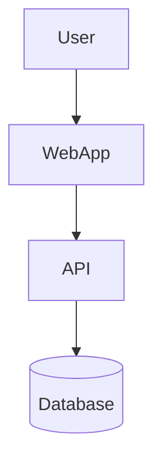

# Generate a Complete Software Architecture Document (SAD)

You are tasked with generating a full **Software Architecture Document** (SAD) for a software system. Follow the structure below. All diagrams must use **Mermaid syntax**. Each document and subdocument must include **header and footer navigation** with links: **Home, Up, Previous, Next**.

## 📐 Document Requirements

- The SAD should be modular (can be split into subdocuments/sections).
- Each document **must** begin and end with navigation headers.
- Diagrams must be written using **Mermaid syntax** (e.g., flowcharts, C4 context/container/component diagrams, class diagrams, etc.)
- Use Markdown formatting throughout.
- All sections must be well-labeled and easy to read.
- The writing style must be clear, concise, and professional.

---

## 🧩 Sections to Include (Full List)

1. **Introduction**
2. **Architectural Goals and Constraints**
3. **System Overview**
4. **Logical Architecture**
5. **Physical Architecture**
6. **Technologies Used**
7. **Build and Deployment Architecture**
8. **Runtime View**
9. **Data Architecture**
10. **Security Architecture**
11. **Integration and External Interfaces**
12. **Operational Concerns**
13. **Architectural Decision Log**
14. **Glossary and References**

---

## 🧪 Example Template (Excerpt)

### 🔹 `01_Introduction.md`

```markdown
# Software Architecture Document – Introduction

[Home](index.md) | [Up](index.md) | [Previous](index.md) | [Next](02_Architectural_Goals.md)

## Purpose
This document describes the architecture of the [Project Name] system in detail...

## Scope
The system covers...

## Stakeholders
- Product Owner
- Dev Team
- Infrastructure Team

---

[Home](index.md) | [Up](index.md) | [Previous](index.md) | [Next](02_Architectural_Goals.md)
```

---

### 🔹 `03_System_Overview.md`

```markdown
# Software Architecture Document – System Overview

[Home](index.md) | [Up](index.md) | [Previous](02_Architectural_Goals.md) | [Next](04_Logical_Architecture.md)

## High-Level Overview



---

[Home](index.md) | [Up](index.md) | [Previous](02_Architectural_Goals.md) | [Next](04_Logical_Architecture.md)
```

---

## ✅ Output Requirements

- Output must be in Markdown (`.md`) format
- All navigation links must be consistent and relative (no absolute URLs)
- Each section must be saveable as an individual file (split when needed)
- Each Mermaid diagram must render correctly in tools like Obsidian, GitHub, or VS Code extensions

---

## 🚀 Task

**Generate the full Software Architecture Document for the provided system specification. Follow all formatting, diagram, and navigation requirements above. Begin with a TOC in `index.md`.**
