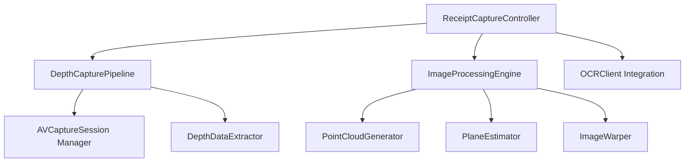
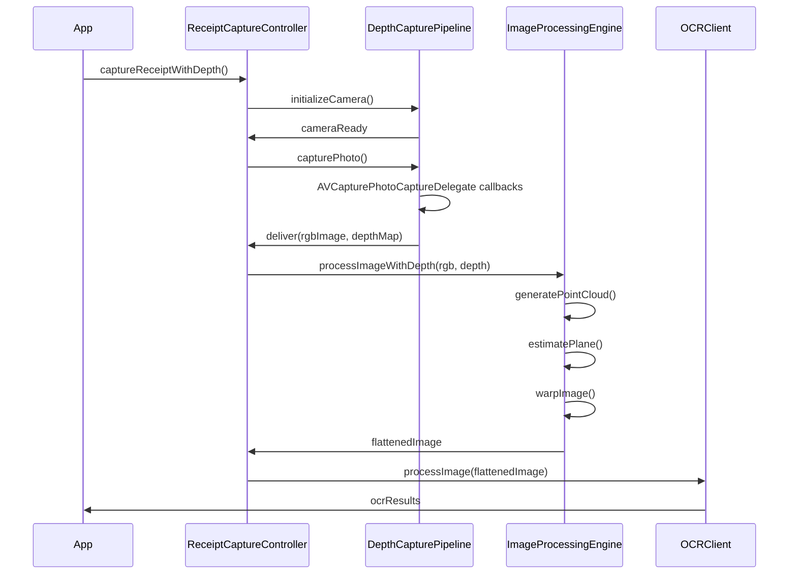
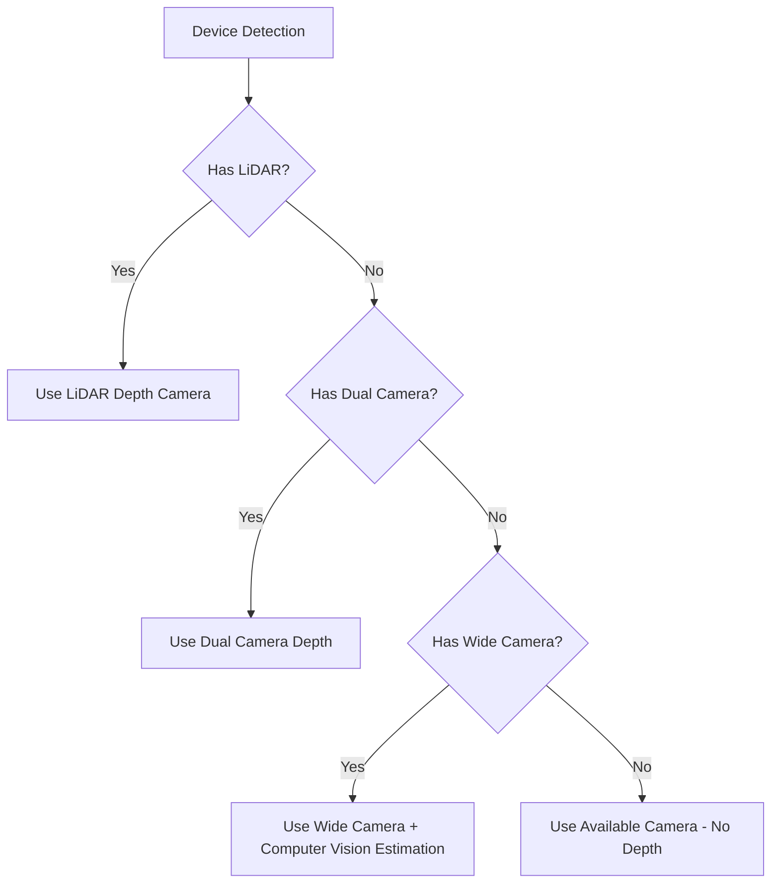

# Architectural Design Document: Swift Receipt Image Capture with Depth Mapping

## 1. Overview

This document outlines the architecture for enhancing the Swift proxy client with advanced receipt capture functionality. The feature leverages LiDAR and depth-sensing capabilities to capture, process, and flatten wrinkled or curved receipts, significantly improving OCR accuracy.

## 2. System Components

The architecture consists of the following primary components:



### 2.1 Core Components

1. **ReceiptCaptureController**
   - Main public interface for client applications
   - Coordinates between capture and processing pipelines
   - Provides callback mechanisms for async operations

2. **DepthCapturePipeline**
   - Manages camera session configuration and device selection
   - Implements delegate methods for photo and depth capture
   - Handles device compatibility detection and fallbacks

3. **ImageProcessingEngine**
   - Converts depth data into 3D point clouds
   - Performs plane estimation and surface flattening
   - Applies geometric corrections to images

### 2.2 Supporting Components

4. **AVCaptureSession Manager**
   - Configures and manages camera sessions
   - Handles camera device selection (LiDAR/dual/standard)
   - Manages camera permissions and error states

5. **DepthDataExtractor**
   - Processes raw AVDepthData
   - Converts between depth map formats
   - Provides normalized depth representations

6. **PointCloudGenerator**
   - Transforms 2D+depth data into 3D point cloud
   - Applies camera intrinsics for accurate spatial reconstruction
   - Filters outliers and noise

7. **PlaneEstimator**
   - Implements PCA algorithm for plane fitting
   - Detects receipt boundaries in 3D space
   - Calculates optimal transformation matrix

8. **ImageWarper**
   - Performs perspective correction based on estimated plane
   - Implements image resampling using Accelerate or Metal
   - Preserves image quality during geometric transformation

9. **OCRClient Integration**
   - Seamlessly connects with existing OCRClient
   - Handles format conversion (PNG encoding)
   - Provides progress feedback during complex operations

## 3. Data Flow



## 4. Interface Definitions

### 4.1 ReceiptCaptureController

```swift
/// Main controller for receipt capture with depth capabilities
public class ReceiptCaptureController {
    /// Configuration options for receipt capture
    public struct Configuration {
        public var preferredCamera: PreferredCamera = .lidarIfAvailable
        public var imageQuality: ImageQuality = .high
        public var outputFormat: ImageFormat = .png
        public var useMetal: Bool = true
        
        public init() {}
    }
    
    /// Camera preference enumeration
    public enum PreferredCamera {
        case lidarIfAvailable
        case dualCameraIfAvailable
        case bestAvailable
        case specific(AVCaptureDevice.DeviceType)
    }
    
    /// Initialize with configuration options
    public init(configuration: Configuration = Configuration())
    
    /// Check if depth capture is available on this device
    public var isDepthCaptureAvailable: Bool { get }
    
    /// Current state of the capture controller
    public var state: ReceiptCaptureState { get }
    
    /// Capture receipt with depth processing
    public func captureReceiptWithDepth(completion: @escaping (Result<CGImage, ReceiptCaptureError>) -> Void)
    
    /// Async version of capture function (iOS 15+)
    @available(iOS 15.0, *)
    public func captureReceiptWithDepth() async throws -> CGImage
    
    /// Capture preview with depth visualization overlay
    public func capturePreviewWithDepthVisualization(completion: @escaping (Result<UIImage, ReceiptCaptureError>) -> Void)
    
    /// Save the last processed image to disk
    public func saveLastProcessedImage(to url: URL) throws
}
```

### 4.2 DepthCapturePipeline

```swift
/// Manages depth-enabled camera capture
internal class DepthCapturePipeline: NSObject, AVCapturePhotoCaptureDelegate {
    /// Initialize with configuration
    internal init(configuration: ReceiptCaptureController.Configuration)
    
    /// Set up the capture session with appropriate device
    internal func configureCaptureSession() throws
    
    /// Begin running the capture session
    internal func startSession() throws
    
    /// Stop the capture session
    internal func stopSession()
    
    /// Capture a photo with depth
    internal func capturePhotoWithDepth() throws
    
    // MARK: - AVCapturePhotoCaptureDelegate
    
    internal func photoOutput(_ output: AVCapturePhotoOutput, 
                            didFinishProcessingPhoto photo: AVCapturePhoto, 
                            error: Error?)
}
```

### 4.3 ImageProcessingEngine

```swift
/// Handles 3D processing and image warping
internal class ImageProcessingEngine {
    /// Initialize with processing options
    internal init(useMetal: Bool)
    
    /// Process image with depth data to create flattened image
    internal func processImageWithDepth(image: CGImage, 
                                     depthMap: CVPixelBuffer, 
                                     cameraIntrinsics: simd_float3x3) throws -> CGImage
    
    /// Generate visualization of depth map for preview
    internal func generateDepthVisualization(depthMap: CVPixelBuffer) -> CGImage
    
    /// Export processed image to specified URL
    internal func exportImage(_ image: CGImage, to url: URL) throws
}
```

## 5. Compatibility Strategy

The implementation will follow a progressive enhancement approach:



## 6. Error Handling

```swift
/// Errors that can occur during receipt capture and processing
public enum ReceiptCaptureError: Error {
    case cameraUnavailable
    case depthCapabilityUnavailable
    case captureFailed(underlying: Error?)
    case insufficientDepthData
    case processingFailed(underlying: Error?)
    case userCancelled
    case sessionConfigurationFailed(underlying: Error?)
    case permissionDenied
    case exportFailed(underlying: Error?)
}
```

## 7. Integration with OCRClient

The ReceiptCaptureController will seamlessly integrate with our existing OCRClient:

```swift
// Example integration in client code
let captureController = ReceiptCaptureController()
let ocrClient = OCRClient()

captureController.captureReceiptWithDepth { result in
    switch result {
    case .success(let flattenedImage):
        // Convert CGImage to PNG data using enhanced PNG support
        let pngData = flattenedImage.pngData()
        
        // Process with existing OCR pipeline
        ocrClient.processReceipt(imageData: pngData) { result in
            // Handle OCR result
        }
        
    case .failure(let error):
        // Handle capture errors
    }
}
```

## 8. Testing Strategy

The implementation will include comprehensive testing:

1. **Unit Tests**
   - Test plane estimation algorithms with known 3D data
   - Validate image warping with synthetic datasets
   - Test depth map normalization and filtering

2. **Device-Specific Tests**
   - Test on LiDAR-equipped devices (iPhone 12 Pro and newer)
   - Test on dual-camera devices without LiDAR
   - Test on single-camera devices for fallback behavior

3. **Integration Tests**
   - Validate end-to-end flow with the OCR pipeline
   - Test performance with various receipt types and lighting conditions

## 9. Privacy and Permission Handling

The implementation will address privacy concerns:

1. **Camera Permissions**
   - Request camera permissions with clear purpose messaging
   - Handle denied permissions gracefully with helpful guidance

2. **User Feedback**
   - Provide visual cues during camera operation
   - Show depth visualization to help users position the receipt optimally

## 10. Performance Considerations

To ensure optimal performance:

1. **Memory Management**
   - Properly manage AVCaptureSession lifecycle to avoid memory leaks
   - Use autoreleasepool for large image processing operations

2. **Processing Optimization**
   - Use Accelerate framework for vector operations
   - Optionally use Metal for parallelized image warping
   - Implement downsampling for preview generation

3. **Battery Impact**
   - Minimize active camera time
   - Stop sessions when not in use
   - Use appropriate quality settings for different device capabilities

## 11. Future Enhancements

Potential future enhancements include:

1. Multi-image capture for super-resolution
2. Integration with AR scene capture for advanced spatial awareness
3. Machine learning-based receipt edge detection
4. Support for additional document types (checks, business cards)
5. Real-time OCR feedback during camera preview

## 12. Conclusion

This architectural design provides a comprehensive foundation for implementing advanced receipt capture with depth processing in our Swift proxy client. The implementation will enhance OCR accuracy while maintaining compatibility across a wide range of iOS devices, with graceful degradation on less capable hardware.